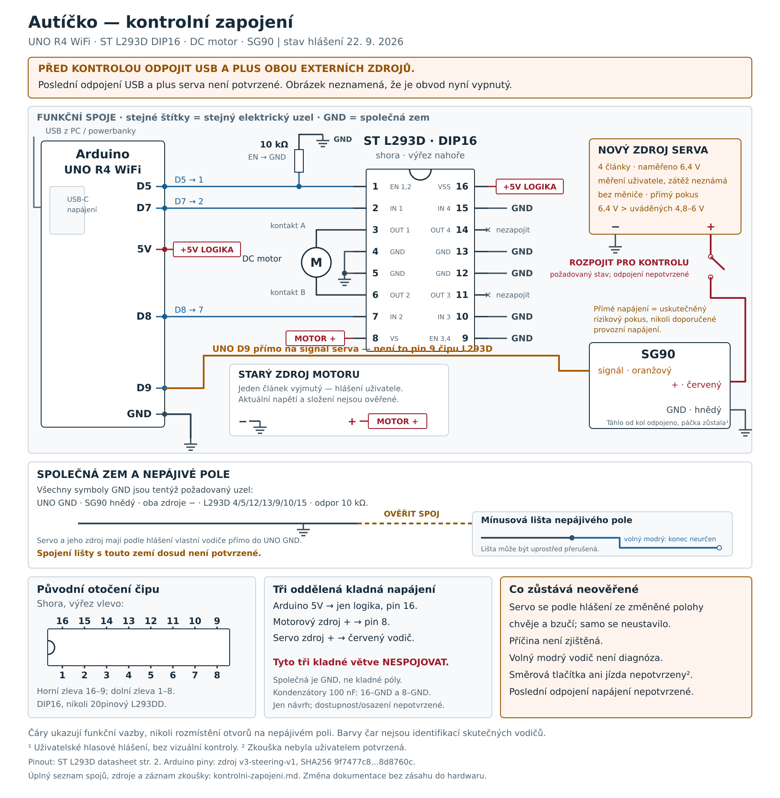

# Autíčko — kontrolní přehled celého zapojení

Stav záznamu: **23. 9. 2026**. Tento dokument ukazuje požadované funkční spoje a zvlášť popisuje hlášený pokus se servem. Neprokazuje skutečné zapojení každého vodiče ani funkčnost sestavy.

**Nové potvrzení před uploadem couvání:** na otázku „Je Arduino připojené přes USB a napájení motoru i červený vodič serva odpojené?“ Jiří odpověděl **„ano, servo odpojeno“**. Jde o aktuální hlášení odpojeného servo plusu, UNO na USB a motoru bez napájení; motor měl podle posledního hlášení odpojený jeden článek, beze změny. Agent napájení elektricky neměřil a táhlo se neměnilo. Následné obecné potvrzení funkčnosti je v bodě 28; následné dokončení vypnutí uživatel potvrdil podle bodu 29.

**Nyní nahráno `v3-reverse-v1`: 86 716 B / 22 stran / exit 0.** Tři pasivní výpisy potvrdily novou verzi, vypnutý motor a střed 1575 µs / rozsah ±300 µs. Zařízení už mělo HTTP=29/closed=29; během čtení se počty neměnily a původ není určený. Agent neposlal HTTP, sériová data ani pohybový povel; monitor je zavřený. [Evidence uploadu](../../models/jednoduche-auticko/firmware/prvni-motor/evidence/2026-09-23-v3-reverse-v1-upload/README.md).

**Historické potvrzení před uploadem trimu v4:** Pro upload v4 uživatel nově odpověděl „Ano“ na dotaz zahrnující odpojení servo plusu, ponechání UNO na USB a motor bez napájení. Táhlo smí zůstat připojené a před novým odpojením je hlásil připojené. Toto potvrzení patří novému uploadu; starý motorový držák má podle posledního hlášení tři zapojené články a čtvrtý odpojený, servo zdroj je samostatný čtyřčlánkový. Žádný z těchto údajů není přímým měřením agentem.

Po opravě mínusu nového zdroje IOREF → GND byl hlášen první pohyb v1 a poté pěkný pohyb volného serva v2 oběma směry. Dříve nahraný **`v3-steering-v4`: střed 1575 µs, zachované ±300 µs a 50 Hz (1275 / 1575 / 1875 µs)**. Upload **84 948 B / 21 stran / exit 0** a tři pasivní USB výpisy potvrdily novou verzi, klid motoru, `steeringUs=neutralUs=1575` a `rangeUs=300`. **Uživatel následně s připojeným táhlem, koly nad stolem, motorem bez napájení a povelem Rovně potvrdil správnou neutrální polohu kol: „Super, takhle to je perfektní“.** Jde přímo o +50 µs od v3 ve směru Doprava, bez mezikroku 1550 µs. Uživatel na v3 s připojeným táhlem a povelem Rovně stále hlásil kola mírně doleva; první +25µs trim byl podle něj skoro neznatelný. Potvrzení se týká neutrální polohy kol při krátké zkoušce; nejde o měření úhlu, ověření všech dorazů, dlouhodobého provozu ani jízdy. Podrobné kroky a uploady jsou níže; [firmwarová evidence](../../models/jednoduche-auticko/firmware/prvni-motor/README.md) je oddělená od fyzické zkoušky.

[Otevřít přesné SVG](kontrolni-zapojeni.svg) · [PNG pro zobrazení v chatu](kontrolni-zapojeni.png)

**Časový rozsah obrázku:** SVG/PNG uchovávají původní kontrolní nákres z doby neověřeného propojení lišty a původního měření 6,4 V. Po pozdějších fyzických krocích se obrázky neregenerovaly. Jejich upozornění na tehdy nepotvrzené odpojení není aktuální stav; novější potvrzení, oprava IOREF → GND a měření 6,35 V jsou zaznamenané v tomto textu.

## Jak nákres číst

- Všechny symboly **GND** znamenají tentýž požadovaný elektrický uzel. Čárkovaná vazba k mínusové liště v původním obrázku označuje spoj, jehož provedení tehdy nebylo potvrzené; později uživatel jeho doplnění ohlásil, elektrická kontinuita není změřená.
- Dva štítky **+5V LOGIKA** označují spoj Arduino 5V ↔ L293D pin 16. Dva štítky **MOTOR +** označují spoj motorový zdroj + ↔ pin 8. Štítky šetří křížení čar; nejsou to další součástky.
- Přerušené **servo +** ukazuje požadovaný stav pro kontrolu; aktuální odpojení se musí opírat o nové potvrzení pro konkrétní upload; pro nynější couvání v3-reverse-v1 jej uživatel nově potvrdil. Větev zachycuje uskutečněný rizikový pokus s původně naměřenými 6,4 V; neukazuje správné provozní napájení ani neexistující hotový regulátor.
- Čáry jsou funkční spoje, ne pozice konkrétních otvorů nepájivého pole. Barvy čar nejsou důkazem barvy či identity skutečného vodiče. Oranžový, hnědý a červený u SG90 odpovídají uživatelovu hlášení; volný modrý je zvlášť neidentifikovaný konec.

## Arduino a řídicí vodiče

| Odkud | Kam | Poznámka |
|---|---|---|
| UNO USB-C | USB napájení z PC / powerbanky | Pro upload couvání nově potvrzené USB v rámci předuploadového dotazu |
| **UNO D5** | **L293D pin 1, enable** | Z téhož uzlu vede odpor **10 kΩ na GND**; není v sérii s D5 |
| **UNO D7** | **L293D pin 2, vstup 1** | Zachované motorové řízení |
| **UNO D8** | **L293D pin 7, vstup 2** | Zachované motorové řízení |
| **UNO D9** | **SG90 signál, hlášený oranžový** | Přímo k servu; **nikoli na pin 9 čipu L293D** |
| **UNO 5V** | **L293D pin 16, VSS** | Napájení logiky čipu |
| **UNO GND** | **Společná zem** | Může využít více GND vývodů Arduina |

Mapování D5/D7/D8/D9 je stejné v předchozích verzích i [nyní nahraném zdroji `v3-reverse-v1`](../../models/jednoduche-auticko/firmware/prvni-motor/prvni-motor.ino). V2 při startu hlásil nominální servo pulz 1500 µs, první trim v3 měl 1525 µs a druhý trim v4 má 1575 µs, které zachovává také nynější couvání; nejde o měření polohy ani důkaz, že se konkrétní servo samo vystředí. Motorové piny zůstaly stejné; couvání nově obrací IN1/IN2 se stejným PWM 128/255.

## L293D: všechny vývody DIP16

Pohled **shora na nápis, výřez nahoře**: vlevo shora dolů 1–8, vpravo shora dolů 16–9. Pin 1 je vlevo u výřezu. Při původním otočení **výřezem vlevo** je spodní řada zleva **1–8** a horní zleva **16–9**. Nezaměnit s 20vývodovým L293DD.

| Pin | Funkce | Spoj v kontrolním schématu |
|---|---|---|
| 1 | EN 1,2 | UNO D5 a jedna strana odporu 10 kΩ; druhá strana odporu na GND |
| 2 | IN 1 | UNO D7 |
| 3 | OUT 1 | První kontakt DC motoru |
| 4 | GND | Společná GND |
| 5 | GND | Společná GND |
| 6 | OUT 2 | Druhý kontakt DC motoru |
| 7 | IN 2 | UNO D8 |
| 8 | VS | Plus **motorového** zdroje |
| 9 | EN 3,4 | GND, nepoužitá část vypnutá |
| 10 | IN 3 | GND |
| 11 | OUT 3 | Nezapojený |
| 12 | GND | Společná GND |
| 13 | GND | Společná GND |
| 14 | OUT 4 | Nezapojený |
| 15 | IN 4 | GND |
| 16 | VSS | Arduino 5V, logika |

**Ani jeden kontakt motoru nevede přímo na GND:** oba jsou připojené na výstupy 3 a 6. Pořadí motorových kontaktů určuje fyzický směr, který schéma samo neověřuje.

Pinout vychází ze [ST L293D, strana 2](https://www.st.com/resource/en/datasheet/l293d.pdf) a odpovídá zkontrolovanému obrázku [TI L293D, strana 3](https://www.ti.com/lit/ds/slrs008c/slrs008c.pdf). Čísla v některých tabulkách ST pro SO20 nelze přenášet na tento DIP16.

## Tři napájecí větve a jedna společná zem

| Větev | Kladný pól | Záporný pól | Doložený stav |
|---|---|---|---|
| USB / Arduino | UNO 5V → L293D 16 | UNO GND | Pro upload couvání nově potvrzené USB v rámci předuploadového dotazu |
| Starý motorový zdroj | L293D 8 | Společná GND | Pro upload trimu v4 nově potvrzený stav bez napájení v rámci předuploadového dotazu; v držáku podle posledního hlášení tři zapojené články, čtvrtý odpojený; aktuální napětí a složení neověřené |
| Nový zdroj serva | Při pokusu přímo SG90 červený | Po opravě uživatelem potvrzený UNO GND, dříve chybně IOREF | Původně 6,4 V; po opravě 6,35 V bez USB i s USB bez zátěže; před v4 červený plus nově potvrzený odpojený |

**Kladné póly těchto tří větví nespojovat.** SG90 hnědý i mínus nového zdroje mohou mít každý vlastní vodič do GND Arduina, jak uživatel hlásí; není podmínkou vést je přes lištu nepájivého pole. Mínus motorového zdroje, všechny předepsané zemní vývody L293D a odpor ovšem musí sdílet stejnou GND.

Původních **6,4 V i pozdějších 6,35 V je nad výrobcem uváděným rozsahem 4,8–6 V**. Uživatel se po upozornění rozhodl pro krátký pokus; tento záznam jej nepovyšuje na doporučené provozní napájení. Regulovaná 5V větev není hotová a uživatel snižující měnič nemá. Chemie, proudová rezerva a napětí nového zdroje pod zátěží nebyly ověřené. [TowerPro SG90 — specifikace a odpověď výrobce k napětí](https://towerpro.com.tw/product/sg90-7/).

## Mínusová lišta a volný modrý vodič

Původně uživatel oznámil volný modrý vodič od mínusové lišty; jeho cílový bod nebyl určený. Později výslovně hlásil doplnění chybějícího **UNO GND → mínusová lišta**, ale bzučení a výpadky pokračovaly. Kontinuita lišty nebyla proměřená. Při další kontrole se podle fotografie ukázalo jiné chybné propojení: **mínus nového servo zdroje s modrým prodloužením byl v IOREF**. Uživatel následně potvrdil přesunutí do správného GND. Tyto dva kroky nezaměňovat. Barva sama neurčuje vodič ani diagnózu; všechny dřívější výpadky nebyly vysvětlené měřením.

Při vypnutém obvodu porovnat každý konec s tabulkou spojů a ověřit, které úseky lišt skutečně tvoří jeden uzel. Dlouhé napájecí lišty bývají uprostřed rozdělené; levá a pravá lišta ani protilehlé poloviny kontaktního pole nemusejí být propojené. Potřebné spojení GND se ověřuje mezi konkrétními body, nikoli pouze podle natištěného mínusu. Kontinuitu měřit jen na odpojené sestavě.

Dva dříve navržené **100nF kondenzátory 16–GND a 8–GND** jsou stále pouze návrhem; dostupnost ani osazení nebyly potvrzené. Ve schématu nejsou vydávané za již připojené díly. Referenční doporučení pro blokování napájení uvádí [TI, strana 13](https://www.ti.com/lit/ds/slrs008c/slrs008c.pdf); nejde o diagnózu dnešního chvění.

## Hlasová zkouška 22. 9. 2026

Původ fyzických údajů: **slovní hlášení uživatele v původním hlasovém tasku**; kroky 11–12 navíc vycházejí z **fotografií vyhodnocených původním taskem a jeho auditem**, jak je u nich uvedeno. Elektrické měření prováděl uživatel. Tento dokumentační doplněk hardware přímo neprohlížel ani neměřil.

1. Po nahrání V3 a zobrazení návrhu uživatel potvrdil oranžový SG90 do D9, hnědý do GND a původně odpojený červený vodič.
2. Nemá snižující měnič. Rozhodl se přijmout riziko přímých naměřených 6,4 V; nový zdroj označil za nerozebiratelný. Vyjmutí článku z tohoto zdroje není dostupný postup.
3. Odpojil USB, potvrdil mínus nového zdroje do volného GND Arduina a znovu připojil USB. Nakonec výslovně potvrdil odpojení táhla od kol; páčka na servu zůstala.
4. Připojil plus nového zdroje přímo k červenému vodiči SG90. Hlásil krátký zvuk a cukání při ručním pohybu páčkou. Vysvětlení jako odpor serva proti ruce zaznělo jen jako hypotéza.
5. Potvrdil skutečné nové UI na telefonu v síti **Auticko-test**: Držet pro jízdu vpřed, Rovně, Doprava a Doleva. V této fázi potvrdil odpojený červený vodič, pak jej znovu připojil pro krátký pokus.
6. Upřesnil, že v nominální středové poloze servo stojí klidně, ale z jiné polohy se chvěje a bzučí; podle něj mu musí rukou pomoci. **Samostatné ustavení bez táhla nebylo úspěšně fyzicky ověřené.** Nejde o změřený geometrický střed ani stanovenou příčinu závady.
7. Byl vyzván odpojit plus serva a nepomáhat páčce rukou. Provedení tohoto posledního odpojení nepotvrdil. Následně ohlásil volný modrý vodič z mínusové lišty; otázka jejího jiného propojení s UNO GND zůstala nezodpovězená.
8. Před kontrolou byl vyzván odpojit USB i plus serva; jejich tehdejší odpojení nepotvrdil. **V tomto bodě byl stav napájení nejistý** a směrová tlačítka ani jízda nebyly potvrzené jako vyzkoušené. Následující kroky jsou novější.
9. Doplnil chybějící spoj **UNO GND → mínusová lišta**. Bzučení a výpadky podle něj pokračovaly. Při prvním pokusu se směrovými tlačítky servo chvělo místo zatáčení a web přestal fungovat; uživatel podezíral reset. **Reset nebyl potvrzen diagnostickým logem.**
10. S výslovně **odpojeným červeným plusem serva** vyzkoušel Doleva a Doprava v UI; stránka bez chyby hlásila vypnutý motor a zvolený směr. Krátké „Připravuji ovládání“ odpovídá přípravě relace. Tato zkouška neověřuje pohyb odpojeného serva ani případný dřívější reset Arduina či modemu.
11. U multimetru **RETLUX RDM 3001** fotografie doložily rozsah 20 V DC, zapojení šňůr do COM a V/ΩmA a zobrazených **10,46 V**. Uživatel výslovně určil černý hrot na **hnědém kontaktu serva** a červený na **volném plusu nového zdroje**: šlo o měření napětí, nikoli sériové měření proudu ani měření napájeného serva pod zátěží. Na stejných bodech uvedl **10,46 V s USB a 6,2 V bez USB**.
12. Původní task a audit fotografie identifikovaly mínus nového čtyřčlánkového zdroje s modrým prodloužením v **IOREF**, druhém otvoru POWER od napájecího konektoru, nikoli v GND. Uživatel chybu uznal a **výslovně potvrdil přesunutí do správného GND**; přepojování probíhalo s odpojeným USB a pokynem odpojit plus zdroje. Původní slovní hlášení „mínus do GND“ v bodě 3 tím bylo opravené. Ověřený pinout řady POWER je BOOT, IOREF, RESET, 3V3, 5V, GND, GND, VIN ([Arduino UNO R4 WiFi — oficiální pinout](https://docs.arduino.cc/resources/pinouts/ABX00087-full-pinout.pdf)).
13. Po opravě naměřil mezi volným plusem zdroje a hnědým kontaktem serva **6,35 V nejprve bez USB a pak výslovně stále 6,35 V s USB**. Ani to není měření pod zátěží. Změna měření neprokazuje nepřítomnost poškození ani úplnou příčinu všech předchozích výpadků.
14. Při krátkém zapnutí s odpojeným táhlem a volnou páčkou bylo podle něj servo klidné. Následoval krátký povel Doprava při motoru bez napájení. Podle jeho hlášení se servo po stisku tlačítka vždy pohnulo o malý kus daným směrem; považoval je za fungující a kvůli vůli požádal o větší pohyb. Jde o **první potvrzený fyzický pohyb v `v3-steering-v1` po opravě GND**; úplná kontrola obou krajních poloh, návratu, zatížení a jízdy potvrzená není.
15. Analogová/digitální varianta konkrétního SG90 není ověřená. Nový čtyřčlánkový zdroj zůstává nerozebiratelný, bez regulátoru; 6,35 V je stále nad uváděnými 4,8–6 V. Uživatel výslovně přijal riziko dalšího pokusu a nechce nyní přidávat měnič. Toto rozhodnutí není doporučením provozního napájení ani zárukou bez poškození. U starého motorového držáku výslovně upřesnil **jen tři zapojené články, čtvrtý odpojený**; nepopisovat jej jako čtyři aktivní články.
16. Uživatel požádal o dvojnásobnou výchylku. **`v3-steering-v2` mění ±150 → ±300 µs**, tedy 1200 / 1500 / 1800 µs při stejných 50 Hz; v tomto okamžiku šlo o zadání přípravy. Nejde o změřený úhel ani záruku dvojnásobného natočení kol.
17. **Potvrzení před uploadem v2:** červený plus serva **odpojený**, motor **bez napájení**, táhlo od kol **odpojené**, UNO **na USB**. Toto výslovné hlášení nahrazuje dřívější nejistotu odpojení. Připravenost sama není fyzická akceptace nové verze.
18. Následoval upload **`v3-steering-v2`**, zdroj SHA256 `fcefad5f61f703e3294ac1464206d1022e72fcf85fc7acea3f634947d1b8a5b6`: **84 948 B / 21 stran / exit 0**. Tři pasivní USB výpisy v 21:26:15–21:26:26 UTC potvrdily novou verzi, `safety=1`, vypnutý motor, `steeringReady=1`, `steeringUs=neutralUs=1500`, `rangeUs=300`, `leaseMs=0` a připravený server s HTTP=0. Port byl uzavřen; agent neposlal žádná sériová data, HTTP ani pohybové povely. **Při dokončení uploadu ještě fyzická zkouška většího rozsahu neproběhla; následná zkouška je v bodě 19.** [Evidence tohoto uploadu](../../models/jednoduche-auticko/firmware/prvni-motor/evidence/2026-09-22-v3-steering-v2/README.md).

19. Uživatel na `v3-steering-v2` s volným servem výslovně potvrdil: „Jo, funguje to, hezky se to hýbe doprava i doleva.“ Jde o fyzické potvrzení obou směrů volného serva v2; neověřuje dorazy, zatížení ani jízdu.
20. Poté chtěl připojit táhlo. Původní koordinátor mu popsal postup Rovně, odpojit servo plus a USB, srovnat kola a připojit táhlo bez násilí. Následně uživatel hlásil mírné natočení kol doleva ve středu a požádal o malý trim. Toto hlášení není samostatným potvrzením každého předepsaného úkonu ani nového stavu napájení.
21. Uživatel zadal **`v3-steering-v3` s posunem nominálního středu 1500 → 1525 µs**, tedy +25 µs ve směru Doprava při `STEER_SIGN=1`; zachovává ±300 µs a 50 Hz (1225 / 1525 / 1825 µs). Jde o první nenaměřený kalibrační krok; v tomto bodě ještě nebyl nahraný. Následně uživatel výslovně potvrdil odpojený červený vodič serva a souhlasil s nahráním; předuploadový dotaz zahrnoval motor bez napájení a UNO na USB. Toto nové potvrzení opravňuje upload trimu; táhlo může zůstat připojené, jeho aktuální připojení není samostatně ověřené.

22. Následoval upload **`v3-steering-v3`**, zdroj SHA256 `0e56dfc88e022d18fcf4b8d33e511c5f99cc0671d2a23572686be4324a19dbb3`: **84 948 B / 21 stran / exit 0**. Tři pasivní USB snapshoty v 21:36:23–21:36:34 UTC potvrdily `build=v3-steering-v3`, `steeringReady=1`, `steeringUs=neutralUs=1525`, `rangeUs=300`, `safety=1`, vypnutý motor, `leaseMs=0` a připravený server s HTTP=0. Port byl uzavřen; agent neposlal sériová data, HTTP ani pohybové povely. **V okamžiku dokončení uploadu ještě vyrovnání kol nebylo vyzkoušené; následné hlášení je v bodě 23.** [Evidence trimu v3](../../models/jednoduche-auticko/firmware/prvni-motor/evidence/2026-09-22-v3-steering-v3/README.md).

23. Uživatel po zapnutí `v3-steering-v3` s **připojeným táhlem** a po Rovně stále hlásil kola mírně doleva; první trim +25 µs byl podle něj skoro neznatelný. Chtěl více a souhlasil s dalším +50 µs ve směru Doprava. To není potvrzením srovnání kol, dorazů, zatížení ani jízdy.
24. Připravovaný `v3-steering-v4` mění střed **1525 → 1575 µs přímo**, bez mezikroku 1550 µs. Zachovává ±300 µs a 50 Hz, tedy 1275 / 1575 / 1875 µs; jde o druhý nenaměřený kalibrační krok. Uživatel nově odpověděl „Ano“ na dotaz odpojit servo plus, ponechat UNO na USB a motor bez napájení. Táhlo smí zůstat a před tímto novým odpojením bylo uživatelem hlášené připojené. V tomto okamžiku se verze připravuje, není ještě nahraná.

25. Upload **`v3-steering-v4`** prošel: **84 948 B / 21 stran / exit 0**, zdroj SHA256 `0ee42b5512b97240a9d466e833e46a4360a3d4b5a7d112ae647146946781126e`. Tři pasivní USB snapshoty v **21:42:01–21:42:13 UTC** potvrdily `build=v3-steering-v4`, `steeringReady=1`, `steeringUs=neutralUs=1575`, `rangeUs=300`, `safety=1`, `drive=0`, EN/IN1/IN2 LOW, `leaseMs=0`, `watchdog=0`, server=1 a HTTP=0. Port je uzavřen; žádná sériová data, HTTP ani pohybové povely nebyly odeslány. **V okamžiku dokončení uploadu ještě fyzická zkouška neproběhla; její následné potvrzení je v bodě 26.** [Evidence uploadu v4](../../models/jednoduche-auticko/firmware/prvni-motor/evidence/2026-09-22-v3-steering-v4/README.md).

26. Po krátkém zapnutí serva na **v3-steering-v4 s připojeným táhlem**, koly nad stolem, motorem bez napájení a po povelu **Rovně** Jiří řekl: **„Super, takhle to je perfektní“.** Jde o uživatelskou akceptaci neutrální polohy kol při středu **1575 µs**. Potvrzení se týká neutrální polohy kol při krátké zkoušce; nejde o měření úhlu, ověření všech dorazů, dlouhodobého provozu ani jízdy. Nastavení 1575 ±300 µs při 50 Hz zůstalo beze změny. Doporučené odpojení servo plusu po úspěchu již nepotvrdil; hlasový hovor skončil a aktuální napájení serva není potvrzené. Zdroj pro krátké pokusy zůstává uživatelem přijatých 6,35 V bez měniče, nad uvedeným rozsahem SG90. Tento zápis neprovedl nový upload, testy ani přístup k zařízení.

27. **Nový upload couvání, 23. 9. 2026 místního času:** Jiří na otázku „Je Arduino připojené přes USB a napájení motoru i červený vodič serva odpojené?“ odpověděl **„ano, servo odpojeno“**. Koordinační úloha tím předala nové potvrzení připravenosti a autorizaci nahrání; motor měl podle dosavadního potvrzení odpojený jeden článek, bez hlášené změny. Táhlo se neměnilo. Agent živě ověřil správnou UNO R4 WiFi `3CDC75F1A2D4`, volný `/dev/ttyACM0` a shodné hashe připraveného zdroje a BIN. Upload **`v3-reverse-v1`** proběhl **22:09:20–22:09:27 UTC dne 22. 9. (00:09 místního času dne 23. 9.)**, **86 716 B / 22 stran / exit 0**, zdroj SHA256 `d24a87631fd32a41685baedd7488c425a75ca6f9e300706349c61e09e79fe930`. Tři pasivní snapshoty v **22:10:07–22:10:19 UTC** potvrdily tuto verzi, `safety=1`, `drive=0`, EN/IN1/IN2 LOW, `steeringReady=1`, `steeringUs=neutralUs=1575`, `rangeUs=300` a `leaseMs=0`. Zařízení už v prvním snapshotu vykazovalo **HTTP=29, closed=29, stopReason=1**; během čtení se počty nezměnily. Původ dřívějších požadavků není určený. **Agent neposlal žádná sériová data, HTTP ani pohybové povely a zavřel monitor.** V okamžiku uploadu fyzická zkouška ještě nebyla hlášená; následné obecné potvrzení je v bodě 28. Akceptace neutrálu v4 v bodě 26 zůstává samostatná. [Přesná nová evidence](../../models/jednoduche-auticko/firmware/prvni-motor/evidence/2026-09-23-v3-reverse-v1-upload/README.md).

28. **23. 9. 2026 — Jiří po zkoušce aktuální `v3-reverse-v1` řekl: „Hele, všechno to funguje“.** Jde o obecnou uživatelskou fyzickou akceptaci po předání postupu jízdy vpřed a couvání, nikoli samostatně doložené měření proudu, průběh změny směru nebo dlouhodobou zkoušku. Následně potvrdil „Hotovo“ po postupu úplného vypnutí: pustit ovladače, zastavit kola, vyjmout jeden článek motorového zdroje, odpojit plus servo zdroje od červeného vodiče serva, zaizolovat volný plus a odpojit USB. Jde o uživatelské potvrzení dokončení postupu, nikoli nezávislou kontrolu jednotlivých spojů. Původ hlášení: původní koordinační úloha `01a0caa4-9807-78f0-9152-893a808ca99a`. Tento zápis neprovedl přístup k zařízení, upload ani testy.

29. Po pokynech pustit ovladače, zastavit kola, rozpojit motorový zdroj vyjmutím jednoho článku, odpojit plus dlouhého zdroje od červeného vodiče serva, zaizolovat volný plus a odpojit USB uživatel řekl **„Hotovo“** a ukončil hlasový hovor. Jde o **uživatelské potvrzení dokončení vypnutí podle předaného postupu**, nikoli nezávislou kontrolu jednotlivých spojů. Nahrazuje předchozí nepotvrzené vypnutí. Agent při tomto zápisu nepřistupoval k zařízení.

Fotografické podklady kroků 11–12 vyhodnotil původní task a jeho audit; tento dokumentační doplněk je znovu neinterpretoval: `/home/novakj/Downloads/20260922_230659.jpg`, `20260922_230625.jpg`, `20260922_230656.jpg` (multimetr) a `/home/novakj/Downloads/20260922_231323.jpg` (IOREF). Při vyvozování závěrů rozlišovat zobrazenou hodnotu, uživatelem určené hroty, vizuální identifikaci pinu a jeho pozdější slovní potvrzení přepojení.

Upload a tři klidové diagnostické výpisy z dřívějšího kroku zůstávají platnou [softwarovou evidencí](../../models/jednoduche-auticko/firmware/prvni-motor/evidence/2026-09-22-v3-steering-v1-upload/README.md). Nepotvrzují fyzický úspěch této pozdější servo zkoušky. První omezený pohyb v1 a následný pěkný pohyb volného serva v2 oběma směry jsou uživatelem hlášené. Úplná fyzická akceptace dorazů, zatížení a jízdy nebyla udělena; potvrzení v2 se nepřenáší na výsledek kalibrace. V3 s připojeným táhlem podle následného hlášení levý odklon nedostatečně opravila; u v4 uživatel přijal neutrální polohu kol v přesném rozsahu bodu 26. Nyní nahrané couvání má upload podle bodu 27 a následné obecné uživatelské potvrzení funkčnosti podle bodu 28.

## Co bylo ověřeno při tvorbě přehledu

Piny byly porovnané se zdrojem V3, existujícím [zapojením L293D](zapojeni-l293d.md), [řízením V3](rizeni-v3.md) a oficiálními podklady výše. SVG vzniká z [programového zdroje](kontrolni-zapojeni.py), obsahuje všech 16 očíslovaných vývodů a textový popis pro čtečky. PNG je render téhož SVG; prošel vizuální kontrolou popisků, spojů a orientace. [Záznam kontrol](overeni-kontrolniho-zapojeni.json) uvádí konkrétní soubory a meze ověření.

Při původní tvorbě nákresu nebyl otevřen USB port, nahrán firmware ani odeslán pohybový povel; firmware, testy, CAD a tiskové soubory se tehdy neměnily. Následné doplnění tohoto textu zaznamenává nové fyzické hlášení a odděleně provedené autorizované uploady `v3-steering-v2`, `v3-steering-v3` a `v3-steering-v4`; samotná editace dokumentace nepřidává hardwarový úkon. Po dřívějším potvrzení středu přibylo nové hlášení odpojeného serva a autorizovaný upload couvání podle bodu 27; následné obecné potvrzení funkčnosti je v bodě 28; následné vypnutí uživatel potvrdil podle předaného postupu, bez nezávislé kontroly spojů.
