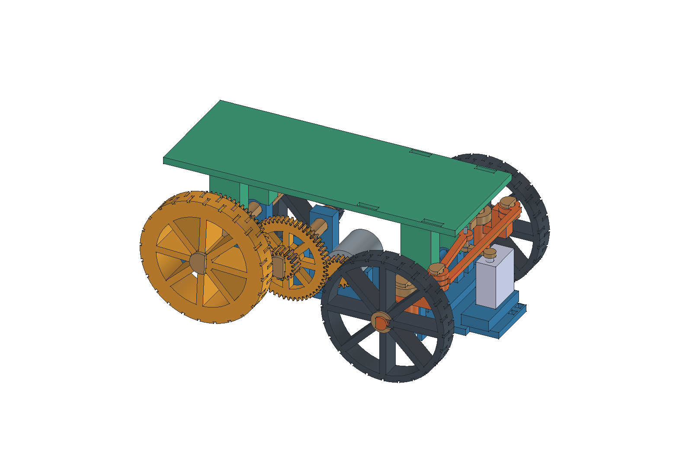
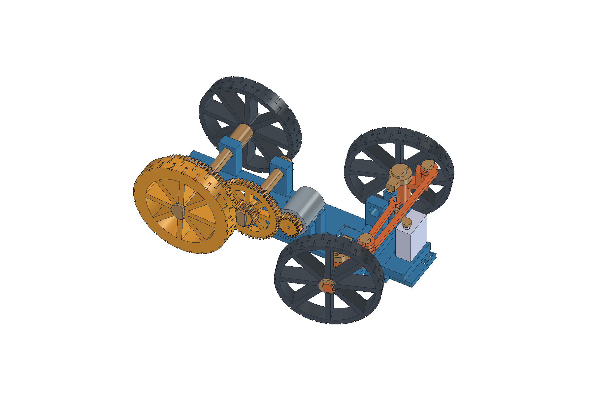

# Autíčko s převodem 12:1 a předním řízením SG90

**Dokončený a geometricky ověřený CAD prototyp; skutečný výtisk, montáž a řízení zatím neověřené.** Aktuální kola mají Ø76 × 12 mm a skutečný tištěný dezén. Původní dvě varianty zůstávají beze změny. Firmware se při této mechanické úpravě nemění.

Nová přední kola se otáčejí samostatně na osičkách těhlic. Svislé čepy jsou podepřené rámem i horní odnímatelnou čelistí. Servo přenáší pouze sílu táhla, nikoli hmotnost kol. Jednoduchý rovnoběžník natáčí obě kola stejným úhlem; není to Ackermannovo řízení, takže v zatáčce očekáváme smýkání pneumatik. Skutečnou sílu potřebnou k zatáčení a schopnost SG90 zatáčet pod zatížením neznáme.

[Celé autíčko:33 tištěných kusů](tiskovy-balicek.zip) · [Jen přestavba z V2:22 kusů](prestavba-z-v2.zip) · [Náhled mechanismu](mechanismus.png)

**Pro tisk celé sestavy na Kobra X použij [připravené rozložení 3MF](rozlozeni/README.md): první podložka 31 kusů, druhá rám a plošina.** Soubory zachovávají samostatné díly, měřítko a navržené tiskové orientace; neobsahují tiskové ani materiálové profily. Není potřeba znovu načítat a rozmísťovat 33 STL.

[Parametrický model](auticko-se-zatacenim.FCStd) · [Generátor](auticko-se-zatacenim.FCMacro) · [Geometrická kontrola](kontrola-modelu.json) · [Původní varianta 12:1](../auticko-s-prevodovkou/README.md) · [Elektronika](../../elektronika/auticko/README.md) · [Inventář](../../elektronika/vybaveni.md)

## Skutečně známé údaje a návrh

- Jiří identifikoval Tower Pro Micro Servo 9g SG-90. Má originální jednoramennou páčku s vnitřním ozubením a středový šroubek. Vzdálenost středu osy ke středu posledního malého otvoru **výslovně změřil 15 mm**. Starší nejednoznačné údaje 20/19 mm tento rozměr nenahrazují.
- Nominální výkres výrobce: tělo 22,7 × 12,2 mm, výška těla 27 mm, celková výška včetně výstupu 30,3 mm, délka přes uši 32,3 mm, spodek → spodní rovina uší 17 mm. Přesný posun osy po délce těla a výška skutečné páčky nejsou kótované. Analogová/digitální varianta se nerozlišila; nepředpokládáme rozsah 180°.
- Rozměry těla, malý otvor páčky a výška páčky **nejsou fyzicky ověřené**. `CaseAxisOffset=5 mm` a tloušťka páčky 2,5 mm jsou označené návrhové hodnoty, nikoli měření. Páskové lože umožňuje posunout servo; před finálním utažením vyrovnat skutečnou osu a klouby do modelových poloh.
- Původní DC motor: uživatelsky změřený válec Ø22,5 × 26 mm, hřídel délky 6 mm. Nominální tištěný otvor pastorku 2,2 mm uživatel nasadil; skutečný průměr hřídele, moment a zatížitelnost nejsou změřené.
- Střed řízení X154, Y±44, Z24; kola Ø76 × 12, středy při rovné jízdě X150,3, Y±59. Zadní náprava X32. Přední rozchod 118 mm je širší než zadní92 mm. Rozšíření kol vede pouze ven, vnitřní čela zůstala na původních pozicích. Konstrukční mechanické dorazy ±24°, zamýšlený provozní rozsah maximálně ±20° před fyzickou kalibrací.
- Servoosa X184/Y0, páčka v nule dozadu; čep páčky X169/Y0. Ramena těhlic délky20, jejich konce X174/Y±44. Příčné táhlo mezi osami88, servotáhlo mezi osami√(44²+5²)=44,283 mm. Celá vazba se přepočítává z tabulky `Steering`.
- Horní plošina má nezměněnou souvislou užitnou plochu **170 × 60 mm**. Je to stejný díl jako u V2, s dosedy X32/150 a Y±18. Zadní kontakty motoru zůstávají přístupné po sejmutí plošiny.

Primární zdroje: [TowerPro SG90 analog](https://towerpro.com.tw/product/sg90-analog/), [TowerPro SG90 digital](https://towerpro.com.tw/product/sg90-7/). Nominální údaje nepotvrzují skutečný rozměr uživatelova kusu ani zatížitelnost celého mechanismu.

## Opětovné použití z V2

Přebíraných **8 typů STL** jsou přesné bajtové kopie z `auticko-s-prevodovkou/stl`, jejich SHA jsou v kontrolním JSON. Beze změny lze použít plošinu, pastorek, mezikolo, meziosu, zadní levou rozpěrku8,6, jednu dlouhou rozpěrku17,6 a dvě krátké1,6. Z šesti velkých C pojistek se tři dají převzít z kompletního V2 a tři je třeba dotisknout. Celkem se převezme **11 fyzických kusů**.

Nový rám nahrazuje rám V2. Nepoužijí se čtyři původní kola, obě dlouhé osy a dvě přední dlouhé rozpěrky: spolu s rámem je to **9 nepotřebných kusů V2**. Nové jsou čtyři širší kola s dezénem, zadní osa109,3 a celý přední mechanismus. Úplná třetí varianta má **33 kusů / 23 typů STL**; přestavba z kompletní V2 vyžaduje **22 nově tištěných kusů**, včetně tří dodatečných velkých C pojistek. Kontrola počtů:20 původních +22 nových −9 nepoužitých =33.

| STL typ | Celkem V3 | Dotisk pro přestavbu V2 |
|---|---:|---:|
| ram-rizeni |1|1|
| plosina-170x60 |1|0|
| kolo-zadni-76x12-72z |1|1|
| kolo-zadni-76x12-prave |1|1|
| kolo-predni-76x12 |2|2|
| pastorek-18z-otvor-2_2 |1|0|
| mezikolo-54_18z |1|0|
| osa-zadni-109_3 |1|1|
| osa-mezi-65_2 |1|0|
| rozperka-8_6 |1|0|
| rozperka-17_6 |1|0|
| rozperka-1_6 |2|0|
| pojistka-c |6|3|
| celist-horni |2|2|
| svisly-cep |2|2|
| tehlice-leva / tehlice-prava |1+1|1+1|
| spojovaci-tahlo |1|1|
| servo-tahlo-r15 |1|1|
| distanc-packy |1|1|
| cep-tahla-dlouhy / cep-tahla-kratky |1+1|1+1|
| pojistka-mala |2|2|

Pracovní předchozí návrh s úzkými Ø80×8 koly zůstal v [historii](historie/pracovni-80x8/README.md); není to další tiskový balíček.

## Kola a tisk

Ozubené levé zadní kolo má celkovou osovou výšku **21 mm = běhoun12 + ozubení9**, ostatní kola12 mm; vyšší údaj ve sliceru je správný. Dezén je součást geometrie FCStd i STL:24 příčných drážek v každé polovině šířky, druhá polovina posunutá o7,5°. Drážky jsou1 mm hluboké a1,6 mm široké; vnější průměr76, kořen74. Souvislá stěna předního a pravého zadního ráfku má pod kořenem3 mm. Na ideálně rovné podložce zůstává geometrický valivý průměr76 mm: drážka zabírá asi2,413°, druhá půlka je posunutá o7,5° a vždy ponechá plný poloměr38 mm. Ø74 označuje kořen drážky, nikoli valivý průměr celého kola. Nominální světlost72z věnce je4,7 mm vůči vnějšímu obvodu; konzervativně3,7 mm při dosednutí až na kořen drážky. Plošina zůstává Z70, nominální mezera nad kolem je8 mm.

Proti Ø80 poskytne Ø76 při stejném momentu ideálně o5,3 % větší obvodovou sílu a o5 % menší rychlost. Převod zůstává12:1. Větší šířka ani dezén **nezaručují lepší tření PLA na konkrétní podlaze**; nejde o gumovou pneumatiku. Větší šířka a posun styčné plochy dále od kingpinu také zvyšují požadavek na servo. Skutečný rozjezd, prokluz, vibrace a moment řízení se ověří fyzicky.

STL jsou v mm, v navržené tiskové orientaci, nejnižší Z=0. U dezénu vzniká v polovině šířky místní1mm radiální převis /1,6mm přemostění; bez skutečného náhledu vrstev a výtisku není prokázán tisk bez podpor. Kola, táhla a pojistky leží plochou na podložce, osy a čepy D plochou dolů, horní čelisti velkou horní plochou dolů (klíč vzhůru), plošina užitnou stranou dolů. Těhlice leží společnou rovinnou plochou zadní strany těla/osičky; jejich vyvýšené rameno a kapsa klipu mohou potřebovat **lokální podpory**. Rám má místní přemostění dolních závěsů a klipových otvorů; zkontrolovat náhled podpor, neuzavřít dráhu dorazů. Žádný konkrétní slicerový profil ani G-code nebyl vytvořen nebo odeslán. Materiál, pružnost pojistek a orientace vrstev vyžadují zkušební tisk; netvrdit ověřené nastavení trysky/teploty.

## Spoje a montážní omezení

Tištěná osička kola má Ø8, kruhový otvor kola Ø8,6; svislé čepy Ø8 proti otvorům8,6; klouby táhel Ø6 proti otvorům6,5. Vůle jsou návrhové. Jemný tisk, odstranění otřepů a skutečná volnost chodu se musí ověřit. Netvrdit ověřený press-fit ani nosnost tištěných os/pojistek.

Originální páčku upevňuje její dodaný středový šroubek. Pro poslední malý otvor je navržen **1× šroub M2×16, 2× podložka M2 a 1× pojistná matice M2**; vlastnictví tohoto materiálu není potvrzené. Tištěné servotáhlo má otvor2,3. Před montáží ověřit otvor v originální páčce, tloušťku páčky a průchodnost šroubu; nevnucovat šroub do menší díry. Případnou úpravu otvoru provést až po ověření zbývající stěny a uchycení. Spoj musí zůstat otočný, nesmí být sevřený. Délka šroubu a výška distančního válečku se ověří podle skutečné páčky; nevhodný spoj nenahrazovat násilným utažením.

Servo se uchytí dvěma malými stahovacími páskami přes otevřené lože; potřebný materiál navíc k dvěma páskům motoru. Otvory jsou pro návrhovou šířku pásku maximálně2,5 mm, vlastnictví/typ nepotvrzen. Udržet kabel mimo táhla, ozubení a kola. Vyjímatelná plošina potřebuje podle uživatelem zvoleného zatížení vlastní zajištění; těsný fit a nosnost nepovažovat za potvrzené.

Před spojováním odpojit motorové napájení. Nejdříve sestavit a ručně projít celý podvozek bez servotáhla. **Levá těhlice (L) patří na stranu zadního ozubeného kola, tedy Y− v modelu; pravá na opačnou stranu.** Asymetrické těhlice neprohazovat. Vložit těhlice mezi čelisti, nasadit horní čelisti klíčem do registru, svislé čepy shora a C pojistky radiálně z vnější strany příčníku. Ústí pojistky při nasouvání směřuje k ose; netlačit ji axiálně přes plný konec čepu. Potom nasadit přední kola a jejich C pojistky. Připojit příčné táhlo, malé čepy a pojistky. Malé pojistky nasouvat do přední kapsy zepředu, s ústím směrem dozadu k ose čepu; kulatá drážka dovoluje následné pootočení do jiné orientace zobrazené v CAD. Nakonec nastavit servo do neutrálu a připojit originální páčku a servotáhlo bez předpětí. Dorazy chrání geometrii, **nejsou příkazem pro servo, aby do nich tlačilo**.

Řízení potřebuje samostatné budoucí ovládání/napájení serva. V této etapě se na Arduino nic nenahrálo, servo nepřipojovalo a nezkoušelo. Moment SG90, tření kol a napájecí stabilita se z CAD neprokazují. Dříve hlášený těžký rozjezd existoval i se starým pulzním firmwarem; silikonový olej podle uživatele moc nepomohl. Převod ani servo nejsou prokázanou opravou jeho příčiny.

## Parametry a regenerace

Tabulka `Parameters` zachovává původní standardní graf pohonu, `Steering` řídí nové vazby. Živě svázané jsou zejména `WheelAngle`, `HornRadius`, `ServoX`, `KingpinX`, `HalfTrack`, `StopAngle` a rozměry drážek dezénu. Změna radiusu automaticky přepočte neutrální délku servotáhla; u hotového fyzického táhla se samozřejmě délka sama nezmění. `DeckBottom=70 mm` je záměrně pevné kvůli přesné kompatibilitě plošiny V2.

`Arm` mění kinematické osy a oko, ale nosné bloky ramene mají v makru pevné rozměry; neprovádět samostatnou změnu této hodnoty bez úpravy podpory oka a nového ověření. Řádky označené „konstrukční informace“ nejsou samostatné všestranné nastavovače: `PinDiameter`, `PinClearance`, `BodyRadius`, `WheelOffset`, `KnuckleBottom`, `KnuckleTop`, `JointDiameter`, `JointBore` a `WorkingAngle` vyžadují související změny makra a novou kontrolu. Počet drážek24 je konstanta generátoru. Po jakékoli změně rozměrů znovu exportovat a zkontrolovat sestavu; nestačí upravit buňku a ponechat staré STL.

Generátor čte předchozí FCStd a ihned pracuje s jeho kopií v této složce; předchozí dokument neukládá. Přepisuje pouze místní model, STL a kontrolní JSON. Spustit v izolovaném FreeCADu postupem z [dokumentace softwaru](../../docs/software.md), pak spustit `kinematika.py`, `overit-rizeni.FCMacro`, `overit-vule.FCMacro`, `nahled.FCMacro` a `overit-exporty.py`. GUI náhled zároveň uloží správnou viditelnost finální sestavy a ověří ji znovuotevřením. Neměnit osobní FreeCAD konfiguraci ani spouštět historické makro bez úpravy výstupních cest.

## Co geometrická kontrola neprokazuje

CAD a matematická vazba nedokazují pevnost, životnost, skutečný fit SG90, průchod M2 otvorem páčky, správný šroub, vůle po vytištění, sílu serva, napájení, přenos momentu přes spline/pastorek ani bezpečné jízdní vlastnosti. Doraz je tištěná mechanická součást a může se deformovat nebo zlomit. První zkouška má ručně ověřit volný celý rozsah bez motorového napájení; skutečné ovládání serva a jeho elektrické napájení jsou další samostatná etapa. Model nemá diferenciál ani ložiska, takže zatáčení může vyžadovat větší sílu a kola mohou smýkat.

## Provedené kontroly

Výsledky jsou uložené v [kontrola-modelu.json](kontrola-modelu.json), [kinematika.json](kinematika.json) a [hash/mesh manifestu](overeni-exportu.json). Kontroly se týkají přesné dodané varianty, nikoli libovolných budoucích změn parametrů.

- Nové díly: validní jediný solid; exportované STL: jedna souvislá uzavřená orientovaná mesh, kladný objem, Z0. Převzatých8 typů má shodné SHA s V2; předchozí modely zůstaly beze změny.
- Skutečné objemy sestavy a celé rotační obálky předních kol:25 poloh po2° od−24° do+24°, bez průniku. To je vzorkovaná CAD kontrola, nikoli nekonečně jemný důkaz všech deformovaných fyzických poloh.
- Geometrické dorazy: v±24,5° vzniká očekávaný průnik čepu s dorazem, tedy další volný pohyb modelu už není možný. Pracovní cíl je±20°, aby servo záměrně netlačilo do dorazu.
- Uzavřená servo vazba:4801 poloh po0,01°, bez mrtvého bodu a změny směru převodu; maximální délková odchylka1,5×10⁻¹⁴ mm. Nejmenší účinné rameno u kola18,07 mm a u serva12,29 mm. Uživatelův radius15 je použit ve všech kontrolách.
- Změny a vrácení `HornRadius15→14,5→15`, `StopAngle24→23→24`, `HalfTrack44→45→44` změnily skutečnou geometrii a po návratu obnovily objemy přesně.
- Samostatná zkouška axiálních mezí předních kol:−0,2 mm dovnitř /+0,5 mm ven včetně0,1 mm dodatečného pohybu pojistky, při−24/0/+24°;156 objemových porovnání bez průniku. Zadní převod:4 kombinace původních axiálních mezí bez průniku. Nominální rejd a tento axiální test jsou oddělená kontrola.
- Geometrie zadního72z věnce v montážní rovině je přesně stejná jako V2: objem symetrického rozdílu0 mm³. Nezměněné soukolí nepodstoupilo zbytečně opakovaný celý test; jeho původní záběr dokládá [kontrola V2](../auticko-s-prevodovkou/kontrola-modelu.json).
- Bodové kontroly v tělese potvrzují střídavé drážky dezénu, nejde o obrázkovou texturu. Skutečné GUI náhledy ukazují rovně, oba směry a mechanismus bez plošiny; uložený FCStd se otevírá v přímé poloze s viditelnou finální sestavou.

