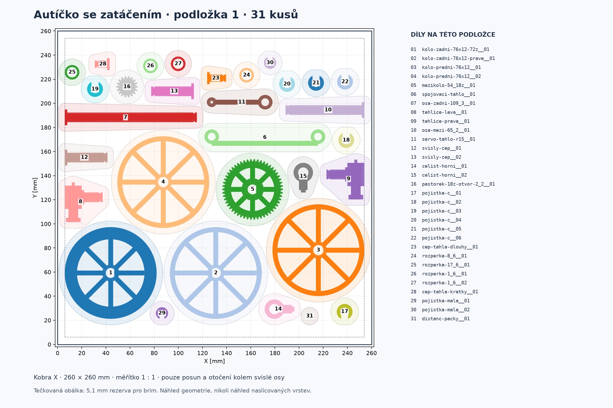
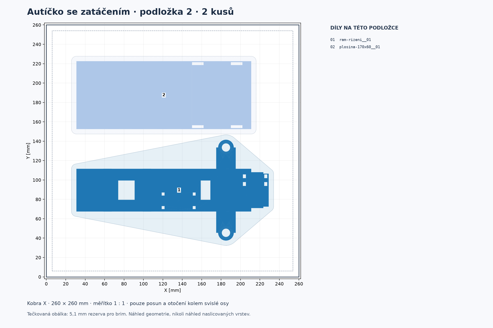

# Autíčko V3: dvě připravené podložky pro Kobra X

Všech **33 kusů** je rozdělených na dvě podložky. **Všechna čtyři kola jsou na první: dvě přední a dvě zadní.** V náhledu jsou označená čísly 1 až 4. Nic z kusovníku nechybí. Jde o nové soubory s rozložením; tvůj otevřený projekt ani nastavení sliceru se neměnily.

| Soubor | Obsah | Kusů |
|---|---|---:|
| [Podložka 1](auticko-v3-podlozka-01.3mf) | Všechna čtyři kola, ozubení, osy, těhlice, čelisti, táhla, čepy, rozpěrky a pojistky | 31 |
| [Podložka 2](auticko-v3-podlozka-02.3mf) | Rám se zatáčením a horní plošina | 2 |

## Otevření v Anycubic Slicer Next

1. Rozpracovaný projekt si ulož, pak použij nový prázdný projekt s tiskárnou **Anycubic Kobra X 0.4 nozzle** a svým skutečným materiálem.
2. Načti **jen podložku 1** z odkazu výše. Pokud se objeví volba způsobu importu, vyber **Import geometry only**. Případné spojení do jednoho objektu nebo změnu jednotek/měřítka odmítni.
3. Díly už jsou rozmístěné. Nepoužívej znovu Arrange ani Auto orient; měřítko je 100 %. V seznamu má být 31 samostatných objektů. Není potřeba přidávat STL ani kopírovat pojistky.
4. Zkontroluj svůj profil a náhled vrstev, zejména podpory těhlic, přemostění a přilnavost drobných dílů. Podložku 2 potom načti samostatně do dalšího prázdného projektu; má dva objekty. Obě 3MF nevkládej současně na tutéž desku.

Soubory obsahují pouze geometrii a polohy. **Neurčují teploty, cívku, výplň, rychlosti ani podpory** a neobsahují G-code. Neposílají nic tiskárně. Rozložení je určené pro tisk všech objektů po vrstvách, nikoli postupně celý objekt po objektu (tam by bylo nutné počítat s prostorem tiskové hlavy).

## Prostor pro brim a podpory

Podložka konkrétního místního profilu Kobra X 0,4 mm má **260 × 260 mm**, bez deklarovaných vyloučených zón. U systémového procesu `0.20mm Standard @Anycubic Kobra X 0.4 nozzle` je Auto Brim široký 5 mm, mezera od objektu 0,1 mm, skirt 0 a podpory vypnuté. To je **přečtený default**, nikoli potvrzení tvých neuložených nastavení v otevřeném okně. Vybrané údaje jsou v [profil-podlozky.json](profil-podlozky.json).

Rozmístění má mezi konzervativními obálkami celých dílů nejméně **11,0175 mm** a od okraje nejméně **6 mm**. Tím se vejdou dva brimy po 5,1 mm s přibližně 0,82 mm mezery; u okraje zbývá nejméně 0,9 mm. Na druhé podložce je minimum mezi díly 11,05 mm a k okraji 31 mm. Použité obálky zahrnují celý díl ve všech výškách; drobné díly nejsou zastrčené do otvorů kol ani do dutin rámu.

**Skutečné podpory a dráhy nejsou vyslicované ani ověřené.** Těhlice a rám mohou potřebovat lokální podpory podle [modelového návodu](../README.md#kola-a-tisk). Rozložení rezervuje okolí dílu, nezaručuje místo pro libovolně rozvětvené stromové podpory, širší brim, raft či skirt. Při jejich změně zkontroluj dosah v náhledu; přesahující podporu nelze vydávat za prověřenou touto geometrickou kontrolou. Kvůli těsnějšímu rozmístění se neměnily tiskové orientace ani nevypínaly potřebné podpory.

## Co bylo ověřeno

- Čtyři kola v prvním finálním 3MF: zadní ozubené `kolo-zadni-76x12-72z__01`, zadní pravé `kolo-zadni-76x12-prave__01`, přední `kolo-predni-76x12__01` a `kolo-predni-76x12__02`.
- Přesně 33 názvů/kopií z původního `tiskovy-balicek.zip`, každá právě jednou; rozdělení 31 + 2.
- Jednotka milimetr, měřítko 1:1, pouze posuny XY a otočení kolem svislé osy Z. Spodní Z zůstalo 0; navržená spodní plocha každého STL se nezměnila.
- Všechny původní trojúhelníky se ve 3MF zachovaly, při zpětné transformaci do souřadnic STL maximální odchylka pod 0,000001 mm.
- 465 dvojic na první desce a jedna na druhé bez překryvu rezervovaných konvexních obálek; všechny díly uvnitř použitelné plochy. Skupinový bounding box obou desek má střed 130,130.
- Oba finální soubory prošly importem/exportem místním CLI Anycubic Slicer Next 2.0.0.5, bez řezání a bez osobních presetů. Všech 110 436 trojúhelníků zachováno; největší číselná odchylka vrcholů při reexportu je 0,000016 mm. Výsledek importu/exportu je v [overeni-importu.json](overeni-importu.json); nejedná se o pozorování aktuálního živého okna uživatele.

Rozmístění vzniklo geometrickou heuristikou s několika variantami pořadí a rotacemi po 90°. Je to praktické uspořádání na dvě desky s velkým počtem kusů na první; **není prokázané globální optimum** pro všechny možné úhly, dutiny a tisková nastavení. Součet rezervovaných konvexních obálek přesahuje plochu jedné podložky, takže pro tento konzervativní způsob balení jsou nutné dvě. To nedokazuje nemožnost odlišného uspořádání s menšími rezervami.

## Technické podklady a obnovení

- [overeni-importu.md](overeni-importu.md): postup skutečné kontroly v místním CLI.
- [rozlozeni.json](rozlozeni.json): zdrojové SHA256, přesné transformace a geometrická kontrola.
- [overeni-3mf.json](overeni-3mf.json): nezávislá kontrola skutečných výstupních 3MF proti původnímu ZIPu.
- [vytvorit-3mf.py](vytvorit-3mf.py): generátor standardního Core 3MF, bez presetů.
- [overit-3mf.py](overit-3mf.py): kontrola facetů, počtů, jednotek, plochy a odstupů (Python, numpy, shapely).
- [rozmistit.py](rozmistit.py): zdroj heuristického rozmístění; přesný dodaný výsledek zachovává `rozlozeni.json`.

Z této složky lze 3MF obnovit do nového cílového adresáře příkazem `python3 vytvorit-3mf.py ../tiskovy-balicek.zip rozlozeni.json /cesta/k/novemu/vystupu`. Ověření: `python3 overit-3mf.py ../tiskovy-balicek.zip rozlozeni.json /cesta/k/novemu/vystupu`. Nepoužívat CLI roundtrip export jako náhradu dodávaných souborů: reexport Nextu přidává procesové a tiskárnové defaulty, které ve výsledných geometry-only 3MF záměrně nejsou.

Oficiální kód Nextu: [import a centrování celé skupiny](https://github.com/ANYCUBIC-3D/AnycubicSlicerNext/blob/6103ed8b511609658d00d0538cc7f0609cdb57da/src/slic3r/GUI/Plater.cpp#L4411-L4423), [společný XY posun](https://github.com/ANYCUBIC-3D/AnycubicSlicerNext/blob/6103ed8b511609658d00d0538cc7f0609cdb57da/src/libslic3r/Model.cpp#L686-L704), [Import geometry only](https://github.com/ANYCUBIC-3D/AnycubicSlicerNext/blob/6103ed8b511609658d00d0538cc7f0609cdb57da/src/slic3r/GUI/Plater.cpp#L11132-L11188). Proto má každá deska vlastní vystředěný soubor. Zdrojový commit není důkazem přesné shody sestavení s instalací; místní import/export se kontroloval zvlášť.

