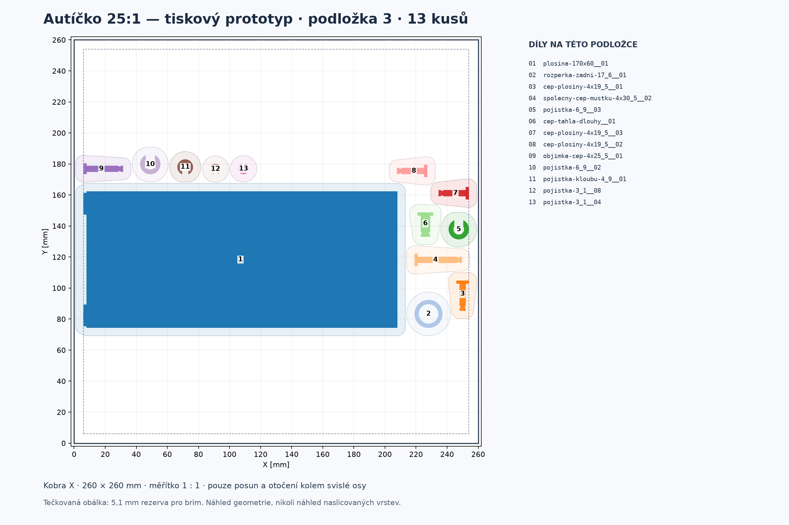

# Autíčko 25:1 se zatáčením: kompletní tiskový prototyp

**Aktualizace po první várce, 20. 9. 2026:** původní podložku 1 znovu celou netisknout. Pro šest chybějících dílů a vadnou pravou těhlici je připravený **[samostatný dotisk 7 kusů, 1 / 1 / 5 na třech menších úlohách](dotisk-prvni-varky-2026-09-20/README.md)**. Má vlastní orientace a návod k podporám/brimu, ověřené místním řezáním. Druhá původní podložka (27 kusů) podle uživatele právě tiskne, třetí (13) zůstává plánovaná. Následující kompletní 26/27/13 sada se zachovává jako původní podklad; opravy ji nepřepisují.

**Pozor na lokálně uloženou první 3MF:** soubor `auticko-25-podlozka-01.3mf` byl před přípravou dotisku uložený jako celý projekt Next (čas souboru 01:29), s vrstvou 0,12 mm a **vypnutými podporami**. Jeho 26 meshů a polohy stále odpovídají původnímu manifestu, ale již nejde o původní geometry-only archiv a jeho hash se liší od historického reportu. Agent tuto uživatelskou kopii nepřepsal. Druhá a třetí 3MF stále odpovídají původním hashům. Pro dotisk použij nové jasně oddělené [nastavené projekty nebo geometrické alternativy](dotisk-prvni-varky-2026-09-20/README.md); nepřebírej vypnuté podpory z první staré úlohy. [Kontrola zachování a této výjimky](dotisk-prvni-varky-2026-09-20/overeni-zachovani.json).

**Revize 20. 9. 2026 po hlášení fitu 8,6 / 12,6 mm.** Tato sada je kompletní tiskový prototyp s původním 20° ozubením modulu 1 a původními roztečemi. Uživatel zvolil tisk celého prototypu bez dalších testovacích výtisků. Kontroly níže ověřují soubory a rozmístění; neznamenají potvrzený chod převodu při skutečných vůlích nebo motorovém zatížení.

Kompletní sada obsahuje **66 fyzických kusů ze 34 typů**. Všechny kopie jsou již vložené v těchto třech 3MF jako samostatné objekty. **Všechna čtyři pojezdová kola jsou na první podložce**: dvě přední pod čísly 2 a 3, dvě zadní pod čísly 4 a 6. Samostatná kalibrace se do 66 dílů nepočítá.

| Otevřít samostatně | Hlavní obsah | Objektů | Náhled |
|---|---|---:|---|
| [Podložka 1](auticko-25-podlozka-01.3mf) | Všechna čtyři kola, dvojkola A/B, zadní osa, táhla a část dalších dílů | **26** | [Očíslované díly](podlozka-01.png) |
| [Podložka 2](auticko-25-podlozka-02.3mf) | Rám, výstupní kolo, pastorek, objímka páčky a další díly | **27** | [Očíslované díly](podlozka-02.png) |
| [Podložka 3](auticko-25-podlozka-03.3mf) | Plošina, rozpěrka a zbývající čepy a pojistky | **13** | [Očíslované díly](podlozka-03.png) |

**[Úplný kusovník s počty a polohou každé kopie](kusovnik-podlozek.md)** zahrnuje obě zadní rozpěrky, podložku páčky, všechny čepy a pojistky. Po tisku je podle něj spočítej; správné soubory samy nepotvrzují kompletní fyzický výtisk. Montáž popisuje [návod sestavy](../montaz.md). Motor, SG90 a jeho původní páčka jsou referenční netištěné součásti.

## Načtení do Anycubic Slicer Next

1. Rozpracovaný projekt si ulož a otevři nový prázdný projekt s tiskárnou **Anycubic Kobra X 0.4 nozzle** a skutečným filamentem.
2. Načti **jednu** z uvedených podložek. Pokud se objeví volba způsobu importu, vyber **Import geometry only**. V seznamu zkontroluj počet 26, 27 nebo 13 samostatných objektů podle desky.
3. Zachovej měřítko 100 % a uložené orientace. Arrange ani Auto orient nejsou potřeba; nepřidávej stejné STL a ručně nenásob kopie. Další podložku načti samostatně do prázdného projektu.
4. Zkontroluj skutečné nastavení, lokální podpory a celé dráhy ve vrstveném náhledu. Rozložení je určeno pro **tisk po vrstvách**, nikoli dokončení jednoho objektu po druhém; prostor pro kolize s tiskovou hlavou se zde nepočítal.

Původně předané 3MF obsahovaly pouze geometrii a polohy v milimetrech, bez tiskových nastavení. **U aktuální lokální první 3MF platí výjimka popsaná nahoře: byla následně uložená jako projekt Next s vypnutými podporami.** Druhá a třetí stále nenastavují materiál, vrstvy ani podpory. Všechny tři neobsahují G-code a nic neposílají tiskárně. Původní import/export byl ověřen místním CLI, nikoli pozorováním aktuálního uživatelova okna.

## Nastavení vrstev a povrchu

Jiří hlásí změnu běžné výšky vrstvy z 0,20 na **0,08 mm** a chce zachovat horní povrch **Monotonic line**. Po importu tyto hodnoty zkontroluj, 3MF je neaplikuje. Přečtený systémový profil Kobra X 0,4 mm dovoluje vrstvy **0,08–0,28 mm**. Jeho proces Standard má běžnou i první vrstvu **0,20 mm** a horní vzor `monotonicline`.

První vrstva je samostatné nastavení; hlášení o změně běžné vrstvy nepotvrzuje změnu první. [Evidence profilu](profil-podlozky.json) odlišuje systémové defaulty od uživatelova hlášení. Nejde o přečtení neuloženého UI, hotový G-code ani potvrzení tisku hlavní sady. Jemnější vrstva zmenšuje schody ve směru Z, sama však nepotvrzuje přesnost XY otvorů, ozubení ani změřené tření. Pro porovnání s již vytištěnou kalibrací zachovej odpovídající skutečné nastavení a způsob očištění.

## Mezery, brim a potřebné podpory

Podložka ověřeného místního profilu je **260 × 260 mm**, bez deklarovaných vyloučených zón. Systémový Standard má Auto Brim 5 mm, mezeru od dílu 0,1 mm, skirt 0 a podpory vypnuté. Vypnuté podpory jsou pouze přečtený default, **pro tento model je nelze bez kontroly převzít**.

| Podložka | Nejmenší mezera celých obálek | Nejmenší okraj | Zkontrolovaných dvojic |
|---|---:|---:|---:|
| 1 | 11,0467 mm | 6 mm | 325 |
| 2 | 11,0466 mm | 6 mm | 351 |
| 3 | 11,0206 mm | 6 mm | 78 |

Vzdálenosti jsou počítané z konzervativních konvexních obálek **všech výšek každého dílu**, ne pouze první vrstvy. Žádný díl není zastrčený do otvoru kola nebo dutiny rámu. Rezerva 5,1 mm kolem každého dílu pokrývá uvedený brim a jeho mezeru; mezi takovými obálkami zbývá nejméně **0,8206 mm** a u okraje **0,9 mm**.

**Podpory ani skutečné dráhy nejsou naslicované nebo ověřené.** Kruhové čepy a zadní osa zůstávají naležato a potřebují podpory spodních oblouků; větší hlava může zvedat dřík nad podložku. Dvojkola mohou vyžadovat podpory vyvýšeného ozubení na těle modelu, nejen z podložky. Těhlice, kapsy, vodorovné otvory, objímka a nohy plošiny rovněž vyžadují kontrolu; podrobnosti uvádí [tiskové orientace hlavního modelu](../README.md#tiskové-orientace-a-podpory).

Před tiskem nastav potřebné lokální podpory a prohlédni jejich dosah, dotyk s kluznými plochami a oddělení malých pojistek. Rozmístění nezaručuje místo pro libovolně rozvětvené stromové podpory, širší brim, raft či skirt. Pokud dráhy zasahují do sousedního dílu nebo mimo podložku, je potřeba rozmístění upravit. Kvůli balení se tisková orientace žádného dílu nezměnila.

## Provedené kontroly

- **66 zaznamenaných montážních instancí = kusovník = 66 STL kopií v ZIPu = 66 samostatných objektů ve třech 3MF.** Tři netištěné reference jsou vedené zvlášť. Každá STL kopie je bitově shodná s příslušným zdrojovým typem. [Kontrola kusovníku](overeni-kusovniku.json).
- Všech **202 604 trojúhelníků aktuálních STL** zůstalo zachováno. Jednotka mm, měřítko 1:1, pouze posuny XY a rotace kolem Z. Výškové souřadnice ani původní spodní plocha na Z0 se nezměnily. [Kontrola skutečných 3MF](overeni-3mf.json).
- Všech **754 dvojic** bez překryvu rezervovaných obálek, požadované mezery i okraje splněny. Každá skupina má společný střed bounding boxu v (130, 130). [Nezávislá kontrola rozmístění](overeni-rozlozeni.json).
- Všechny tři finální soubory prošly importem/exportem místním **Anycubic Slicer Next CLI** v samostatné cache, s vypnutým Arrange a Auto orient. Zachovány názvy, počty, pořadí a orientace indexů všech trojúhelníků. Největší rozdíl světového vrcholu při reexportu je **0,000015674 mm**, v mezích číselné přesnosti. [Kontrola importu](overeni-importu.json).

Neproběhl slicing, nebyl vytvořen G-code, použity osobní presety ani ovládána tiskárna. Dočasné reexporty z CLI se nedodávají, protože Next do nich přidává výchozí nastavení. Dodané 3MF jsou původní soubory obsahující pouze geometrii.

Rozdělení 26/27/13, pořadí objektů a všechny transformace z předchozího rozložení byly zachované. Obrysy, hashe a kontroly byly přepočítané z aktuálního ZIPu; změnilo se 13 fyzických STL kopií. Nejde o prokázané globální optimum počtu podložek. Ověření CADu a souborů nepotvrzuje vytištěný fit, účinnost převodu, nosnost, životnost ani jízdu.

Zdroj této revize je [aktuální tiskový ZIP](../tiskovy-balicek.zip), SHA-256 `3e6ea7b537a1b2cb9197cbcf23623bbfbc9b7354323d0415af6e7eac19d7aa6f`. Předkalibrační soubory jsou zachované v [historickém archivu](../historie/pred-kalibraci-8_6-12_6-2026-09-20/README.md).

## Reprodukce a podklady

- [rozlozeni.json](rozlozeni.json): přesné transformace a zdrojové SHA256.
- [aktualizovat-rozlozeni.py](aktualizovat-rozlozeni.py): aktualizace původních poloh z nového ZIPu, se selháním při odlišném seznamu dílů, chybné mezeře nebo okraji.
- [rozmistit.py](rozmistit.py): hledání poloh s mezerou alespoň 11 mm a okrajem 6 mm.
- [vytvorit-3mf.py](vytvorit-3mf.py): standardní Core 3MF, každý fyzický kus samostatně, bez presetů.
- [overit-kusovnik.py](overit-kusovnik.py), [overit-3mf.py](overit-3mf.py), [overit-rozlozeni.py](overit-rozlozeni.py), [overit-import.py](overit-import.py): kontroly počtů, geometrie, vzdáleností a CLI importu.
- [nahled-rozlozeni.py](nahled-rozlozeni.py): PNG skutečných XY projekcí všech trojúhelníků; tečkovaná obálka značí rezervu 5,1 mm, nikoli naslicované dráhy.

Pro opakování aktualizace rozložení: `python aktualizovat-rozlozeni.py /cesta/k/archivnimu-rozlozeni.json ../tiskovy-balicek.zip rozlozeni.json --expected-count 66`. Skript zachová pořadí, desky i transformace a uloží výsledek až po kontrole všech nových obálek. Použité prostředí je `/home/novakj/.cache/auticko-packing/venv/bin/python`.

Obnova do **nového** výstupního adresáře: `python3 vytvorit-3mf.py ../tiskovy-balicek.zip rozlozeni.json /cesta/k/vystupu`. Kontrola: `python3 overit-3mf.py ../tiskovy-balicek.zip rozlozeni.json /cesta/k/vystupu --wheel-part kolo-76x12-zadni-d --wheel-part kolo-76x12-predni`. Kontrolní nástroje vyžadují numpy, shapely a podle úlohy trimesh/scipy/matplotlib; runtime a cache nepatří do projektu.

Již předaná [kalibrační podložka](kalibrace/README.md) zůstává samostatná a beze změny. Do nových tří desek se její vzorky nepřidávají.

