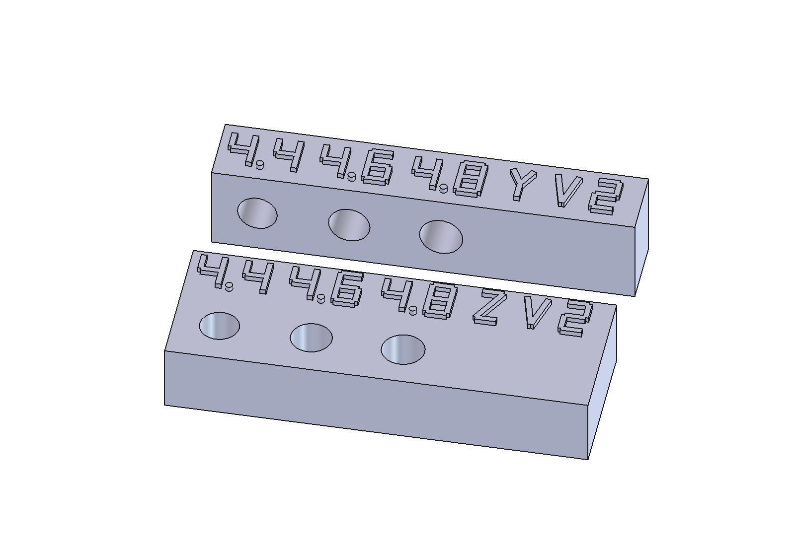

# Ø4 kalibrace V2: větší otvory ve dvou orientacích

**Nový doplňkový vzorek: dva malé bloky, otvory 4,4 / 4,6 / 4,8 mm, skutečná hloubka každého otvoru 8 mm.** Použij znovu původní plně kruhový čep Ø4 × 24 mm. Nový čep se netiskne a jeho průměr se nesnižuje.

**[Připravená podložka 3MF — oba nové bloky](kalibrace-4-v2-podlozka-01.3mf)** obsahuje přesně dva samostatné objekty. V prázdném projektu Anycubic Slicer Next s Kobra X 0,4 mm zvol při nabídce **Import geometry only**, zachovej 100 % měřítko a uložené orientace. Arrange ani Auto orient nejsou potřeba. Soubor obsahuje pouze geometrii, nenastavuje vrstvy, filament, podpory ani další tiskové hodnoty a neobsahuje G-code.

Alternativně [ZIP dvou STL](kalibrace-4-v2.zip), každý soubor jednou. Nemíchat jeho kopie s již načtenou 3MF. Tato složka je **V2**, původní kalibrační sada zůstává beze změny.

| Označení přímo na dílu | Jak jsou otvory při tisku | Rozměry bloku včetně popisků |
|---|---|---|
| **Z V2** | Svisle skrz horní plochu; osa otvoru Z | 47 × 16,6 × 8,6 mm |
| **Y V2** | Vodorovně mezi předním a zadním čelem; osa otvoru Y | 47 × 8 × 10,8 mm |

Každý otvor má nad svým sloupcem vlastní vystouplé číslo **4.4, 4.6 nebo 4.8**. Popisky jsou skutečná tisknutelná geometrie, vysoká 5 mm, s tahy 0,65 mm a vystoupením 0,6 mm. Vodorovný blok má otvory na čele pod popisky. Rozměry jsou nominální CAD, nikoli změřené výtisky.

## Proč vznikl nový vzorek

Jiří hlásí, že největší předchozí otvory 8,6 a 12,6 mm mu subjektivně vyhovují, zatímco původní Ø4 čep se volně neotáčí ani v největším otvoru 4,3 mm. Nejde o změřené průměry ani potvrzení, že každý Ø4 spoj má být volně otočný. **Nové otvory 4,4–4,8 mm zatím fyzicky vyzkoušené nejsou.**

Svislý a vodorovný otvor mohou vyjít při stejném nominálním průměru odlišně. Proto jsou zde obě orientace a zachovaná funkční hloubka 8 mm. Omezili jsme sadu na dva bloky; osm původních vzorků ani další čep není potřeba tisknout znovu. Doba tisku nebyla vypočítána slicerem.

## Jak zkoušet

1. Použij stejný původní Ø4 čep. Odstraň jen volné otřepy a zbytky podpor; nesnižuj celý jeho pracovní průměr broušením, aby prošel. Pokud můžeš měřit, zapiš skutečný průměr v několika směrech. Čep může být po tisku větší či oválný; označení Ø4 je nominální hodnota.
2. Každou řadu zkoušej samostatně, od **4,4 přes 4,6 po 4,8**. Čep musí projít celými 8 mm bez násilí. Zapiš zvlášť výsledek Z a Y, odpor při zasouvání, případné otáčení a boční vůli.
3. **Příčný klínek a montážní zajišťovací čep potřebují především správně zasunout. Volné otáčení není automatickým kritériem pro klínek.** Pro skutečně otočný kloub je navíc nutný lehký chod po celé otáčce. Největší otvor se nemá automaticky převzít do všech spojů; příliš velká vůle může zhoršit vedení a zajištění.
4. Pokud nevyhoví ani 4,8 mm, neaplikuj další zvětšení naslepo. Zaznamenej, zda jde o vstupní hranu, těsný celý otvor, deformaci čepu nebo stopy podpor. Podle konkrétního výsledku se upraví odpovídající spoj hlavního modelu.

Krátký vzorek ověřuje **8 mm vedení**. Nepotvrzuje chod delšího skutečného otvoru, souosost dvou podpor, pevnost klínku ani chování celého mechanismu pod zatížením. Výsledek jedné tiskové orientace nepřenášej automaticky na druhou.

## Tiskové podmínky a meze kontroly

Použij odpovídající skutečný materiál, vrstvy, kompenzaci otvorů a způsob očištění jako u porovnávaných dílů. Uživatel hlásil běžnou vrstvu 0,08 mm a horní vzor Monotonic line; tato 3MF je neaplikuje. První vrstva má vlastní nastavení. Neměň měřítko celé geometrie kvůli fitu otvorů.

U bloku **Y V2** prohlédni ve vrstveném náhledu kruhové stropy vodorovných otvorů: propad nebo stopy podpor mohou ovlivnit průchodnost. Podpory a skutečné dráhy zde nebyly naslicované ani ověřené. Pokud použiješ podpory nebo opracování otvorů, zaznamenej postup a porovnávej s odpovídajícím skutečným dílem. Nový ležatý čep se v této sadě nevyskytuje.

Podložka má 260 × 260 mm. Mezi konzervativními obálkami bloků je **11,05 mm**; rezerva počítá s brimem 5 mm + mezerou 0,1 mm kolem každého dílu. Pro jiné podpory, brim nebo skirt zkontroluj skutečný dosah. Soubor je určen pro tisk po vrstvách.

## Co bylo ověřeno a jak model upravit

- [CAD kontrola](kontrola-kalibrace.json): dva platné jednodílné solidy, šest průchozích otvorů, kontrola osy a okolní stěny v hloubkách 0,05 / 4 / 7,95 mm, přepočet hloubky 8 → 9 → 8 mm, uložení a opětovné otevření FCStd.
- [Přímá kontrola průměrů finálního FCStd](overeni-prumeru.json): 432 bodových zkoušek skutečných vyříznutých otvorů, vždy 0,01 mm uvnitř a vně jmenovitého poloměru, ve 12 směrech a třech hloubkách. Ověřuje CAD průměry, nikoli vytištěné tolerance.
- [STL a ZIP](overeni-exportu.json): rozměry, uzavřenost, orientace, jedna propojená síť na blok, Z0, soulad zdroje a exportů.
- [3MF](overeni-3mf.json) a [počty](overeni-kusovniku.json): přesně dva objekty, původní trojúhelníky a jednotky mm; pouze posuny XY a rotace kolem Z, bez změny měřítka či spodní plochy.
- [Import/export Next](overeni-importu.json): místní CLI v izolované cache zachovalo obě jména a všech 7 108 trojúhelníků; největší číselná odchylka vrcholu je 0,000007634 mm. Neběžel slicing, nevznikl G-code a tiskárna nebyla ovládána. Reexport z CLI není dodávaným souborem, protože obsahuje přidané defaulty.

[Editovatelný FCStd](kalibrace-4-v2.FCStd) obsahuje standardní FreeCAD Part objekty, booleany, tabulku Parameters a výrazy. [Zdrojové makro](kalibrace-4-v2.FCMacro) zapisuje jen tuto složku. Hloubka otvorů je parametrická; **při změně průměrů uprav hodnoty v makru a regeneruj i číselné popisky**, které jsou tvořené nativními tahy bez závislosti na fontu. Samotné přepsání průměru v tabulce neaktualizuje tvar číslic. Po změně znovu vytvoř STL, 3MF, náhledy a kontroly.

[Detail popisků](popisky.png) a [náhledové makro](nahled.FCMacro) zachycují skutečnou CAD geometrii. Náhled není důkazem vytištěné čitelnosti nebo fyzického fitu.
