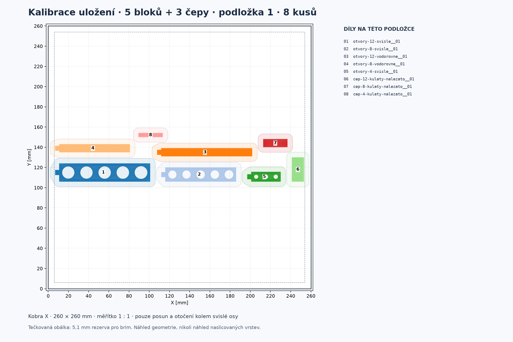

# Kalibrace: jedna připravená podložka

[Kalibrační podložka 3MF](kalibrace-podlozka-01.3mf) obsahuje přesně **8 samostatných objektů: pět bloků s otvory a tři čepy**. Každý kus je již vložen jednou; další kopie nepřidávej. Tyto vzorky jsou samostatné a nepatří do počtu dílů hlavního autíčka.

V prázdném projektu Anycubic Slicer Next zvol **Anycubic Kobra X 0.4 nozzle** a skutečný filament, potom načti tuto jedinou 3MF. Pokud se objeví volba, použij **Import geometry only**. Zachovej 100 % měřítko a uložené orientace; Arrange ani Auto orient nejsou potřeba. Soubor obsahuje pouze geometrii a polohy, bez tiskových nastavení a G-code.

Jiří hlásí změnu běžné vrstvy z 0,20 na **0,08 mm** a chce zachovat horní vzor **Monotonic line**. Po importu si tato nastavení ověř: geometry-only 3MF je nenastavuje. Živě přečtený systémový profil Kobra X 0,4 mm dovoluje 0,08–0,28 mm; proces Standard má běžnou i první vrstvu 0,20 mm a horní vzor `monotonicline`. První vrstva je samostatná hodnota — hlášení o změně běžné vrstvy nepotvrzuje její změnu. [Evidence profilu](../profil-podlozky.json) nerozhoduje o neuložených hodnotách v okně a nepotvrzuje G-code či fyzický tisk. Jemnější vrstva zmenšuje schody ve směru Z; sama nepotvrzuje přesnější XY otvory, ozubení ani nižší změřené tření. Kalibraci a finální díly vytiskni se shodnými skutečnými nastaveními.

**Všechny tři čepy (čísla 6–8 v náhledu) potřebují podpory spodního oblouku.** Zůstaly naležato jako plné válce; balení jejich tvar ani tiskovou orientaci nezměnilo. Před tiskem nastav lokální podpory a zkontroluj skutečné dráhy, jejich dosah i přilnavost v náhledu vrstev. Podpory zde nebyly naslicovány ani ověřeny. Nastavení a následné opracování musí odpovídat zkoušeným finálním dílům; [výběr otvorů a vyhodnocení](../../kalibrace/README.md).

Geometrické rozložení zachovává minimálně **11,016 mm mezi konvexními obálkami dílů** a **6,875 mm od okraje** podložky 260 × 260 mm. Po rezervě 5,1 mm kolem každého dílu zůstává minimálně 0,816 mm mezi obálkami brimů. To odpovídá přečtenému systémovému defaultu brim 5 mm + mezera 0,1 mm, bez skirtu. Nejde o potvrzení nastavení otevřeného okna ani libovolných stromových podpor.

Ověření:

- [Počty](overeni-kusovniku.json): osm skutečných zobrazených CAD objektů = kusovník = osm bitově shodných STL kopií v ZIPu = osm samostatných 3MF objektů.
- [Geometrie 3MF](overeni-3mf.json): všech 11 140 původních trojúhelníků, mm, 1:1, Z0 beze změny, pouze rigidní XY posuny a rotace kolem Z.
- [Vzdálenosti](overeni-rozlozeni.json): všech 28 dvojic a okraje podložky.
- [Import/export](overeni-importu.json): místní CLI Anycubic Slicer Next v oddělené cache zachoval osm názvů, všechny indexy trojúhelníků a polohy s maximální číselnou odchylkou 0,000016 mm. Neběžel slicing, nebyl vygenerován G-code ani oslovena tiskárna. Export z CLI se uživateli nedodává, protože doplňuje vlastní defaulty.

