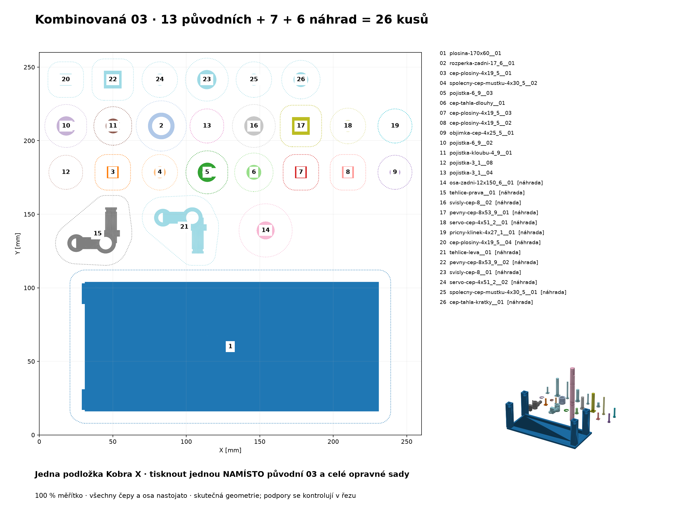
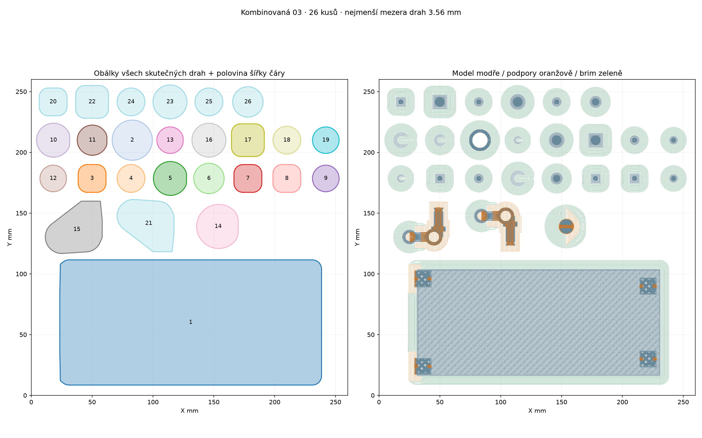

# Kombinovaná 03: zbývající díly a potvrzené náhrady

**Jedna připravená podložka, 26 kusů.** Otevři [nastavený projekt Anycubic Slicer Next](auticko-25-kombinovana-03-nastaveny-projekt.3mf) jako celý projekt. Obsahuje **13 dosud netištěných dílů původní 03 + 7 náhrad první várky + 6 náhrad druhé**. Všechny kopie jsou rozmístěné, čepy a zadní osa stojí podélně v Z, měřítko je 100 %.

Tuto podložku tisknout **jednou**. Následně už netisknout samostatnou původní03 ani tři podložky sedmidílného dotisku — vznikly by duplicity. Žádný tisk z tohoto projektu zatím nebyl spuštěn ani fyzicky ověřen.

## Co ještě není rozhodnuté

26 kusů je uzavřený výběr pro tuto podložku, **ne potvrzení kompletní použitelné sestavy**. Čeká se na boční detail motorového dorazu rámu, potvrzení zachovaného víka objímky páčky a obou motorových klínků. Tyto položky nejsou do26 přidané bez důkazu. Pokud rám vyžaduje náhradu, je nutné připravit další rozložení a skutečný řez; nynější projekt jej neobsahuje.

Druhá várka byla skutečně dokončená. Fotografie `20260920_185846.jpg` ukazuje původní02 na podložce, `20260920_192335.jpg` zachované díly **obou** várek. Z druhé patří do oprav levá těhlice a pět samostatných čepů. Pravá těhlice už je v prvních sedmi. Oba motorové můstky jsou viditelné, další se nepřidává. Počet úlomků vadných čepů není počet dalších konstrukčních dílů. [Podrobný inventář a hash fotografií](inventar-druhe-varky.json).

## Použití v Anycubic Slicer Next

1. Otevři výše uvedený soubor **jako celý projekt**, aby se načetla i objektová nastavení podpor. Projekt má26 samostatných objektů na jedné podložce.
2. Tiskárna je **Anycubic Kobra X, tryska0,4mm**, tisk po vrstvách. Zachovej měřítko100 %, nepoužívej automatické rozmístění ani otočení a nepřidávej STL/ZIP.
3. Materiálový podklad je systémový **Anycubic PLA pro Kobra X**, nikoli kalibrovaný Alzament. Zkontroluj skutečnou cívku Alzament PLA Basic a její slot; barva náhledu jej nepotvrzuje.
4. Proveď Slice a prohlédni vrstvy. Lokální kontrolní řez již proběhl se stejnou geometrií a nastavením. Změna vrstvy, procesu nebo podpory vyžaduje novou kontrolu. Projekt neobsahuje G-code a sám tisk nespouští.

[Geometry-only alternativa](auticko-25-kombinovana-03-geometrie.3mf) je pouze pro vědomé použití vlastního procesu; **nenese podpory ani profil**. Neotevírat současně obě varianty.

## Uložený proces

- Vrstva **0,12mm**, první0,20mm, první rychlost20mm/s. Podložka60°C, tryska220°C první /205°C další. Jde o hodnoty systémového profilu, ne o měření této cívky.
- **Plošina:2 stěny a15 % 3D honeycomb**, vnější stěny60 /vnitřní150mm/s. Není omylem vyplněná na100 %.
- **Ostatních25 dílů:4 stěny a100 % rectilinear**, vnější30 /vnitřní50 /malé obvody20mm/s. Zadní osa má ještě pomalejší vnější20 /vnitřní30 /malé15mm/s.
- Zrychlení500mm/s², vnější stěna osy300mm/s². Brim8mm, osa12mm, mezera0,1mm. Brim pomáhá přilnavosti, nenahrazuje podpory ani nezaručuje stabilitu150,6mm vysoké osy.
- **Podpory pouze plošina, osa, pravá a levá těhlice.** Normal auto /Snug, práh45°, také na modelu, malé převisy neignorovat, rozhraní3 vrstvy, horní/dolní mezera0,12mm aXY0,35mm. Zbylých22 objektů má podpory vypnuté.

Odhad skutečného společného řezu: **19h37min17s /120,09g**. Je to odhad sliceru; upřednostňuje jednu podložku a opatrnější pohyb kvůli vysoké ose. Doba není fyzicky naměřená ani součet starších samostatných odhadů.

## Podpory a mechanické meze

Plošina má oporu spodních převisů a příčných otvorů všech čtyř noh. Obě těhlice mají podpory pod vyloženým tělem/osou a také uvnitř otevřených kapes nad částí modelu; podpory jsou v řezu skutečně vygenerované, nikoli jen doporučené. Po tisku je nutné očistit funkční plochy a otvory.

Zadní osa stojí na D čele. Podporovaný je přechod D plošky kolemZ19,3 a příčný otvorØ4,1 se středemZ52,3. Slicer vytvořil i tenké podporové prstence v pojistných drážkách; vyčistit před montáží. Otvor je přístupný z obou stran, ale snadnost odstranění, tuhost vysokého dílu a pevnost vrstev zatím výtiskem ověřené nejsou. Svislý tisk neznamená obecně větší pevnost v ohybu.

Čepy stojí na rozšířených hlavách. Jejich malé horní okraje pojistných drážek zůstávají bez podpory. Rozměry CAD/STL nejsou změněné; jde pouze o rigidní rotace a posuny.

## Ověření

- Přesně26 unikátních kopií podle původního66kusového kusovníku:13 +7 +6. Zdroj každé kopie je ověřen SHA256 proti kanonickému ZIPu.
- Mesh geometrií, nastaveného projektu a skutečně naslicovaného projektu má stejné trojúhelníky a odchylku vrcholů nejvýše0,000011807mm. Všechny modely mají skutečné extruze do své plné výšky s tolerancí jedné vrstvy.
- Obálky **všech modelových, podporových a brim drah**, rozšířené o polovinu největší šířky čáry daného objektu, jsou vzájemně oddělené. Nejmenší odstup **3,56mm**, nejmenší okraj od tiskové plochy **4,39mm**. Startovací/custom pohyby se do této geometrické kontroly nepočítají.
- Stejná objektová nastavení před řezem i po něm. Jediná globální normalizace Next je doplnění třetí nuly v `machine_max_junction_deviation`; není skrytou změnou podpor nebo rozměrů.
- Slicer hlásí `bed_temperature_too_high_than_filament` (podložka60°C proti profilové hranici54°C) a `not_support_traditional_timelapse`. Zůstávají zaznamenaná; nejde o výsledek bez varování.
- Fyzická přilnavost, odstranitelnost podpor, kruhovitost, pevnost a montáž nejsou prokázané počítačovou kontrolou. Tiskárna nebyla oslovena, osobní presety ani firmware nebyly upravené.

[Úplné ověření](overeni.json), [geometrie a původ každé kopie](rozlozeni.json), [přesné příkazy a objektová nastavení](evidence/prikazy.json), [zachování kanonických souborů](overeni-zachovani.json).





[Detail kritických vrstev](evidence/kriticke-vrstvy.png) překrývá oranžovou vrstvu podpory a modrou vrstvu modelu těsně nad ní; skutečné výšky obou jsou v titulku. U levé těhlice byly nezávisle ověřeny dvojice Z7,04 /7,28, Z10,88 /11,12 a Z16,52 /16,76 mm.

## Kusovník této jedné podložky

| Číslo v náhledu | Kopie | Původní podložka / číslo | Důvod |
|---:|---|---|---|
| 1 | `plosina-170x60__01` | 03 / 1 | Dosud netištěná03 |
| 2 | `rozperka-zadni-17_6__01` | 03 / 2 | Dosud netištěná03 |
| 3 | `cep-plosiny-4x19_5__01` | 03 / 3 | Dosud netištěná03 |
| 4 | `spolecny-cep-mustku-4x30_5__02` | 03 / 4 | Dosud netištěná03 |
| 5 | `pojistka-6_9__03` | 03 / 5 | Dosud netištěná03 |
| 6 | `cep-tahla-dlouhy__01` | 03 / 6 | Dosud netištěná03 |
| 7 | `cep-plosiny-4x19_5__03` | 03 / 7 | Dosud netištěná03 |
| 8 | `cep-plosiny-4x19_5__02` | 03 / 8 | Dosud netištěná03 |
| 9 | `objimka-cep-4x25_5__01` | 03 / 9 | Dosud netištěná03 |
| 10 | `pojistka-6_9__02` | 03 / 10 | Dosud netištěná03 |
| 11 | `pojistka-kloubu-4_9__01` | 03 / 11 | Dosud netištěná03 |
| 12 | `pojistka-3_1__08` | 03 / 12 | Dosud netištěná03 |
| 13 | `pojistka-3_1__04` | 03 / 13 | Dosud netištěná03 |
| 14 | `osa-zadni-12x150_6__01` | 01 / 8 | Náhrada první várky |
| 15 | `tehlice-prava__01` | 01 / 11 | Náhrada první várky |
| 16 | `svisly-cep-8__02` | 01 / 12 | Náhrada první várky |
| 17 | `pevny-cep-8x53_9__01` | 01 / 13 | Náhrada první várky |
| 18 | `servo-cep-4x51_2__01` | 01 / 14 | Náhrada první várky |
| 19 | `pricny-klinek-4x27_1__01` | 01 / 17 | Náhrada první várky |
| 20 | `cep-plosiny-4x19_5__04` | 01 / 19 | Náhrada první várky |
| 21 | `tehlice-leva__01` | 02 / 4 | Náhrada druhé várky |
| 22 | `pevny-cep-8x53_9__02` | 02 / 11 | Náhrada druhé várky |
| 23 | `svisly-cep-8__01` | 02 / 12 | Náhrada druhé várky |
| 24 | `servo-cep-4x51_2__02` | 02 / 16 | Náhrada druhé várky |
| 25 | `spolecny-cep-mustku-4x30_5__01` | 02 / 22 | Náhrada druhé várky |
| 26 | `cep-tahla-kratky__01` | 02 / 23 | Náhrada druhé várky |

## Reprodukce

Z kořene `/home/novakj/3d-print` spustit postupně s Pythonem obsahujícím numpy, trimesh, shapely a matplotlib:

```bash
/home/novakj/.cache/auticko-packing/venv/bin/python models/auticko-silovy-prevod-25/rozlozeni/kombinovana-03-2026-09-20/pripravit.py
/home/novakj/.cache/auticko-packing/venv/bin/python models/auticko-silovy-prevod-25/rozlozeni/kombinovana-03-2026-09-20/projekt.py
/home/novakj/.cache/auticko-packing/venv/bin/python models/auticko-silovy-prevod-25/rozlozeni/kombinovana-03-2026-09-20/overit.py
```

Generátor přepisuje pouze soubory této kombinované varianty. Čte kanonický66kusový ZIP, aktuální manifest a ověřené rotace sedmidílné opravy. Nesliceuje do původních01/02/03 a nemění CAD/STL. CLI data, diagnostický G-code a logy jsou v ignorované `.cache/kombinovana-03-2026-09-20/`. Kanonická orientace všech nových čepů z druhé várky i obou těhlic je Y−90° vůči STL; poloha je explicitní v generátoru.
