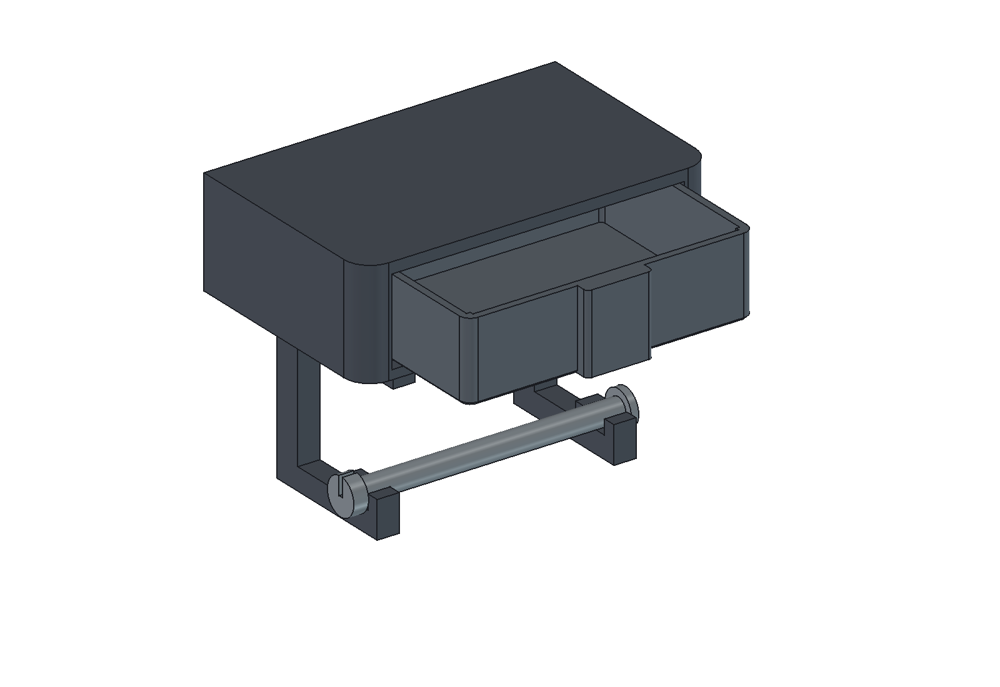

# Držák toaletního papíru s čelním šuplíkem

Tiskový **prototyp** podle fotografie „Compartment Toilet Paper Holder“, kterou Jiří poslal 24. 9. 2026. Fotografie nemá měřítko ani technické rozměry. Černý obdélník na horní ploše je samostatný telefon. Tento vlastní návrh má pevnou horní odkládací plochu, lehce výsuvný šuplík s integrovaným úchopem a dvě boční ramena pro roli. Všechny rozměry níže jsou návrhové, nikoli změřené z předlohy.

## Soubory k použití

- [Parametrický FreeCAD model](drzak.FCStd), [zdrojové makro](drzak.FCMacro), [CAD sestava](nahled-sestava.png), [CAD náhled s ilustrační rolí](nahled-s-roli.png) a [měření/validace modelu](kontrola-modelu.json).
- [Podložka 01 – schránka a dvě ramena](rozlozeni/drzak-podlozka-01-nastaveny-projekt.3mf): tři fyzické kusy.
- [Podložka 02 – šuplík, osa a pojistná zátka](rozlozeni/drzak-podlozka-02-nastaveny-projekt.3mf): tři fyzické kusy.
- [Přehled podložek, očíslované náhledy a proces](rozlozeni/README.md). Každou `.3mf` podložku otevři samostatně **jako celý projekt**, jednou, bez ručního přerovnávání nebo množení.
- [Pět STL typů](stl/) pro případné další úpravy; `bracket.stl` je v připraveném projektu 2×.

Původní návrh s odnímatelným víkem je výslovně označený jako [historická varianta](historie/prvni-navrh-s-vikem/README.md). Pro aktuální sestavu použij jen soubory z této složky a jejích `stl/` a `rozlozeni/`.

## Návrhové rozměry a vůle

| Věc | Návrhová hodnota | Fyzická zkouška |
|---|---:|---|
| Schránka vně | 190 × 120 × 58 mm | prostor u stěny |
| Pevná horní deska | 6 mm | průhyb při odložení telefonu |
| Čelní otvor | 158 × 47 mm | stav hran po tisku |
| Šuplík vně, bez úchopu | 155,6 × 114 × 43 mm | volný chod po tisku |
| Užitný prostor šuplíku, bez zaoblení | přibližně 147,6 × 106 × 39 mm | zda vyhovuje ukládaným věcem |
| Boční vůle | **1,2 mm na každé straně** | změnit podle skutečného tisku |
| Vůle pod stropem | **1,2 mm** při vyrovnané poloze modelu | zda čelo nedrhne |
| Montážní svislá vůle nad lištami | **0,8 mm** v nezatížené CAD poloze | vlastní tíha usadí dno na lišty; ověřit klouzání |
| Vodítka | 2× lišta široká 5 mm, vysoká 2 mm | očistit případné přetoky vrstev |
| Vzdálenost vnitřních ploch ramen | 116 mm | role široká nejvýše 112 mm |
| Prostor role | návrh pro roli do Ø120 mm; náhled Ø110 × 110 mm | skutečný rozměr role |
| Osa / dutinka role | osa jmenovitě Ø12 mm; dutinka nejméně Ø13 mm | volný běh konkrétní role |
| Otvory do stěny | 130 mm vodorovně, Ø5,5 mm | podklad, vruty a kotvy |

Boční vůli lze snadno měnit v tabulce `Parameters` v FCStd položkou **SlideClearance** (výchozí 1,2 mm). Odvodí se z ní šířka šuplíku a montážní poloha, takže se drží stejná vůle vlevo i vpravo. `RailGap` je samostatná výchozí hodnota 0,8 mm pro volné zavedení a toleranci vrstvy; při vložených věcech se šuplík opře o úzké lišty. Ve FreeCADu jsou lišty v příčných intervalech x = 19–24 a 166–171 mm, dno šuplíku sahá od x = 17,2 do 172,8 mm; na jeho spodní ploše tedy zbývá 1,8 mm od každé boční hrany k nejbližší liště. Lišty míjejí zahloubení šroubů M4 nejméně o 2,4 mm. Mají zaoblené čelní konce a zadní spodní hrana zásuvky je sražena 1,5 mm. Vodítka mají omezenou kontaktní plochu; mechanismus nemá tuhou západku.

Šuplík se dá **celý vytáhnout** směrem dopředu. To je úmyslný způsob úplného vyjmutí pro čištění a pro přístup ke šroubům, takže při vysunutí nadoraz je třeba jej držet rukou. Ve FreeCAD sestavě byly změřeny nominální mezery 1,2 mm vlevo/vpravo a nahoře, 0,8 mm nad lištami a 1,0 mm za zadní hranou. Průnik schránky se šuplíkem je 0 mm³ v zavřené poloze i při posunech 25, 50, 75, 100 a 114 mm; podrobnosti jsou v `kontrola-modelu.json`. Stejná kontrola bez průniku prošla i po snížení šuplíku o 0,8 mm na pracovní dosednutí k lištám. **Skutečný lehký chod a potřebná korekce vůle lze potvrdit až po fyzickém tisku.** Při změně `SlideClearance` se přepočítá šuplík, ale tvar schránky zůstane stejný; po prvním výtisku proto případná oprava boční vůle vyžaduje novou podložku pouze pro upravený šuplík, nikoli nový tisk velké schránky.

## Kusovník a montáž

Tisknout **1× schránku, 1× šuplík, 2× stejné rameno, 1× osu, 1× zátku** = šest kusů. Veškeré rozměry šroubů jsou návrhové: pro ramena **4× M4 × 25 mm se zápustnou hlavou do 9 mm**, odpovídající matice a podložky. Skrz dno schránky a horní pásy ramen jsou otvory Ø4,6 mm; hlavy zapadnou do kuželových zahloubení v horní ploše dna a nezachytávají šuplík. Vlož šrouby **zevnitř schránky dolů**, matice s podložkami utáhni pod rameny. Pro upevnění na stěnu počítej se **2× vrutem přibližně Ø5 mm se zápustnou hlavou do 11 mm** a hmoždinkami zvolenými podle skutečného podkladu. Jejich délka, druh stěny ani nosnost kotvení nejsou známy z fotografie. Hlavy jsou zapuštěné v zadní stěně a po vyjmutí šuplíku přístupné přímo čelním otvorem.

1. Vyndej šuplík. Ve schránce nasaď obě ramena čtyřmi M4; jejich ploché horní pásy patří pod dno a otevřená lůžka osy proti sobě. Zkontroluj, že hlavy šroubů sedí pod rovinou dna.
2. Na vhodné pevné stěně vyznač dva body 130 mm vodorovně, ověř podklad a zvol odpovídající kotvy. Schránku upevni přes zadní zápustné otvory. Před vrtáním ověř skryté vedení; obklad vyžaduje postup pro jeho materiál.
3. Zasuň prázdný šuplík zepředu. Náběhovou hranou jej veď mezi boční stěny na dvě úzké lišty. Zkus celý pohyb rukou a případné drobné otřepy po tisku začisti. Nenuť jej silou do těsného vedení.
4. Nasuň roli na osu, polož ji do obou otevřených lůžek a nasaď pružnou zátku na volný konec za pravým ramenem. Při výměně role zátku sejmout a osu vyjmout.

Střed osy je 73 mm pod dnem schránky; ideální role Ø120 mm má od dna přibližně 13 mm. Pružná zátka má návrhovou vůli; její odpor a bezpečné držení je třeba ověřit rukou. Širší nebo jumbo roli model před tiskem uprav v parametrech a znovu zkontroluj související délku osy a polohy ramen.

## Tisk, pevnost a stav ověření

Schránka je na STL položena **zadní stěnou na podložku** a její čelní dutina je při tisku otevřená nahoru. Skrytá zadní hrana je rovná v celé šířce 190 mm, aby první vrstvy měly plnou oporu; pohledové přední rohy zůstávají zaoblené. Pevný strop tak nevytváří dlouhý nepodepřený most. Šuplík se tiskne dnem dolů, včetně úchopu od první vrstvy. Ramena se tisknou **naplocho na boční ploše**, aby obrys nosného pásu a stojiny ležel v rovině vrstev. Pro orientační kontrolu spodního pásu 12 × 12 mm: při předpokládaných 10 N na jediném rameni a délce 61 mm vychází prostým nosníkovým vzorcem asi 2,1 MPa nominálního ohybového napětí. Tento výpočet neověřuje spoje, vrstvy, šrouby, vytržení ze stěny ani sílu při trhání papíru.

FreeCAD potvrdil pět platných jednodílných tvarů a uzavřená STL. Uložený FCStd se znovu otevřel a přepočítal při změně šířky těla 190 → 194 → 190 mm a boční vůle 1,2 → 1,6 → 1,2 mm. Další ověření tiskových projektů a vrstev je v [README podložek](rozlozeni/README.md). **Skutečný tisk, montáž, plynulý chod šuplíku, pasování zátky a role, zatížení horní plochy ani kotvení ke konkrétní stěně nejsou fyzicky ověřené.** Odložení jednoho běžného telefonu asi do 250 g v klidu je pouze návrhový předpoklad, nikoli ověřená nosnost. PLA nevystavuj přímému ostřiku ani dlouhodobému horku.

[drzak.FCMacro](drzak.FCMacro) přepisuje FCStd, pět STL a kontrolní JSON. Při změně parametrů přímo v FCStd slaď také zdrojové hodnoty v makru; pak obnov STL, CAD náhledy a obě 3MF podložky. [nahled.FCMacro](nahled.FCMacro) vytváří tři CAD PNG a ukládá viditelnou sestavu. Generátory tiskových podložek jsou ve složce `rozlozeni/`.
