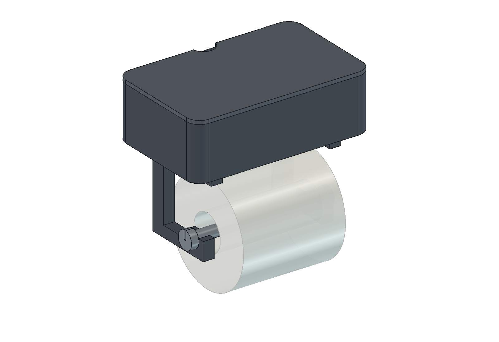

# Archiv: první návrh s odnímatelným víkem

Toto je **starší varianta**. Jiří ji nahradil požadavkem na čelní výsuvný šuplík. Aktuální model, STL a připravené podložky jsou v nadřazené složce modelu. Archiv je ponechán jen pro dohledání původního návrhu; jeho tiskové projekty neotevírejte jako aktuální sestavu.

# Držák toaletního papíru s přihrádkou

Tiskový **prototyp** podle uživatelem dodané fotografie „Compartment Toilet Paper Holder“ ze dne 24. 9. 2026. Fotografie nedává měřítko ani technické rozměry. Černý obdélník na víku je samostatný telefon. Model je vlastní konstrukce s podobně zaoblenou schránkou a snímatelným víkem. Fotografie naznačuje jednostranný držák role; tento model má **dvě boční ramena**, protože jejich plochý tisk a rozdělení tahu jsou pro první funkční prototyp rozumnější. Žádný rozměr níže není měřením předlohy.

## Soubory k použití

- [Držák – parametrický FreeCAD](drzak.FCStd), [zdrojové makro](drzak.FCMacro), [CAD náhled bez role](nahled-sestava.png) a [kontrola modelu](kontrola-modelu.json).
- [Podložka 01 – schránka a dvě ramena](rozlozeni/drzak-podlozka-01-nastaveny-projekt.3mf): tři fyzické kusy.
- [Podložka 02 – víko, osa a pojistná zátka](rozlozeni/drzak-podlozka-02-nastaveny-projekt.3mf): tři fyzické kusy.
- [Přehled obou podložek, očíslované obrázky a profil](rozlozeni/README.md). Každou `.3mf` podložku otevři **samostatně jako celý projekt**, jednou, bez dalšího množení a přerovnávání dílů.
- [STL jednotlivých pěti typů](stl/) pro pozdější úpravy. `bracket.stl` je potřeba **dvakrát**; obě kopie již jsou v podložce 01.

## Návrhové rozměry a předpoklady

| Věc | Návrhová hodnota | Co ověřit fyzicky |
|---|---:|---|
| Schránka vně | 190 × 120 × 58 mm | místo u stěny, přístup k víku |
| Vnitřní prostor | nejvýše 182 × 111 × 53 mm, zaoblené rohy | obsah a užitečná výška |
| Stěny / dno | 4–5 / 5 mm | pevnost a chování PLA v koupelně |
| Odnímatelné víko | 4 mm deska, 5 mm zasouvací lem, vůle 0,5 mm na stranu | nasazení, volnost a vyjmutí prstem |
| Vzdálenost vnitřních ploch ramen | 116 mm | role šířky nejvýše **112 mm** |
| Prostor role | návrh pro běžnou roli do Ø120 mm; náhled ukazuje Ø110 × 110 mm | průměr a šířka konkrétní role |
| Osa | jmenovitě Ø12 mm; dutinka role alespoň Ø13 mm | volný běh a tření konkrétní dutinky |
| Rozteč otvorů do stěny | 130 mm vodorovně, otvory Ø5,5 mm | materiál stěny, kotvy a vhodná místa vrtání |
| Zamýšlené odložení na víku | jeden běžný telefon asi do 250 g v klidu | prohnutí víka, skluz a celkovou bezpečnost uchycení |

Ramena stojí pod schránkou. Střed osy je 73 mm pod dnem, takže ideální role Ø120 mm má od dna asi 13 mm mezery. Skutečná role může sedět na ose excentricky podle velikosti kartonové dutinky. U širších nebo jumbo rolí model před tiskem upravit v tabulce `Parameters` a znovu přepočítat; související délku osy a umístění ramen po změně zkontrolovat. Zámek zátky má úmyslně těsnou návrhovou vůli, ale výsledek závisí na přesnosti tiskárny a PLA.

## Kusovník a montáž

Tisknout **1× schránku, 1× víko, 2× stejné rameno, 1× osu a 1× zátku** = šest kusů. Pro spojení ramen je návrhově potřeba **4× šroub M4 × 25 mm**, odpovídající matice a podložky; nejsou součástí tisku. Skrz dno schránky a horní pásy ramen jdou otvory Ø4,6 mm. Šrouby zavést zespodu a matice utáhnout uvnitř otevřené schránky. Na stěnu jsou potřeba **2× vrut přibližně Ø4–5 mm s vhodnou hlavou/podložkou** a hmoždinky zvolené podle konkrétní stěny; typ, délka, podklad ani nosnost kotvení nejsou z fotografie známy. Hlavy vrutů zůstávají přístupné uvnitř schránky po sejmutí víka.

1. Na vhodné pevné stěně vyznačit vodorovně 130 mm, vybrat odpovídající kotvy a upevnit prázdnou schránku přes zadní otvory. Neprovrtat skryté vedení; u obkladu zvolit postup pro jeho materiál.
2. Při otevřeném víku připevnit obě ramena čtyřmi šrouby M4, s plochými dolními pásy orientovanými dopředu a dorazy pro osu proti sobě.
3. Nasunout roli na osu, položit osu do obou otevřených lůžek zepředu a zkontrolovat, že obě strany sedí. Pružnou zátku nasadit na volný konec za pravým ramenem. Její odpor a bezpečné držení ověřit rukou před provozem.
4. Víko nasadit lemem do schránky; půlkruhový úchop je vpředu. Při výměně role sejmout zátku, vyjmout osu a roli vyměnit.

## Pevnost, tisk a stav důkazů

Rameno se tiskne **naplocho na boční ploše**, profil dolního nosného pásu leží v rovině vrstev. Pro orientační kontrolu: dolní pás 12 × 12 mm, záměrně nadsazená síla **10 N na jediné rameno** a konzervativní délka 61 mm dávají prostým nosníkovým vzorcem přibližně **2,1 MPa nominálního ohybového napětí**. To není zkouška výtisku, šroubových otvorů, vrstev ani stěny a nezaručuje nosnost. Dvě ramena v sestavě sdílejí skutečné zatížení jen tehdy, když jsou dobře namontovaná.

Výpočet FreeCADu potvrdil u každého typu jedno platné těleso a uzavřenou STL síť; uložený FCStd byl znovu otevřen a přepočítán po změně šířky 190 → 194 → 190 mm. Obě podložky se v místním Anycubic Slicer Next 2.0.0.5 nařezaly pro **Kobra X 0,4 mm**; skutečné dráhy obsahují šest objektů, lem, všechny vrstvy a žádnou podporu. Krátké nepodložené mosty otvorů v těle a ramenech mají v G-code jednotlivé úseky nejvýše asi 5,7 mm. Delší úseky klasifikované slicerem jako *Internal Bridge* jsou nad řídkou výplní; jejich délka není volným rozpětím otvoru. Detaily, odhady a varování jsou v [kontrole podložek](rozlozeni/README.md).

**Tisk, pevnost, přilnavost, pasování víka/zátky/role, snadná výměna, zatížení telefonu ani kotvení na konkrétní stěnu nebyly fyzicky ověřeny.** PLA profil je návrhový výchozí bod v rozsazích dodavatele, ne kalibrace cívky. V koupelně se vyhnout přímému ostřiku, dlouhodobému horku a silnému páčení za víko; další revizi určit podle první montáže.

Makro [drzak.FCMacro](drzak.FCMacro) při spuštění přepisuje tento FCStd, pět STL a kontrolní JSON. Po změně tabulky v již otevřeném FCStd je před další regenerací nutné upravit také hodnoty v makru a znovu vytvořit STL, náhledy a 3MF. [nahled.FCMacro](nahled.FCMacro) v GUI obnoví dvě PNG a uloží viditelnou sestavu. Generátory a kontroly podložek jsou ve složce `rozlozeni/`.
