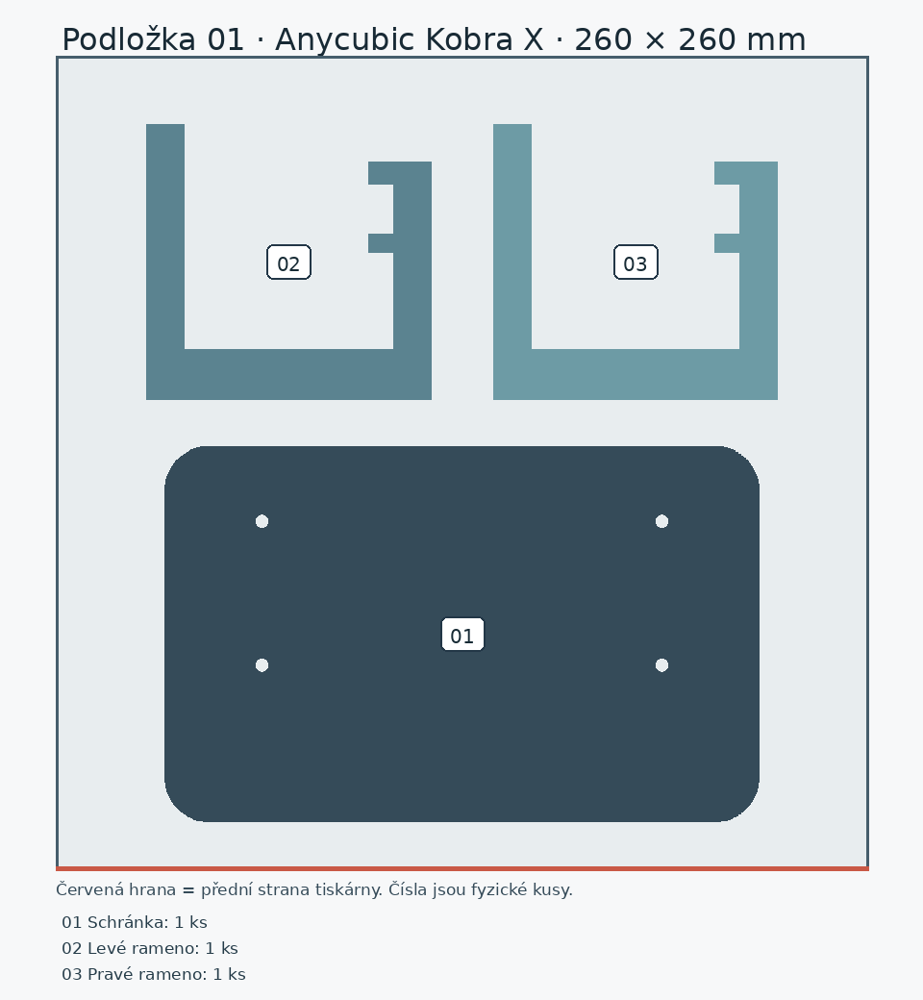
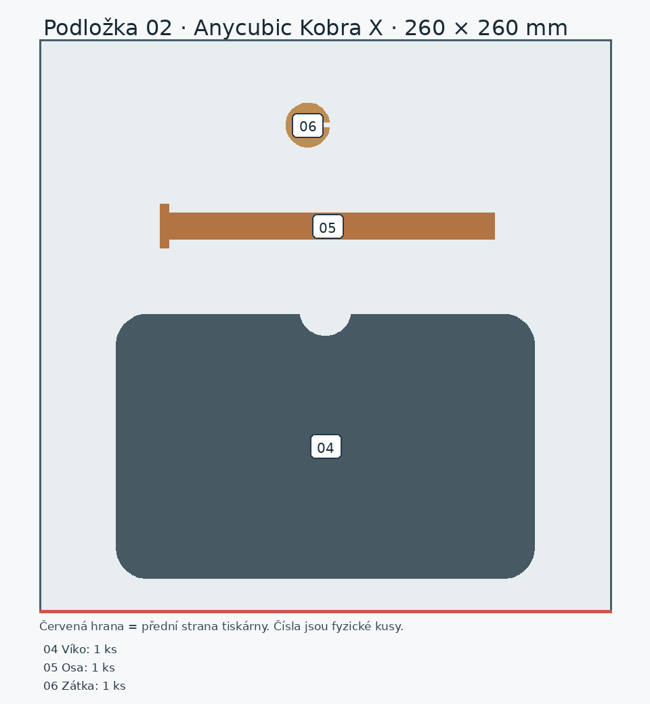
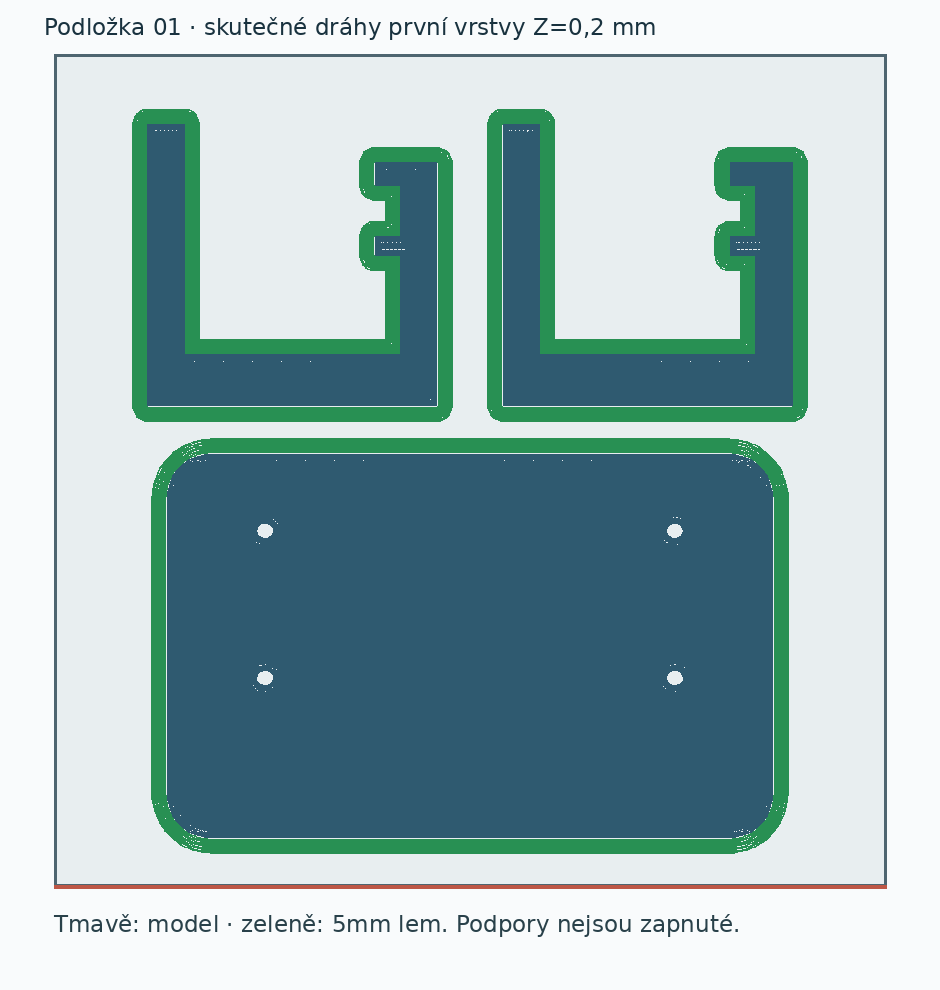
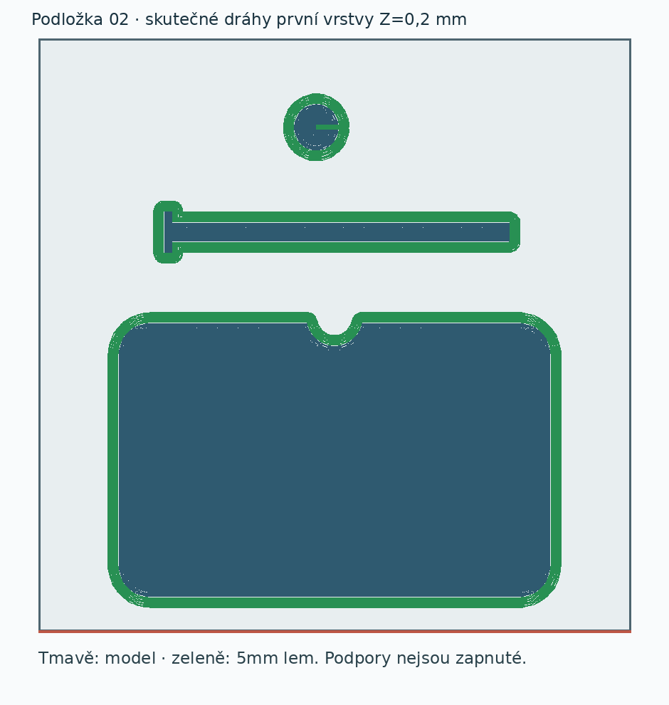

# Archivované podložky původní varianty s víkem

Tyto 3MF jsou starší návrh se snímatelným víkem. Aktuální čelně výsuvný šuplík a jeho tiskové podložky jsou v [hlavní složce modelu](../../../README.md) a jejím `rozlozeni/`.

# Připravené tiskové podložky – držák papíru s přihrádkou

Pro Anycubic **Kobra X, trysku 0,4 mm, prostor 260 × 260 × 260 mm** jsou připravené dvě samostatné podložky. Otevři **každou jako celý projekt** v Anycubic Slicer Next, jednou; neimportuj STL po kusech, nepoužívej automatické uspořádání a nic nemnož. Projekty obsahují skutečné rozmístění, proces, filamentový návrh a místně vytvořené dráhy G-code. Geometrické soubory `*-geometrie.3mf` jsou oddělená alternativa **bez** procesu, filamentu a drah; nejsou určené k přímému tisku bez další přípravy.

| Podložka | Hotový projekt | Fyzické kusy | Místní odhad sliceru |
|---|---|---:|---:|
| 01 | [Schránka + levé a pravé rameno](drzak-podlozka-01-nastaveny-projekt.3mf) | 3 | 11 h 49 min, 255,08 g |
| 02 | [Víko + osa + zátka](drzak-podlozka-02-nastaveny-projekt.3mf) | 3 | 4 h 07 min, 80,71 g |

Celkem **6 kusů z 5 typů STL**, odhad **15 h 56 min / 335,79 g**. Jde o odhad ze sliceru, ne o změřenou spotřebu nebo dokončený tisk. Před spuštěním ověř dostatek skutečného filamentu na zvolené cívce a mapování jejího fyzického vstupu. Starší černá cívka měla při posledním uživatelském odhadu asi 200 g, což nestačí ani na podložku 01; zůstatky jiných cívek zde nejsou potvrzené. Stav materiálu je v [kanonické evidenci](../../../docs/materialy.md).

| Číslo | Díl | Orientace při tisku | Podpory |
|---:|---|---|---|
| 01 | schránka | dnem na podložce, otevřená nahoru | vypnuté; malé vodorovné otvory ve stěně slicer přemosťuje |
| 02–03 | dvě stejná ramena | naplocho na boční ploše, nosný profil v rovině vrstev | vypnuté; otvory M4 se přemosťují |
| 04 | víko | pohledovou horní plochou na podložce, zasouvací lem nahoru | vypnuté |
| 05 | osa | podélně na záměrně zploštěné straně | vypnuté, 5mm lem pomáhá přilnavosti |
| 06 | zátka | uzavřeným dnem na podložce, otvor vzhůru | vypnuté, 5mm lem |

## Použitý návrhový proces

Místní systémový profil tiskárny **Anycubic Kobra X 0.4 nozzle** a standardní proces 0,20 mm byly výchozím základem. [Uložený vlastní proces](proces-kobra-x-pla-navrh.json) nastavil 0,20mm vrstvy, 4 stěny, 25% gyroid výplň, vnější stěnu 70 mm/s, vnitřní 100 mm/s, první vrstvu 25 mm/s, **5mm vnější lem** a podpory vypnuté. Vlastní [návrhový filamentový profil pro Alzament PLA Basic](filament-kobra-x-alzament-pla-basic-navrh.json) vychází ze systémového Anycubic PLA pro Kobra X: tryska **215 °C první vrstva / 205 °C další**, podložka **50 °C**. Hodnoty jsou v dodavatelských intervalech uvedených v [evidenci materiálu](../../../docs/materialy.md), **nejsou však na Jiřího konkrétní cívce kalibrované**. Zkontroluj skutečný typ PLA, slot/cívku a první vrstvu. Barva náhledu není důkaz výběru cívky.

## Místní kontrola

- [Kontrola geometrického rozložení](kontrola-rozlozeni.json): 3 + 3 fyzické objekty, měřítko 1:1, 15mm nejmenší odstup obálky modelu od okraje podložky před lemem.
- [Kontrola profilu a řezu](overeni-rezu.json): oba hotové soubory mají správnou tiskárnu a trysku, proces i filament, v ZIP je pro každou podložku skutečný G-code. Slicer hlásí `outside=false`, `support_used=false`; druhá podložka bez varování. První má pouze upozornění, že daný režim nepodporuje tradiční timelapse. Toto upozornění nemění dráhy modelu ani potvrzení tisku.
- [Kontrola skutečných drah](kontrola-drah.json): 6/6 objektů má dráhy modelu, první vrstvu a lem; žádná podpůrná dráha, žádné překrývání obálek. Nejmenší mezery obálek včetně šířky čáry jsou **5,62 mm** na podložce 01 a **17,65 mm** na 02; nejmenší okraj skutečné dráhy **10,31 mm**. Volné mosty otvorů měly jednotlivé úseky nejvýše **5,66 mm** v ramenech a **5,36 mm** v těle. Delší úseky označené jako `Internal Bridge` jsou nad výplní a nejsou důkazem stejného volného rozpětí.

Fyzická přilnavost, mosty v otvorech, zhotovení, pevnost, pasování a montáž **čekají na první tisk a zkoušku**. Před tiskem v Next ještě vizuálně prohlédni vrstvy u montážních otvorů, okraje ramen a dlouhou osu; případné odstranění lemu, začistění otvorů či úpravu zátky provádět až podle skutečného výsledku. K tiskárně nebyl odeslán žádný úkol.

Reprodukce v tomto projektu: [geometrické podložky](vytvor-podlozky.py) → [místní nastavení a řez](pripravit-projekty.py) → [audit G-code](overit-drahy.py). Skripty používají STL vedle FCStd a systémové profily. Návod na změnu CAD je v [README modelu](../README.md).
