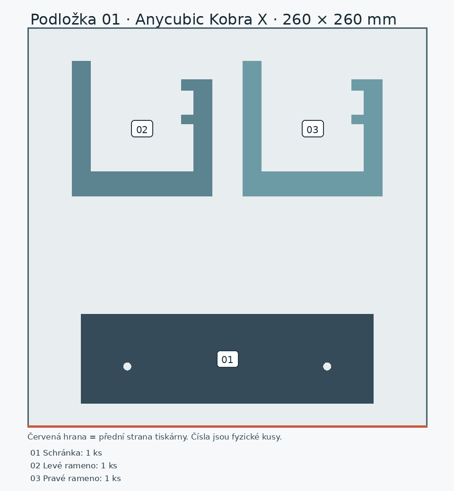
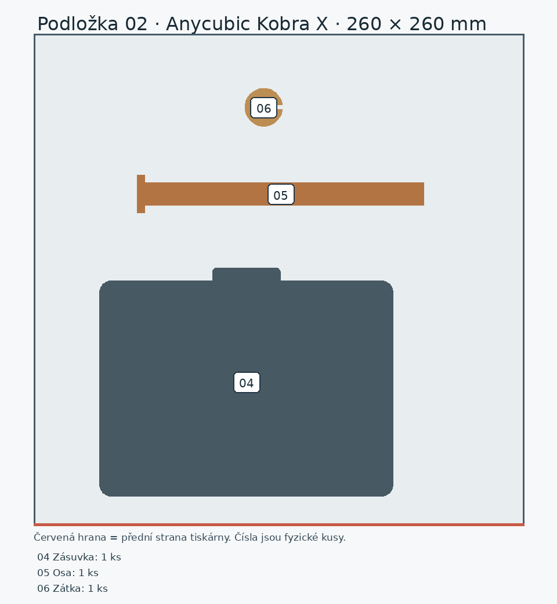
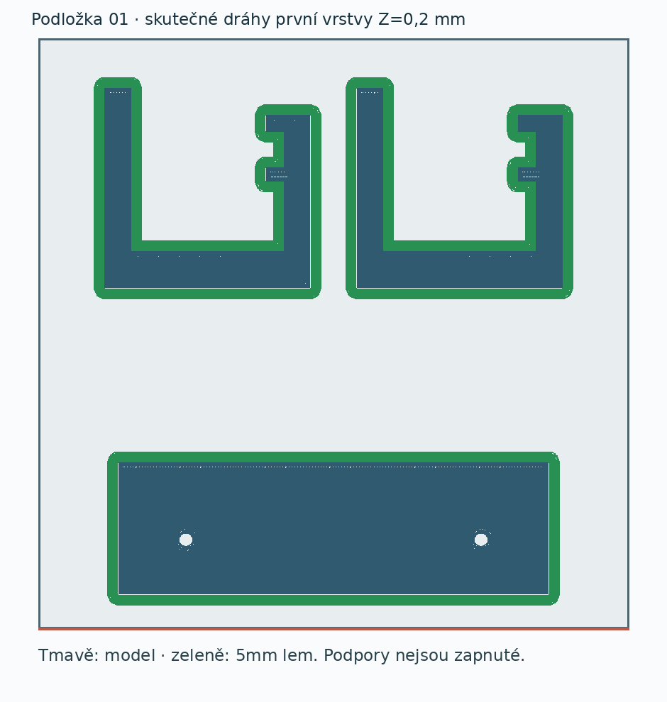
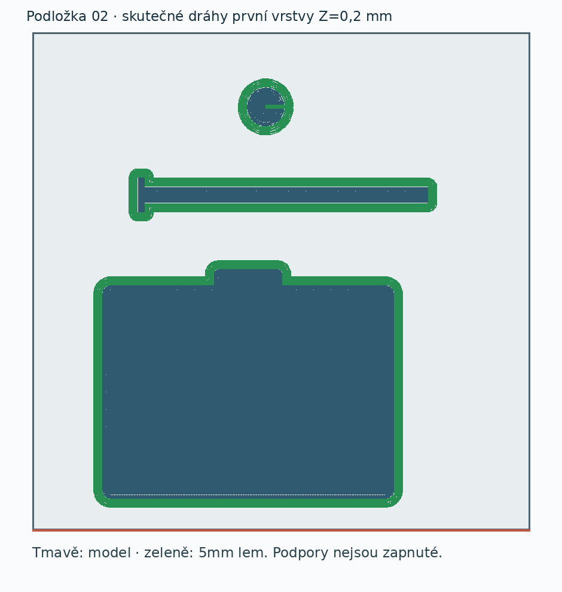

# Připravené podložky – držák papíru se zásuvkou

Pro **Anycubic Kobra X, trysku 0,4 mm** jsou připravené dvě samostatné 3MF podložky. Každou otevři **jednou jako celý projekt** v Anycubic Slicer Next. Není potřeba násobit díly, otáčet je ani je znovu rozmísťovat. Projekty obsahují rozložení, tiskový proces, návrhový PLA profil a místně vypočtený G-code. Soubory `*-geometrie.3mf` jsou oddělená alternativa bez procesu a G-code; samy nejsou připravenou tiskovou úlohou.

| Podložka | Celý tiskový projekt | Fyzické kusy | Místní odhad sliceru |
|---|---|---:|---:|
| 01 | [Schránka a dvě ramena](drzak-podlozka-01-nastaveny-projekt.3mf) | 3 | 16 h 46 min / 357,38 g |
| 02 | [Zásuvka, osa a zátka](drzak-podlozka-02-nastaveny-projekt.3mf) | 3 | 6 h 47 min / 151,92 g |

Celkem **6 kusů z 5 typů STL**, přibližně **23 h 33 min / 509,30 g** podle sliceru. Odhad není fyzicky změřená spotřeba. Množství filamentu na právě zvolené cívce není potvrzené; před tiskem zkontroluj její skutečný zůstatek. [Evidence materiálů](../../../docs/materialy.md) uvádí nákupy a jen některé odhady zůstatků.

| Číslo | Díl | Orientace při tisku | Podpory |
|---:|---|---|---|
| 01 | schránka | hranatou zadní stěnou na podložce; čelní dutina vzhůru | vypnuté; montážní otvory zůstávají průchozí |
| 02–03 | dvě stejná ramena | naplocho na boční ploše, nosný profil v rovině vrstev | vypnuté; volné mosty v otvorech nejvýše 5,67 mm |
| 04 | zásuvka | dnem a integrovaným úchopem na podložce, otevřená nahoru | vypnuté |
| 05 | osa | podélně na záměrně zploštěné straně | vypnuté |
| 06 | zátka | uzavřeným dnem na podložce, otvor vzhůru | vypnuté |

## Proces a materiál

[Návrhový proces](proces-kobra-x-pla-navrh.json) vychází ze systémových profilů Kobra X 0,4 mm a 0,20mm Standard. Nastavuje vrstvu **0,20 mm**, čtyři stěny, **25 % gyroid** výplň, vnější/vnitřní stěny 70/100 mm/s, první vrstvu 25 mm/s a **5mm vnější lem**. Podpory jsou vypnuté pro všechny díly; místní řez opravdu neobsahuje podpůrné dráhy. Lem slouží k přilnavosti, nenahrazuje podpory.

[Návrhový filamentový profil](filament-kobra-x-alzament-pla-basic-navrh.json) vychází ze systémového Anycubic PLA pro Kobra X. Má trysku **215 °C první vrstva / 205 °C další** a podložku **50 °C**. Tyto hodnoty spadají do dodavatelských intervalů pro Alzament PLA Basic v [evidenci](../../../docs/materialy.md), ale **nejsou kalibrací konkrétní cívky**. Barva modelu v náhledu neprokazuje výběr fyzické cívky ani jejího vstupu. Po otevření projektu zkontroluj materiál a přiřazení cívky, znovu proveď Slice a prohlédni první vrstvu a kritická místa.

## Místní ověření

- [Kontrola rozmístění](kontrola-rozlozeni.json): 3 + 3 skutečné kusy, měřítko 1:1, každá podložka má nejméně 15 mm prostoru k okraji před přidáním lemu.
- [Kontrola projektu a řezu](overeni-rezu.json): oba projekty mají správný model tiskárny, trysku, proces a PLA profil; každý obsahuje G-code. Slicer dokončil oba řezy bez varování, uvedl `outside=false` a `support_used=false`.
- [Kontrola skutečných drah](kontrola-drah.json): 6/6 objektů má modelové dráhy, první vrstvu i lem. Podpůrné dráhy chybí, obálky včetně šířky čáry se nepřekrývají. Nejmenší mezery jsou **10,62 mm** na podložce 01 a **17,65 mm** na 02; nejmenší okraj skutečné dráhy je **10,31 mm**. Slicer zachoval polohy a výšky zdrojových dílů.
- [Kritické vrstvy](kriticke-vrstvy.png) a [jejich hodnoty](kriticke-vrstvy.json): dlouhé dráhy označené `Internal Bridge` ve dně schránky a zásuvky leží nad řídkou výplní z předchozí vrstvy; jejich celková délka úseku není volným rozpětím dutiny. Stejně byl zkontrolován horní okraj schránky a čelo zásuvky. Skutečné volné mosty `Bridge` jsou jen v otvorech ramen, nejvýše **5,67 mm**. Po úpravě zadních rohů schránky slicer neoznačuje převisy na prvních vrstvách; její zbývající `Overhang wall` dráhy jsou u otvorů ve výškách 52,4 a 98,4 mm.

Fyzická přilnavost, kvalita krátkých mostů, snadnost vyjmutí zásuvky, pasování osy a zátky i pevnost kotvení **čekají na vytištění a zkoušku**. Žádná úloha nebyla odeslána tiskárně. Při použití celého projektu v Next projdi ve vrstveném náhledu zejména otvory ramen, vodicí lišty schránky, čelo zásuvky a první vrstvu, potom vyber skutečnou cívku a znovu nařež.

Reprodukce: [vytvoření geometrie podložek](vytvor-podlozky.py) → [nastavení a místní řez](pripravit-projekty.py) → [audit drah](overit-drahy.py) → [náhled kritických vrstev](nahled-kritickych-vrstev.py). Podkladem jsou STL a [CAD kontrola](../kontrola-modelu.json) ve složce modelu.
