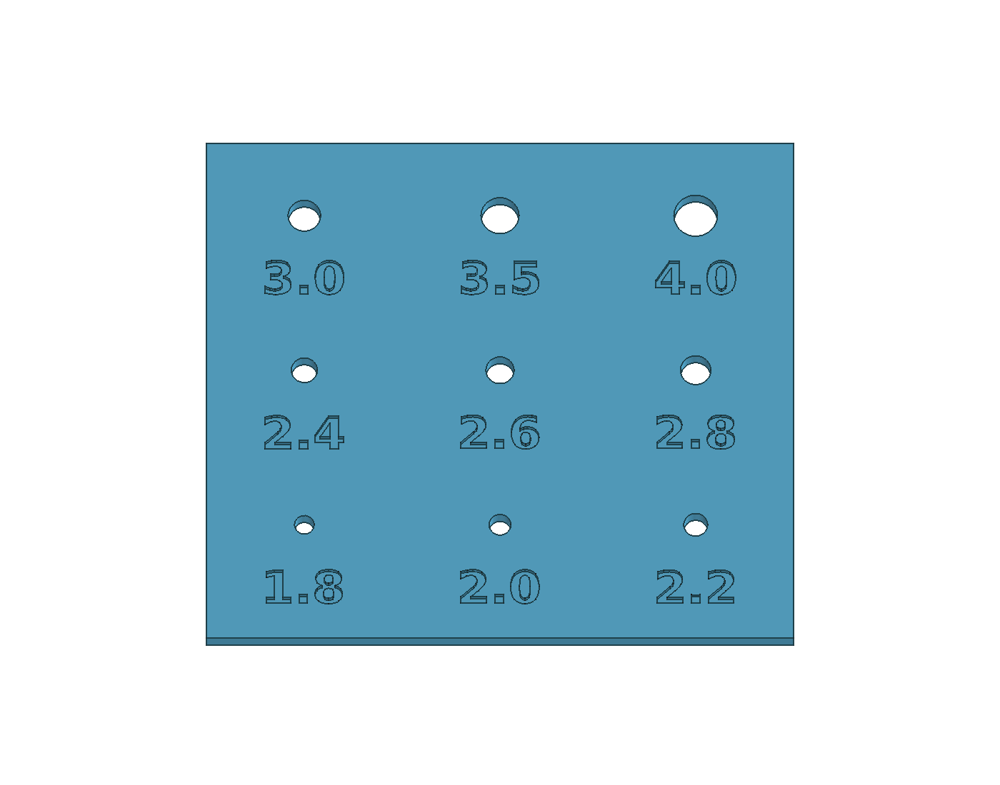
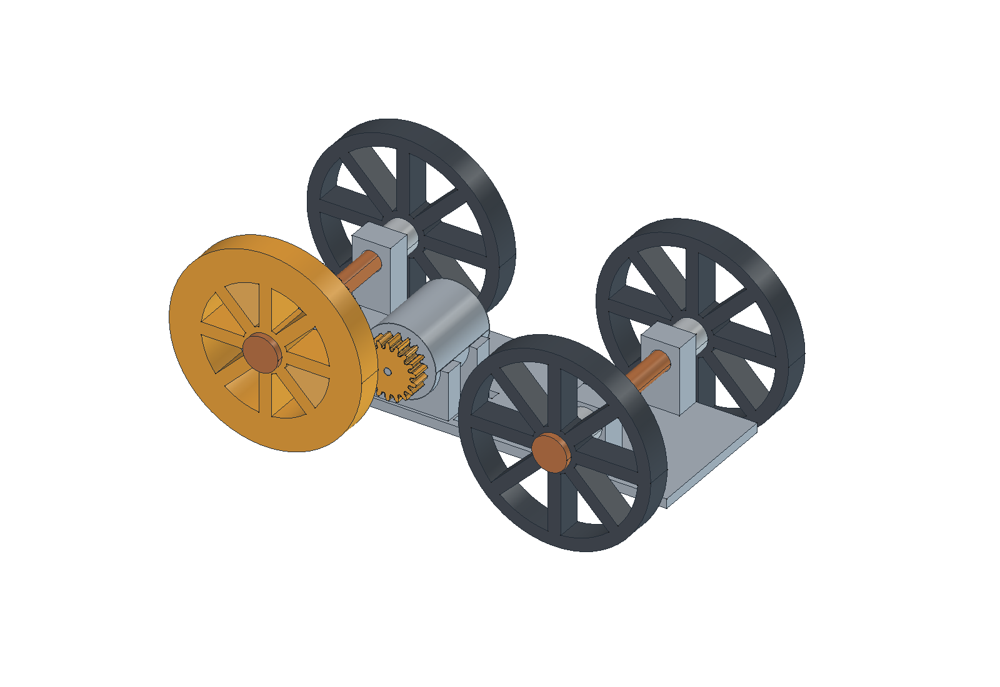

# Jednoduché autíčko s jedním motorem

Zadání uživatele z 19. 9. 2026. **Stav: první parametrický prototyp vytvořený a geometricky zkontrolovaný; fyzická montáž a pohon nejsou ověřené.** Uživatel na vytištěném zkušebním kusu potvrdil nasazení hřídelky do otvoru označeného **2,2 mm**. Podle toho byl upraven **[pastorek pro slicer](stl/pastorek.stl)**, zdrojové makro i sestava. Následuje tisk a zkouška celého pastorku; ostatní díly autíčka jsou připravené k tisku.

## Výsledek zkoušky hřídelky — otvor 2,2 mm

Původní vzorek Ø 0,9–1,3 mm podle uživatele nevyhověl: ani největší otvor nelze nasunout. Kontrola původního STL potvrdila průchozí otvor Ø 1,3 mm, takže export odpovídá původnímu návrhu. Skutečný průměr hřídelky, rozměry vytištěných otvorů ani příčina rozdílu zatím nejsou známé. Požadavek „aspoň dva“ znamená větší zkušební otvory, ne nové přesné měření hřídelky.

Na výslovné přání uživatele je vzorek nyní nižší: **54 × 48 × 2 mm**. Má devět průchozích otvorů a zapuštěná čísla o hloubce 0,6 mm. Čísla označují **nominální průměr v CADu**. Slouží jen k rychlé zkoušce vstupu hřídelky; otvor pastorku je dlouhý **5,5 mm**, takže průchod krátkým vzorkem ještě nepotvrzuje fit po celé délce pastorku ani přenos momentu.

| Spodní řada při čtení číslic | Prostřední řada | Horní řada |
|---|---|---|
| 1,8 / 2,0 / 2,2 mm | 2,4 / 2,6 / 2,8 mm | 3,0 / 3,5 / 4,0 mm |

- **[STL pro Anycubic Slicer Next](stl/vzorek-hridele-v2.stl)** — samostatný zkušební díl, měřítko **100 %**, rovnou spodní stranou dolů, číslicemi nahoru. Po importu ověřit rozměry 54 × 48 × 2 mm. Nezvětšovat celý model ve sliceru.
- [Editovatelný FreeCAD model](vzorek-hridele-v2.FCStd), [zdrojové makro](vzorek-hridele-v2.FCMacro), [kontroly](kontrola-vzorku-v2.json) a [makro skutečného náhledu](nahled-vzorku-v2.FCMacro).
- Ve sliceru zkontrolovat, že jsou všechny otvory průchozí a číslice čitelné; geometrie nevyžaduje podpory. Tiskový profil ani nové G-code zatím nejsou ověřené.
- Na vychladlém výtisku zkoušet jemně **od největšího otvoru k menším**. Zapsat číslo otvoru, který jde nasunout těsně bez násilí, a zda má vůli nebo se protáčí. Těsný fit ještě sám nedokazuje přenos momentu při jízdě.

**Ověření aktuálního souboru:** jeden platný solid, všech devět otvorů průchozích a STL po znovunačtení uzavřené v jedné komponentě. Tloušťka 2 → 2,5 → 2 mm přepočítala i polohu číslic a vrátila původní objem. PNG byl vizuálně zkontrolovaný; uložený FCStd zobrazuje pouze finální objekt `Coupon`, pomocné tvary jsou skryté.

**Fyzický výsledek, hlášení uživatele:** hřídelka motoru se vejde do otvoru označeného **2,2 mm**. To je zvolený nominální průměr otvoru v CADu, nikoli změřený průměr hřídele. Uživatel nepotvrdil vůli, přenos momentu ani nasazení po celé délce pastorku. Přesná verze výšky vytištěného vzorku a tiskový profil nebyly doloženy; původní odeslání souboru proto zpětně nepřiřazujeme k určité výšce. Vzorek už není nutné znovu tisknout.

V2 je samostatný dokument a makro. Průměry při změně upravit v `DIAMETERS` a spustit makro znovu, aby se obnovila také čísla. FCStd obsahuje běžné objekty a výrazy; obrysy číslic jsou uložené přímo, takže otevření modelu nevyžaduje font ani vlastní Python třídu. Regenerace písma používá DejaVu Sans Bold uvedený ve zdroji. Makro autíčka nadále vytváří historický vzorek v1; v2 nepřepisuje. Aktuální sestava a pastorek mají otvor **2,2 mm**. Netisknutelná reference hřídelky má pro náhled také 2,2 mm; jde o vizualizaci zvoleného otvoru, nikoli nové měření skutečné hřídele.

Barvy v náhledu pouze rozlišují součásti. Šedý motor je netisknutelná rozměrová reference; kontakty nebyly rozměrově zadané, a proto nejsou vymyšlené ani modelované. Stahovací pásky nejsou součástí náhledu ani STL.

## Potvrzené zadání

- Uživatel má jeden motor; označení a elektrické parametry zatím neuvedl. Jeho ruční měření je níže.
- Co nejjednodušší tisknutelná konstrukce: platforma pro motor, čtyři kola a ozubený převod pohánějící zadní kola.
- Původní mechanický požadavek je pohyb dopředu a dozadu podle směru motoru. Pro první elektronickou zkoušku uživatel později zjednodušil ovládání na jedno tlačítko a jeden směr. Řízení zatáčení není součástí zadání.
- Parametrický zdroj, STL jednotlivých dílů a skutečný CAD náhled budou uloženy zde podle [workflow projektu](../../docs/workflow.md).

## Motor — údaje potvrzené uživatelem

| Údaj | Poslední upřesněná hodnota | Původ |
|---|---:|---|
| Válcové tělo — průměr | 22,5 mm | Ruční měření uživatele a následné potvrzení kulatého těla |
| Délka těla bez hřídelky | 26 mm | Ruční měření uživatele |
| Délka přední vyčnívající hřídelky | 6 mm | Ruční měření uživatele |
| Průměr přední hřídelky | Skutečný průměr nezměřen; pro otvor zvoleno 2,2 mm | Původní odhad 1 mm neodpovídal zkoušce; uživatel následně potvrdil nasazení do vzorku označeného 2,2 mm |
| Napájecí kontakty | Dva, na zadní straně | Popis uživatele |

Přesnost měření nebyla ověřena. Tělo uživatel výslovně potvrdil kulaté. Hřídelka je v prvním návrhu uvažována jako kruhová; případná ploška jejího průřezu nebyla výslovně potvrzena. Motor podle těchto rozměrů automaticky nepřiřazovat ke konkrétnímu obchodnímu typu.

Držák musí ponechat přístup k oběma zadním kontaktům a místo pro vodiče; zadní čelo motoru neuzavřít. Vepředu musí být možné zasunout hřídelku do náboje hnacího ozubeného kola nebo spojení s jeho osou a přenášet krouticí moment. Způsob spojení se určí podle skutečného průměru a tvaru hřídelky, ne pouhým volným otvorem.

## Navržená koncepce — dosud neověřená

Jednoduchý rám, volně otočná přední kola a společná poháněná zadní náprava. Motorová hřídel bude rovnoběžná se zadní nápravou, aby mohl motor přes čelní ozubená kola otáčet zadní nápravou. Kola a ozubení musí být se svými poháněnými osami mechanicky spojená, nikoli pouze volně nasunutá. Nápravy potřebují podpory a zajištění proti bočnímu posuvu.

První varianta používá jako **návrhový experiment převod 3 : 1**, malé kolo 18 a velké 54 zubů, modul 0,9 mm a úhel záběru 20°. Návrhová osová vzdálenost 32,6 mm zahrnuje 0,2 mm navíc oproti jmenovitým 32,4 mm. Nejde o vyzkoušené tiskové vůle ani o převod zvolený podle změřených otáček motoru. Velké ozubené kolo je součástí levého zadního kola, aby sestava měla méně dílů.

Rám, čtyři kola, osy, distanční kroužky, pojistky a pastorek budou tisknutelné. Zadní osa má průběžnou D plošku, aby šla zadní kola nasunout a přenášela moment. V uložení ji vede zbývající válcová plocha; reálné tření, vůle a odolnost tištěné osy vyžadují zkoušku. Přední kola mají kruhové otvory pro volné otáčení.

**Netištěné součásti pro tuto variantu:** skutečný motor, dvě malé stahovací pásky pro jeho upevnění a vhodné napájení/vodiče. Vlastnictví pásek ani parametry napájení nebyly potvrzeny. Uživatel nově potvrdil Arduino UNO R4 WiFi a požaduje ovládání z prohlížeče; výběr budiče a další postup jsou v [elektronice a ovládání](elektronika.md). Nic se nekupuje a skutečné zapojení zatím neproběhlo. Pásky vedou přes motor a svislými otvory skrz základnu, aby pod sedly nevznikal obtížně tisknutelný dlouhý tunel.

## Aktuální návrhové hodnoty

Rozměry rámu a náprav jsou návrh agenta. Otvor pastorku byl upraven podle fyzické zkoušky hlášené uživatelem; není to měření hotového autíčka:

| Parametr | Návrh |
|---|---:|
| Základní deska rámu | 140 × 44 × 3 mm |
| Rozvor | 90 mm |
| Kola | Ø 60 mm, šířka 8 mm |
| Tištěné osy | Ø 6 mm, délka 80 mm |
| Uložení os a přední kola | Otvory Ø 6,5 mm |
| Výška středu os nad spodkem rámu | 18 mm |
| Otvor pastorku — podle zkoušky | **Ø 2,2 mm**, délka 5,5 mm |
| Vzorek otvorů pro hřídel motoru | Ø 0,9 / 1,0 / 1,1 / 1,2 / 1,3 mm |

Vzorek v1 nevyhověl a slouží jako historie. Podle následné zkoušky otvoru označeného **2,2 mm** je pastorek již upravený. Tloušťka pastorku zůstává 5,5 mm; celý pastorek je dalším dílem ke zkoušce. Rozměr otvoru ve skutečném výtisku se může lišit od CADu a přenos momentu třením není samotnou volbou průměru zaručený.

## Co zůstává neověřené

Typ motoru, napětí, otáčky a dostupný moment nejsou známé. Proto se zatím negarantuje rychlost ani schopnost rozjezdu; podle zkoušky může být potřebný jiný převod. Změna směru jízdy předpokládá skutečné obrácení otáčení motoru; z neznámého typu se neodvozuje návod k elektrickému zapojení.

K ověření při montáži patří profil a rozměr hřídelky, přenos momentu pastorkem, vůle tištěných dílů, volné otáčení os, držení pojistek a motoru, záběr soukolí a skutečná světlá výška. Otáčení bez kolizí v CADu není důkazem pohybu fyzického autíčka.

## Soubory a tiskové díly

- [auticko.FCStd](auticko.FCStd) — editovatelná sestava a jednotlivé zdrojové díly.
- [auticko.FCMacro](auticko.FCMacro) — programový parametrický zdroj; při spuštění přepisuje FCStd, STL a kontrolní JSON.
- [kontrola-modelu.json](kontrola-modelu.json) — parametry, geometrie dílů a výsledky kontrol.
- [nahled.FCMacro](nahled.FCMacro) — navazující uložení viditelnosti sestavy a skutečného CAD náhledu z GUI.
- [overit-parametry.FCMacro](overit-parametry.FCMacro) a [výsledek](overeni-parametru.json) — nezávislé znovuotevření a přepočet uloženého modelu bez přepsání FCStd.

Sestava má **14 tištěných kusů** z 10 různých STL. Navíc jsou uložené zkušební vzorky v1 a v2 jako podklad dosavadních zkoušek; do balíčku dílů pro tisk autíčka nepatří.

Ve sliceru importovat **jednotlivé STL**, nikoli referenční motor ani celou sestavu jako jeden nerozebíratelný kus. Počty pro jedno autíčko:

| Soubor | Počet |
|---|---:|
| [Rám](stl/ram.stl) | 1 |
| [Levé zadní kolo s ozubením](stl/kolo-zadni-ozubene.stl) | 1 |
| [Pravé zadní kolo](stl/kolo-zadni.stl) | 1 |
| [Přední kolo](stl/kolo-predni.stl) | 2 |
| [Pastorek na motor](stl/pastorek.stl) | 1 |
| [Zadní D osa](stl/osa-zadni.stl) | 1 |
| [Přední kruhová osa](stl/osa-predni.stl) | 1 |
| [Krátká rozpěrka](stl/rozperka-kratka.stl) | 1 |
| [Dlouhá rozpěrka](stl/rozperka-dlouha.stl) | 3 |
| [C pojistka osy](stl/pojistka.stl) | 2 |

Vzorek [v2](stl/vzorek-hridele-v2.stl) je zachovaný pro případ další kalibrace; po hlášeném výsledku 2,2 mm jej nyní znovu netisknout. [Původní vzorek v1](stl/vzorek-hridele.stl) je zachovaný jako historie nevyhovující zkoušky: zářez označuje otvor 0,9 mm, po 6 mm doprava následují 1,0 / 1,1 / 1,2 / 1,3 mm. V1 znovu netisknout pro tuto zkoušku.

STL mají spodní plochu na Z = 0. Kola, ozubení, rozpěrky a pojistky se tisknou naplocho; rám základnou dolů. Osy jsou exportovány stojící na přírubě, vysoké 80 mm; před tiskem posoudit přilnavost a v náhledu sliceru případné přidání lemu. Tato orientace je návrh prvního prototypu, ne fyzicky ověřené nastavení. Nastavení PLA a skutečnou cívku zvolit podle [materiálů](../../docs/materialy.md); podpory a tenké prvky zkontrolovat v náhledu vrstev.

## Montážní pořadí

Následující postup vychází z CAD návrhu, dosud nebyl proveden na skutečných dílech:

1. Vytisknout aktuální pastorek s otvorem Ø 2,2 mm a jemně ověřit nasazení po celé potřebné délce. Na hřídelku netlačit silou. Potvrdit, že pastorek nemá vůli a neprotáčí se; dosavadní vzorek ověřil jen možnost nasazení.
2. Ze strany bez příruby navléknout na zadní D osu levé ozubené kolo, ozubením směrem dovnitř autíčka, potom krátkou rozpěrku. Celou osu zasunout oběma zadními uloženími rámu.
3. Na pravou stranu zadní osy nasunout dlouhou rozpěrku a pravé zadní kolo. Do drážky vložit C pojistku. Ověřit, že osa má malou axiální vůli a nikde se nesvírá.
4. Přední osu sestavit stejným způsobem, ale se dvěma volnými předními koly a dlouhou rozpěrkou na každé straně. Druhá C pojistka zajistí pravý konec.
5. Nasadit ověřený pastorek na hřídel motoru. Usadit motor do obou sedel a jemně sladit zuby se zadním kolem. Dvě pásky protáhnout drážkami rámu a přidržet jimi motor; oba zadní kontakty a místo pro vodiče musí zůstat přístupné.
6. Ještě bez pohonu ověřit volné otáčení, záběr, držení pojistek a přenos momentu na obě zadní kola. Elektrické parametry motoru zjistit před volbou napájení.

## Změny modelu

Ve FCStd je tabulka **Parametry (mm) — sloupec B**. Běžné rozměry primitiv jsou navázané výrazy; zadané hodnoty motoru jsou odlišené od návrhu. Změnu uloženého dokumentu promítnout také do `PARAMS` ve zdrojovém makru, aby další regenerace neobnovila staré hodnoty. Změna FCStd sama nepřepisuje STL.

Počet zubů, modul a úhel ozubení vyžadují změnu odpovídajících hodnot makra a jeho nové spuštění. Tyto obrysy nejsou závislé na vlastní Python třídě; jsou uložené jako běžné tvary. Samotná změna těchto tří hodnot v tabulce **nepřegeneruje zuby**. Při větší konstrukční změně prověřit i vazby poloh, rozměry rozpěrek a možnost montáže; všechny nezávislé parametry nelze měnit libovolně bez kontroly.

Použít skutečný FreeCAD a [dokumentovaný runtime](../../docs/software.md#skutečně-použitý-postup-bez-hlavního-gui). Makro `auticko.FCMacro` se spouští místo původního makra poličky, s oddělenými konfiguracemi; běžný systémový Python nestačí. Po headless generování otevřít sestavu v GUI a spustit `nahled.FCMacro`, který skryje konstrukční tvary, ukáže sestavu i referenci motoru, uloží FCStd a obnoví náhled. Skript náhledu je určen pro samostatnou instanci FreeCADu a po dokončení ji zavře.

## Provedené ověření

- Všech **11 STL**: jeden platný solid, uzavřená síť; jednotlivé díly se rozměrově vejdou do tiskového prostoru Kobra X.
- Kontrola všech **105 dvojic** objektů sestavy včetně motorové reference: nulový objemový průnik.
- Finální ozubené zadní kolo a pastorek: **13 poloh** přes jednu zubovou rozteč bez objemového průniku, počáteční fáze pastorku 10°. To je vzorkovaná geometrická kontrola, nikoli fyzický test chodu a vůlí.
- Výška os **18 → 19 → 18 mm** a průměr kol **60 → 62 → 60 mm**: přepočet prošel a objemy se po návratu shodují.
- Původní kontrola motorového sedla: průměr motoru **22,5 → 22,7 → 22,5 mm** přepočítal rám i referenci. Po úpravě otvoru samostatně znovuotevřený FCStd prošel změnou **2,2 → 2,4 → 2,2 mm**, včetně pastorku v sestavě; po návratu se objemy shodují a zkušební změna nebyla uložena.
- Nezávislá kontrola aktualizovaného STL pastorku: jedna uzavřená komponenta, 6 900 trojúhelníků, průchozí otvor nominálně **Ø 2,2 mm** mezi Z = 0 a 5,5 mm. Polygonální aproximace má vepsaný průměr přibližně 2,199 mm. Všech ostatních 11 STL včetně obou historických vzorků je proti předchozí verzi shodných i po bajtech.
- Náhled vznikl ve FreeCAD GUI ze skutečné sestavy; soubor obsahuje zobrazenou sestavu a skryté konstrukční zdroje.

Při kontrole byla opravena montážní průchodnost zadní osy a délka paprsků ozubeného kola. Výše uvedené výsledky se vztahují k opraveným finálním dílům.

První fyzická zkouška sestavy má ověřit volné otáčení kol, spojení motoru s převodem a pohyb. Pro první elektronický test uživatel později zvolil pouze jeden směr. Dokud neproběhne, neoznačovat konstrukci za funkční. Agent žádnou úlohu tiskárně neodeslal; uživatelská hlášení o tisku vzorků jsou v [deníku](../../docs/denik-tisku.md).
