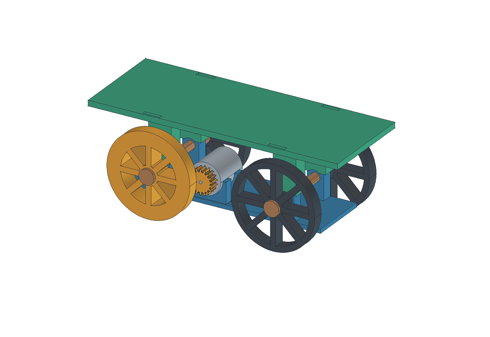
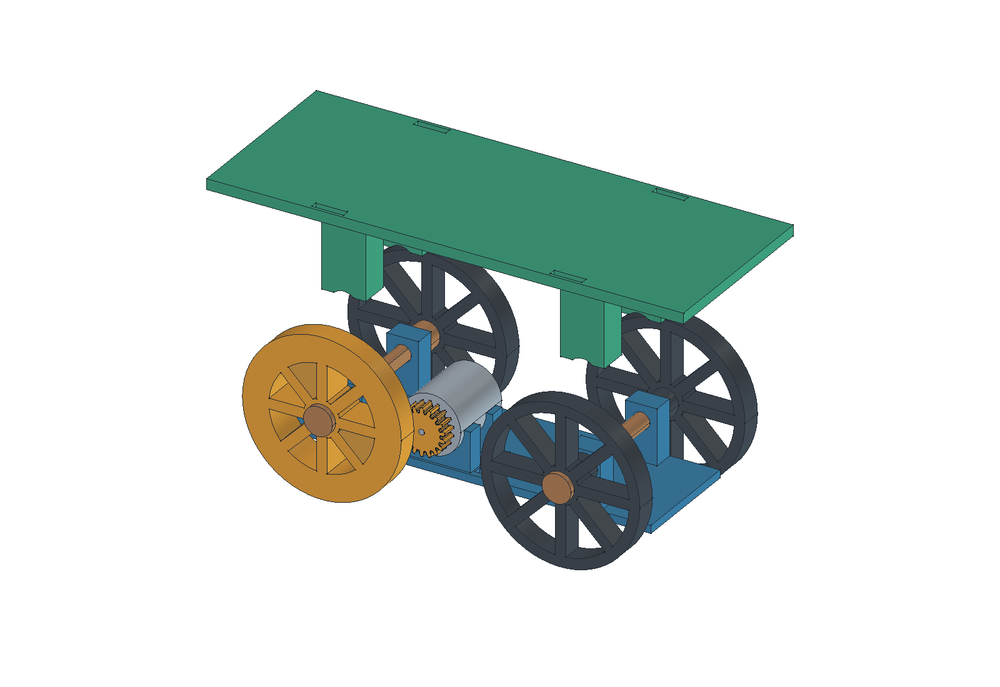
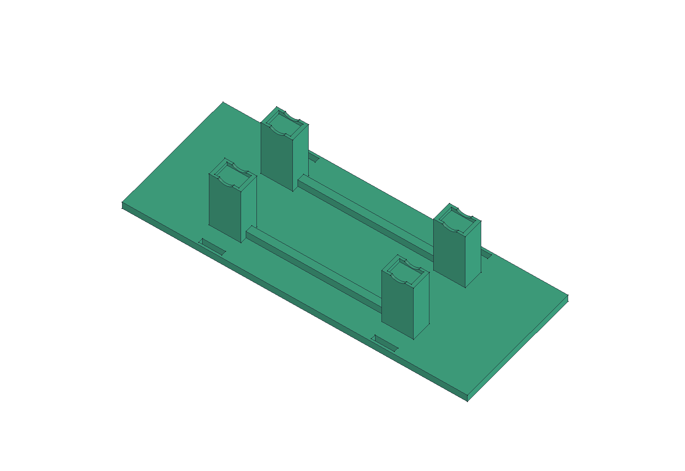

# Snímatelná plošina na původní podvozek

Zadání z 19. 9. 2026: přidat horní nosnou plochu bez přetisku podvozku. Uživatel uvedl nepájivé pole **170 × 60 mm** a požaduje alespoň takto velkou rovnou plochu. Arduino, motorové baterie a USB powerbanku si rozmístí sám na volné místo na poli. Jejich rozměry, hmotnost ani konkrétní sestavení nejsou součástí tohoto rozměrového ověření.

Nástavec je **jeden samostatně tištěný díl**, který se čtyřmi mělkými kapsami nasadí shora na stávající výstupky uložení os. Původní rám, kola, osy, rozpěrky a pastorek zůstávají stejné. Horní desku podpírají čtyři sloupky a dvě podélná žebra zespodu. Boky zůstávají otevřené; přístup k motoru a jeho kontaktům není uzavřený stěnou. Pro servis lze nástavec zvednout bez rozebrání podvozku, pokud jsou vodiče volné.

**Stav: uživatel 19. 9. 2026 potvrdil dokončení tisku a následně nasazení střechy.** Při pokračování hlásí [potíže s rozjezdem a divný zvuk](../../elektronika/auticko/potize-po-montazi.md), nyní i neúspěch s koly ve vzduchu. Podle jeho upřesnění byl těžký rozjezd už na starém programu; samotná hmotnost střechy ani regrese firmwaru nejsou prokázanou příčinou. Dosed a tiskové vůle je potřeba ověřit na skutečném rámu. Kapsy brání bočnímu posunu, ale nejsou pružnou západkou ani zajištěním proti nadzvednutí. Zatížení nahoře zvyšuje těžiště; nosnost, průhyb a stabilita při jízdě nejsou potvrzené. Profil, cívka, skutečný čas a spotřeba tohoto výtisku nejsou doložené.

## Soubory

- **[STL pro tisk — 1 kus](stl/strecha.stl)**; poloha pro tisk je již nastavená.
- **[Editovatelná sestava ve FreeCADu](auticko-se-strechou.FCStd)** včetně původního podvozku a nového nástavce.
- [Zdrojové makro](strecha.FCMacro), [výsledky geometrie a exportu](kontrola-strechy.json).
- [Ověřovací makro](overit-strechu.FCMacro), [nezávislé kontroly a změny parametrů](overeni-strechy.json).
- [Makro náhledů](nahled-strechy.FCMacro), [názorné nasazení](strecha-nasazeni.png), [poloha při tisku](strecha-tisk.png).

Původní `auticko.FCStd`, jeho makro, STL a tiskový balíček zůstaly beze změny. Pro přidání této plochy se tiskne pouze nové `strecha.stl`, nikoliv celá sestava. Nástavec není přidaný do dříve připraveného balíčku 13 zbývajících dílů.

## Rozměry a dosed

| Vlastnost | Hodnota | Původ |
|---|---:|---|
| Souvislá použitelná horní plocha | **170 × 60 mm** | Zadání uživatele podle jeho nepájivého pole |
| Vnější plošina | 180 × 70 mm | Návrh: 5mm okraj kolem užitné plochy |
| Tloušťka horní desky | 4 mm | Návrh |
| Rozměry celého tiskového dílu | 180 × 70 × 36 mm | Změřeno z exportované STL geometrie |
| Spodek / vršek plošiny nad spodkem rámu | 54 / 58 mm | Odvozeno z původních kol a návrhové vůle |
| Středy čtyř výstupků rámu | X = 25 a 115 mm, Y = −18 a +18 mm | Původní CAD |
| Horní plocha každého výstupku | 12 × 8 mm, Z = 24 mm | Původní CAD |
| Vnitřek každé kapsy | 12,6 × 8,6 mm | Návrhová vůle 0,3 mm na každé straně |
| Hloubka nasazení | 2 mm | Návrh; volné nasazení, ne zacvaknutí |
| Obloukový výřez v patce | R 5,5 mm kolem osy | Rozpěrka R 5 mm + návrhová vůle 0,5 mm |
| Dvě podélná žebra | průřez 4 × 4 mm | Návrh |
| Čtyři drážky pro pásky | 12 × 2,6 mm | Návrh; celé mimo plochu 170 × 60 mm |

Výřezy pro rozpěrky jsou podstatné: jejich vršek sahá do Z = 23 mm, zatímco kapsy začínají na Z = 22 mm. Bez výřezu by vnější stěna kapsy o rozpěrku drhla. Horní dosedací plochy zůstaly celé, každá má geometrický kontakt **96 mm²**.

Nominální CAD vůle: **6 mm nad obálkou kol**, **1 mm od velkého ozubení**, **0,5 mm od rozpěrek**, **2,5 mm od os**. Kontakt s rámem na dosedech je záměrný a nemá objemový průnik. Tyto hodnoty platí pro soustředěné nasazení a přesnou CAD geometrii; vůle v kapsách, tiskové odchylky, průhyb a vůle os je mohou zmenšit. Skutečný kontakt konektorů a kabelů nebyl modelován podle měření.

V tomto názorném pohledu je tentýž nástavec pouze posunutý o 35 mm nahoru; nejde o další tiskový díl ani provozní polohu.

## Tisk a nasazení

1. Importovat pouze `strecha.stl`, **jednou a v měřítku 100 %**. Očekávané rozměry jsou 180 × 70 × 36 mm.
2. Ponechat orientaci STL: **velká rovná horní plocha leží na podložce, čtyři sloupky a otevřené kapsy míří vzhůru**. Model je navržený bez podpor; skutečný náhled vrstev ve sliceru ještě zkontrolovat.
3. Vybrat skutečnou Anycubic Kobra X, trysku 0,4 mm a používané PLA. Výška vrstvy 0,2 mm a alespoň tři stěny jsou startovací návrh, nikoli ověřený profil. U tenkých stěn kapes zkontrolovat souvislé dráhy. Čas, spotřeba a konkrétní G-code této nové úlohy nejsou ověřené.
4. Vychladlý díl nejprve bez vybavení lehce položit kapsami na všechny čtyři výstupky. Netlačit jej násilím a nezatěžovat tenké okraje kapes.
5. Ručně protočit kola a ověřit, že se ničeho nedotýká ozubení ani rozpěrky. V případě těsného nasazení upravit vůli v parametrech, nikoliv rozměry původního rámu.
6. Pole uložit na horní plochu; okrajové drážky umožňují jeho zajištění páskami nebo textilním páskem vhodného průřezu. Pásky nejsou součástí výtisku a jejich vlastnictví nebylo potvrzené. Vybavení musí být upevněné tak, aby neomezovalo konektory a nepadalo do soukolí.

## Parametrický model a regenerace

V novém FCStd je tabulka **`ShieldParameters`** s rozměry nástavce; původní tabulka **`Parameters`** obsahuje podvozek. Polohy sloupků a kapes jsou vázané na středy a rozměry existujících uložení. Výška plošiny vychází z poloměru kol, výšky os a `WheelClearance`. Běžné změny tabulek přepočítá FreeCAD standardními objekty `Part::Box`, `Part::Cylinder`, `Part::MultiFuse` a `Part::Cut`, bez vlastního Python modulu.

`strecha.FCMacro` čte původní `auticko.FCStd` a vytváří **samostatný** `auticko-se-strechou.FCStd`, `stl/strecha.stl` a `kontrola-strechy.json`. Tyto nové výstupy při regeneraci přepisuje. Původní FCStd neukládá a jeho hash ověřuje. Makro spouštět v samostatném procesu FreeCADu; při otevřeném zdroji či cíli odmítne pokračovat, aby nepřepsalo ruční změny. Hodnoty měněné ve FCStd je pro budoucí regeneraci nutné současně sladit s makrem.

Po změně znovu exportovat, spustit ověřovací makro a `nahled-strechy.FCMacro`. Náhledové makro zapisuje jen nový FCStd a tři zdejší PNG; uloží sestavu s viditelným nástavcem a skrytými pomocnými tvary. PNG je skutečný snímek CAD geometrie, nikoli generovaná ilustrace.

## Ověření a otevřené body

Kontrola ve FreeCADu 1.1.3 potvrdila jeden platný solid, čtyři úplné dosedy, nulový objemový průnik se všemi 15 ostatními finálními díly včetně reference motoru a volné rotační obálky. Znovunačtený STL je uzavřený, má jednu komponentu a odpovídající rozměry. Jeho orientovaný objem se od CAD liší jen přibližně o 0,00017 % vlivem triangulace. Všechny tři skutečné náhledy byly vizuálně zkontrolované.

**Nezávislá kontrola nově otevřeného uloženého FCStd prošla:** sedm změn a návratů parametrů (délka, šířka, výška, vůle a hloubka kapes, výška výstupků a rozvor) zachovalo správné vazby, validní uzavřený solid a po návratu původní objem. Souvislá užitná plocha má skutečně **10 200 mm²** bez otvorů. Obálky rotačních součástí ověřily volné svislé sejmutí; navíc byly bez kolizí zkontrolovány zdvihy **0,1 / 1 / 2 / 3 / 8 / 30 mm**. Kontrolní součet nového FCStd před a po této zkoušce se nezměnil. Výsledky i rozsah důkazu jsou v [ověřovacím JSON](overeni-strechy.json).

**Dosud neověřeno:** kvalita a rozměry dokončeného výtisku, souběžný fit všech čtyř kapes, vůle při roztočení soukolí, nosnost, průhyb a stabilita naloženého autíčka. Dokončení tisku hlásí uživatel; agent tiskárnu neovládal. Modelování nástavce neměnilo firmware ani elektroniku. Jejich navazující stav je v [přehledu elektroniky](../../elektronika/auticko/README.md), potvrzené montážní pomůcky v [inventáři](../../elektronika/vybaveni.md).
