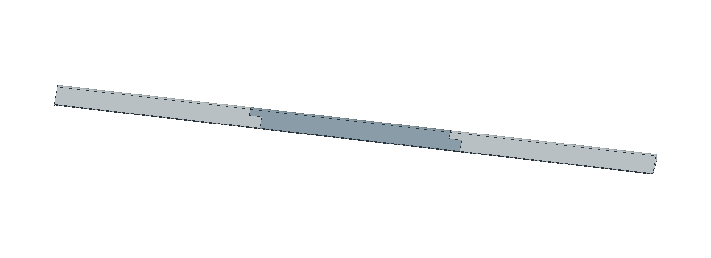
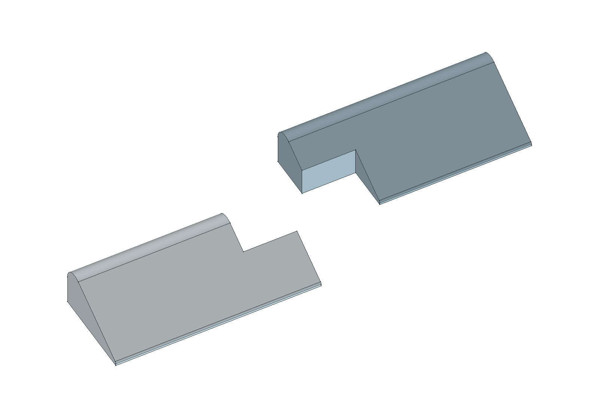

# Koupelnová přepážka B

**Nový návrh k posouzení: [revize 03 — 575 mm se zacvakávacími spoji](revize-03-575-zacvak/README.md).** Tři díly, 8 mm TPU + 2 mm lože; bez lepidla mezi díly. CAD a tiskové projekty jsou ověřené počítačově, fyzické zacvaknutí a těsnost zatím ne.

**Předchozí varianta je [revize 02 — 8mm TPU + 2mm lože](revize-02-8mm/README.md); soubory přímo v této kořenové složce zůstávají starou 10mm referencí a nejsou aktuálním předáním.**

**22. 9. večer: Jiří nahlásil neúspěšný fyzický tisk.** [Diagnostika a zachované důkazy](diagnostika/2026-09-22-nepovedeny-tisk/README.md) rozlišují nalezený místní PLA export od připraveného TPU projektu; skutečně spuštěný soubor ještě není potvrzený. Pro ověření nastavení otevřít celý [tehdejší testovací projekt revize 02](revize-02-8mm/rozlozeni/TEST-EXPERIMENT-spoj-Alzament-TPU95A.3mf), nikoli kopírovat staré díly do jiného procesu. Následující text a soubory této kořenové složky jsou historický popis 10mm reference.

Parametrický mechanický návrh, 22. 9. 2026. Účel: **zabránit vytékání/průtoku vody**. Geometrie prošla kontrolou; fyzická těsnost, spoj, přilnutí a tisk zatím ověřené nejsou.

**Otevřená montážní revize:** Jiří nyní upřesnil limit 10 mm pro celou nalepenou instalaci. Současný CAD má samotný výtisk vysoký 10 mm, takže neponechává místo pro lepicí lože. Je to geometricky ověřená reference, nikoli finální montážní/tisková revize. Výška výtisku a spojové vůle budou upravené po volbě doloženého lepicího postupu.

## Potvrzené zadání

- Jiří zvolil asymetrický náběhový profil **B** z [orientačního srovnání](navrhy/README.md).
- Celková délka sestavy **570 mm**, uživatelské měření.
- Šířka **nejvýše 20 mm** včetně spojů a všech výstupků. Nominální CAD má 20 mm, fyzická rozměrová tolerance není ověřená. Do limitu se nesmí dodatečně přidat boční patka či vůle.
- Původně nejvyšší bod profilu **10 mm**; následně výslovně zpřesněno jako maximum celé nalepené instalace. Současná reference ještě neobsahuje montážní lože.
- Více napojovaných dílů kvůli ploše tiskové desky.
- TPU; dostupný vyzvednutý výrobek **Alzament TPU 95A 1 kg Gray**. 95A je katalogová tvrdost. Nasazení cívky ve stroji nepotvrzené. Kanonická evidence a zdroje jsou v [materiálech](../../docs/materialy.md).
- Podklad je dle Jiřího **jedna dlouhá kachlička bez spár pod lištou**. Druh glazury, rovinnost a lepení neměřeny/nevybrány.

Historie: dříve zadaná šířka 40 mm byla výslovně nahrazena limitem 20 mm ještě před finální geometrií. Nejasnost o „protékání“ byla opravena na zabránění vytékání. Původní ImageGen srovnání zůstává jen historickou vizualizací bez měřítka; aktuální PNG zde vycházejí ze skutečné CAD geometrie.

## Navržené rozdělení a spoj

Tři díly jsou **návrhová volba**, nikoli uživatelem zadaný počet. Oba spoje mají navržený podélný přesah **12 mm** a dělení v polovině šířky, tj. **10 mm**. Jde o boční stupňovité přeplátování: v přesahu leží dvě doplňující se poloviny vedle sebe. Nevzniká výstupek mimo šířku 20 mm ani horní lalok visící nad podložkou.

| Díl / STL | Délka výtisku | Rozsah X v sestavě | Počet |
|---|---:|---:|---:|
| [Díl 1](stl/dil-1.stl) | 196 mm | 0–196 mm | 1 |
| [Díl 2](stl/dil-2.stl) | 202 mm | 184–386 mm | 1 |
| [Díl 3](stl/dil-3.stl) | 196 mm | 374–570 mm | 1 |

Sestavená délka: **196 + 202 + 196 − 12 − 12 = 570 mm**. Každý díl má maximálně 20 × 10 mm v průřezu a rovný dosed v Z=0. STL mají místní počátek na minimu svého ohraničení.

Detail ukazuje výřezy skutečných konců dílů 1 a 2; pravý protikus je pouze pro přehlednost odsunut o 18 mm podélně, 9 mm do strany a 6 mm nahoru. Tyto posuny nejsou vůle ani montážní rozměry.

**Nominální vůle je 0 mm**, jako geometrický referenční styk. Spoj nemá západku ani jiný mechanický zámek; díly se bez upevnění mohou rozjet. Suchý styk a delší styčná čára nezaručují těsnost. Výrobní vůli, případné odlehčení vnitřních rohů a odolnost proti natržení je nutné ověřit na vzorku ze skutečného TPU. Rozměry celého výtisku je třeba změřit před montáží, zejména limit šířky 20 mm.

Další návrhové hodnoty: poloměr nízkého náběhu 0,5 mm a vysokého ramene 3 mm. Mezi rameny je společná přímá tečna, vespod souvislá plochá základna. Nejde o změřený profil původního silikonu.

## Upevnění a utěsnění — dosud neověřený návrh

Na uživatelem popsané kachličce bez spár navrhujeme souvislou tenkou pružnou lepicí/těsnicí vrstvu pod celou patou, utěsnění obou stupňovitých styků a zakončení lišty. Konkrétní prostředek musí prokázat přilnavost k tomuto TPU i glazuře a vhodnost pro mokré prostředí; zatím nebyl vybraný, koupený ani aplikovaný. Vzorek má ověřit přilnutí, případné odlepení a únik vody. Ani plná výplň výtisku sama o sobě nezaručuje nepropustnost.

CAD neobsahuje tloušťku montážního lepidla, toleranci povrchu ani těsnicí hmotu. Případná montážní vrstva zvětší výslednou instalační výšku nad 10 mm; pokud je 10 mm limitem celé instalace, je nutné ji zahrnout do další revize profilu. Způsob napojení konců na okolí zatím není známý.

## Soubory a přepočet

- [prepazka-B.FCStd](prepazka-B.FCStd): editovatelný model se standardní tabulkou, plně zavazbeným skicářem, extruzí, válci a booleovskými operacemi. Nevyžaduje vlastní Python třídu.
- [prepazka.FCMacro](prepazka.FCMacro): zdroj a regenerace FCStd, tří STL a geometrického kontrolního JSON. Hodnoty v `VALUES`; výstup je vedle makra. Existující soubory stejných názvů přepisuje.
- [nahled.FCMacro](nahled.FCMacro): skutečné GUI rendery; skryje pomocné tvary a uloží dokument s viditelnými díly 1–3. Dočasné výřezy a odsunutí neukládá do konstrukce.
- [Detail profilu](profil-B-cad.png): krátký výřez aktuálního profilu, bez změny geometrie.
- [Kontrola CAD](kontrola-modelu.json): rozměry, tělesa, kontakty, kolize, parametrické změny, STL a znovuotevření.
- [Historické podložky a tiskový stav](revize-02-8mm/historie/reference-10mm/rozlozeni/README.md): samostatné projekty; geometry-only varianta neobsahuje proces ani filament.

Makra spouštět skutečným FreeCADem podle [projektového postupu](../../docs/software.md#spuštění-makra-ve-freecadu). Tabulka FCStd dovoluje následný nativní přepočet; změny v ní je třeba promítnout i do `VALUES` a znovu exportovat STL, podložky a náhledy. Před regenerací uložit případné ruční změny. Parametry neměnit mimo použitelné geometrické rozsahy bez nové kontroly.

## Výsledky geometrické kontroly

- Sestava **570 × 20 × 10 mm** (odchylka nejvýše přibližně 1e−12 mm z numeriky CAD).
- **3 platná tělesa**, každé jeden solid; vzájemný průnik objemů 0 mm³.
- Sjednocení přesně vyplní souvislý profil: chybějící i přebytečný objem 0 mm³; sjednocený referenční solid má cca 70 323,972 mm³.
- Nominální vzdálenost protikusů 0 mm, styčná plocha každého spoje cca 201,052 mm². Plocha spodního dosedu každého dílu 3 800 mm².
- Tři uzavřené STL. Oblé plochy jsou teselované: maximální výška mesh je cca 9,999418 mm, tj. o 0,000582 mm nižší než přesný CAD; měřítko je 1:1.
- Dva testy změny rozměrů/přesahu/poloměrů prošly, pak byly obnoveny zadané hodnoty. Uložený FCStd byl znovu otevřen a přepočten; samostatně byla ověřena změna délky 570 → 600 → 570 mm bez spuštění generačního makra.

Jde o kontrolu počítačové geometrie. Fyzický fit, lepení, těsnost a rozměr výtisku zatím nikdo nepotvrdil. Tiskárna nebyla ovládána.
