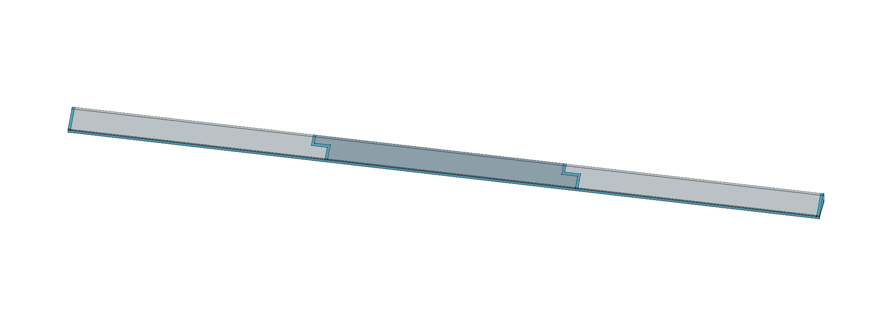
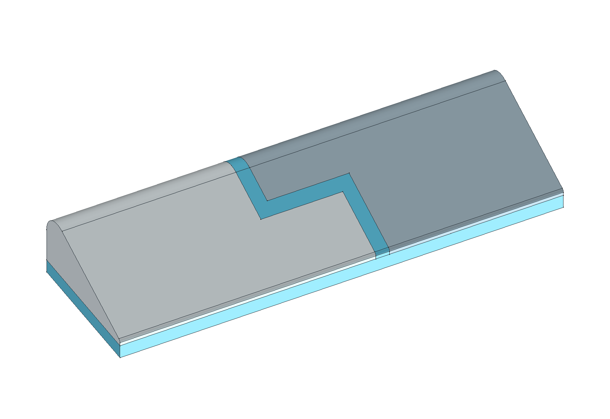
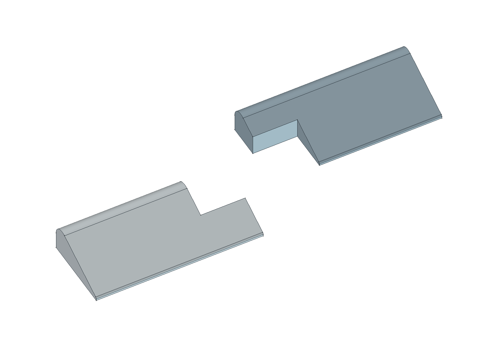

# Koupelnová přepážka B — těla 8 mm + lože 2 mm

Aktuální revize z 22. 9. 2026. Cíl: **zabránit úniku vody**, nominálně **570 × nejvýše 20 × přibližně 10 mm po nalepení**. Geometrie je ověřená; lepení, těsnost a skutečný výtisk vyžadují fyzický vzorek.

**Aktuální fyzický stav: nahlášený neúspěšný tisk, bez potvrzené identity souboru.** Večer 22. 9. Jiří uvedl tenké proužky, chuchvalce a vlásky po úloze, kterou tiskárna sama dokončila přibližně za 1 h 28 min. Předtím kopíroval díly z jiného projektu. [Forenzní záznam](../diagnostika/2026-09-22-nepovedeny-tisk/README.md) zachovává původní soubory a rozlišuje místní PLA export od tohoto TPU projektu. Nejde o úspěšný fyzický test revize 02.

Šedé části jsou TPU, **modrá pouze znázorňuje lepidlo**. Modré objemy se netisknou. Barvy slouží k rozlišení konstrukce, nejsou potvrzením vložené cívky.

## Zadání a návrhové hodnoty

**Jiří potvrdil:** profil B, naměřenou celkovou délku 570 mm, šířku maximálně 20 mm včetně spojů/výstupků a více dílů kvůli podložce. Výška 10 mm byla odhad odpovídající sklu: ideálně cca 10 mm i po nalepení, ale vyšší sestava má prostor, nejde o tvrdý výškový doraz. Podkladem je jedna hladká dlouhá kachlička bez spár pod lištou; její glazura, rovinnost a chemické vlastnosti nebyly ověřené. Pro přepážku určil TPU; vyzvednutý výrobek je Alzament TPU 95A Gray, viz [kanonický sklad](../../../docs/materialy.md). Večer 22. 9. Jiří přímo potvrdil šedé Alzament TPU95A ve vstupu 3; agent cívku neviděl. Nový start a správné odesílací mapování nejsou potvrzené.

**Navrženo:** tři TPU díly vysoké 8 mm, souvislé nominální 2 mm lepicí lože, boční stupňovité spoje s 2 mm prostory pro lepidlo a 2 mm prostor na každém konci uvnitř délky 570 mm. Zaoblení nízkého náběhu má poloměr 0,5 mm, vysokého ramene 3 mm; mezi nimi je společná přímá tečna. Počet dílů, poloměry, mezery a lepení jsou konstrukční návrh, nikoli naměřené vlastnosti.

Šířka přesného CAD je 20 mm včetně lepidla; **nezbývá rezerva pro boční výtlaček tmelu nebo výrobní odchylku**. Před montáží ověřit šířku skutečného výtisku a tmel udržet v obrysu. Skutečná výška závisí na vytištěném těle, vrstvě lepidla a rovinnosti kachličky.

## Díly a spoj

| Díl | STL: délka × šířka × výška | X v montáži | Kusů |
|---|---:|---:|---:|
| [Díl 1](stl/dil-1.stl) | 193 × 20 × 8 mm | 2–195 mm | 1 |
| [Díl 2](stl/dil-2.stl) | 200 × 20 × 8 mm | 185–385 mm | 1 |
| [Díl 3](stl/dil-3.stl) | 193 × 20 × 8 mm | 375–568 mm | 1 |

Podélné obálky sousedních TPU dílů se překrývají o 10 mm. Celkový obrys včetně dvou koncových 2 mm prostorů je **193 + 200 + 193 − 10 − 10 + 2 + 2 = 570 mm**. Základní délka schodu je 12 mm; posuny hran o polovinu 2 mm mezery vytvářejí skutečné lepicí prostory. V prvním spoji končí plný průřez dílu 1 v X=183, jeho nízká polovina sahá do 195 a Y≤9. Vysoká polovina dílu 2 začíná v X=185 a Y≥11, plný průřez od 197. Druhý spoj je stejný, posunutý o 190 mm.

**Mezi TPU protikusy jsou nominálně 2 mm**, ne nulový fit. Mezery jsou záměrné prostory pro lepidlo; geometrická kontrola je nepovažuje za chybějící TPU. Žádná část nepřesahuje maximální 20 mm šířku. Oba protikusy mají rovné spodní plochy a tisknou se na nich; nevzniká zavěšený horní jazýček.

Rozebraný detail ukazuje výřezy skutečných konců; pravý protikus je jen pro názornost posunut o 18 mm v X, 9 mm v Y a 6 mm v Z. Tyto vizualizační posuny nejsou montážní vůle. Spoj nemá západku, vyžaduje upevnění a utěsnění. Těsnost samotného tisku ani odolnost rohů proti natržení nejsou prokázané.

## Lepení a samostatný vzorek

[Montážní návod](montaz.md) navrhuje **Soudal Fix ALL Flexi šedý jako kandidáta k ověření**, nikoli prokázaně kompatibilní lepidlo pro Alzament TPU. 2 mm minimum výrobce se týká lepení; sanitární spárování má v TL minimum 5 mm. Zdejší 2 mm lepené spoje proto musí projít vlastním vzorkem. Občasné smáčení s vysycháním je podmínka návrhu, ne potvrzený režim koupelny; trvalé ponoření je vyloučené výrobcem.

Připravený vzorek tvoří [spoj 1](vzorek/spoj-1.stl) a [spoj 2](vzorek/spoj-2.stl), každý **30 × 20 × 8 mm**. Ve zkušební montáži tvoří 50 mm výřez skutečného spoje s 2 mm lepicí mezerou a nominálním 2 mm ložem. Je na samostatné jednoznačně označené podložce. Nejde o náhradu tří dílů celé lišty. Nejprve ověřit úplné vytvrzení včetně středu lože, přilnavost/odlupování a stav po namočení. Neúspěšný vzorek znamená nepoužít tento postup na celou lištu.

Strmější stěna (strana Y=20 v CAD) má směřovat k vodě. Souvislé lože, oba spoje a konce musí být utěsněné. Model má koncové prostory uvnitř 570 mm, ale skutečné okolní plochy konců nebyly zaměřené: volné konce může voda obtéct. Jejich fyzické napojení je nutné vyřešit podle místa montáže.

## Soubory a tiskový stav

- [prepazka-B.FCStd](prepazka-B.FCStd): aktuální nativní editovatelný FreeCAD model. Tabulka `Parameters`, plně zavazbený skicář, extruze, válce a booleovské operace; bez vlastní Python třídy. Těla jsou v montážní výšce Z=2–10, lepidlo zvlášť. Pomocné obrysy a vzorky jsou uložené skrytě.
- [prepazka.FCMacro](prepazka.FCMacro): zdroj, export FCStd, tří plných a dvou testovacích STL a kontrolního JSON. **Přepisuje stejnojmenné výstupy vedle sebe**. STL obsahují jen TPU, s minimem Z=0; lepidlo se neexportuje.
- [nahled.FCMacro](nahled.FCMacro): obnovuje aktuální skutečné CAD náhledy a uloženou viditelnost. Dočasné výřezy odstraní před uložením. [Detail průřezu s ložem](profil-B-cad.png).
- [Kontrola CAD](kontrola-modelu.json) a [podložky, profily, vrstvy a tiskový stav](rozlozeni/README.md).

Připravená hlavní podložka má 3 díly; samostatná testovací má 2 vzorky. Geometry-only soubory nesou jen geometrii. Oddělené experimentální projekty Anycubic Kobra X 0,4 mm obsahují navržený TPU proces a místní řez; **nejsou fyzicky kalibrovaným profilem**. Pro TPU má Alza proti technickému listu rozporné teploty podložky. Návrhových 60 °C vychází z TDS a místního profilu, nikoli z fyzického ověření; konkrétní varování a exportované hodnoty jsou u podložek. Tiskárna nebyla agentem ovládána. Původní hlášení, že Jiří dává tisknout, nepotvrdilo identitu zdejšího G-code. Později nahlásil fyzické selhání po automaticky dokončené úloze; vazba na konkrétní soubor zůstává neověřená, viz diagnostika nahoře.

Makra spouštět skutečným FreeCADem podle [projektového postupu](../../../docs/software.md#spuštění-makra-ve-freecadu). Po změně v tabulce sjednotit také `VALUES`, přepočítat a obnovit STL, podložky i náhledy. Před regenerací uložit ruční změny.

## Geometrické ověření

- 3 TPU těla, každé jeden platný solid; rozměry 193/200/193 × 20 × 8 mm. Žádné vzájemné objemové kolize.
- Zvlášť 2 objemy lepidla ve spojích a 2 na koncích, dohromady cca 1044,436 mm³; lože 22800 mm³. Lepidlo a TPU se objemově nepřekrývají.
- Konstrukční obrys vyplněný těly a znázorněným lepidlem je 570 × 20 × 10 mm. Chybějící a přebytečný objem proti referenci 0 mm³; rozdíl výšky od 10 mm je jen numerika CAD přibližně 1e−12 mm.
- Nejmenší vzdálenost protikusů obou spojů 2 mm. Dosedy TPU na lože 3728 /3736 /3728 mm². TPU objem cca 55559,257 mm³.
- 5 uzavřených STL, včetně obou vzorků. U STL je nepatrná odchylka vrcholu zaoblení daná teselací; přesná hodnota a hash vstupů jsou v auditu podložek. Měřítko 1:1, žádné přeměřítkování.
- Parametrické změny délky, šířky, výšky, přesahu, lepicích mezer, lože a poloměrů prošly a byly vrácené. Uložený dokument byl znovu otevřen; nativní přepočet délky 570 →600 →570 mm funguje bez generačního makra.

Geometrická shoda neprokazuje rozměr výtisku, kompatibilitu lepidla, přilnavost, těsnost ani životnost.

## Historie

[Reference samotného 10 mm těla](historie/reference-10mm/README.md) uchovává dřívější CAD, STL a proces s nulovou vůlí spojů bez lepicího lože. **Není aktuální variantou k montáži.** Původní šířka 40 mm byla výslovně opravena na maximum 20 mm; konečné zdroje ji nepoužívají. [ImageGen srovnání A/B/C](navrhy/README.md) zůstává historickou vizualizací bez měřítka, nikoli aktuálním CAD.
