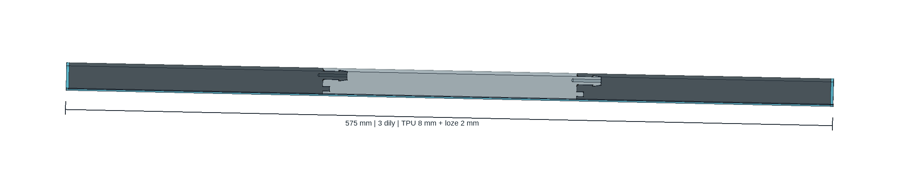
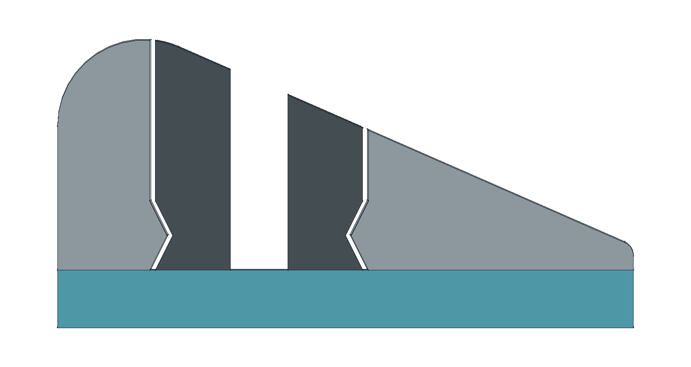
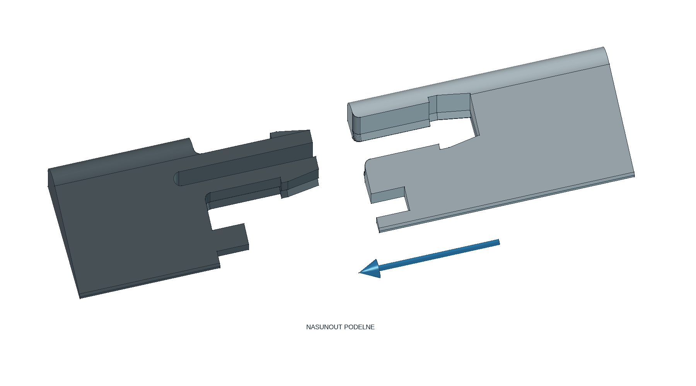

# Přepážka B 575 mm se zacvakávacími spoji

**Návrh k posouzení a fyzické zkoušce, 23. 9. 2026.** Tři díly se mají spojit podélným zasunutím a zacvaknutím, **bez lepidla mezi díly**. Lepicí lože zůstává pouze pod lištou a těsnicí rezerva na jejích koncích. Počítačová geometrie prošla kontrolou; síla zacvaknutí, držení spoje, únava TPU a těsnost nejsou ověřené. Nejde o schválené řešení k hotové montáži.

Pro první fyzickou zkoušku slouží [samostatný dvoudílný TEST — celý 3MF projekt](rozlozeni/TEST-EXPERIMENT-575-snap-Alzament-TPU95A.3mf). Hlavní tříkusovou sestavu posuzovat až podle tohoto vzorku; oba projekty a nastavení jsou níže.

Šedé odstíny pouze rozlišují tři díly; nepotvrzují barvu ani materiál fyzického výtisku. Modré referenční objemy znázorňují lože a koncové utěsnění, které se netisknou.

## Zadání a rozměry

Nově zadaná celková délka je **575 mm včetně koncového utěsnění**. Zachovaný limit šířky je **20 mm včetně všech částí a tmelu**; v CAD nezbývá boční rezerva na výtlaček lepidla ani výrobní odchylku. Výška celé instalace má být přibližně 10 mm, nejde o tvrdý výškový doraz.

Návrh zachovává profil B, **8 mm TPU + nominálně 2 mm lože**, tři díly a **2 mm na utěsnění každého konce uvnitř délky 575 mm**. Samotná propojená TPU sestava proto zabírá **571 mm**. Dříve potvrzeným podkladem je jedna dlouhá hladká kachlička bez spár; rovinnost, glazura a skutečné napojení konců nejsou zaměřené. Výběr tří dílů, rozměry zámků a montážní rezervy jsou konstrukční návrh, nikoli fyzická měření.

| Soubor | Nominální rozměry výtisku, mm | Počet |
|---|---:|---:|
| [Díl 1](stl/dil-1.stl), vidlice na pravém konci | 208,333 × 20 × 8 | 1 |
| [Díl 2](stl/dil-2.stl), dutina vlevo a vidlice vpravo | 208,333 × 20 × 8 | 1 |
| [Díl 3](stl/dil-3.stl), dutina na levém konci | 190,333 × 20 × 8 | 1 |
| [Zkušební protikus 1](vzorek/spoj-1.stl) | 40 × 20 × 8 | 1 |
| [Zkušební protikus 2](vzorek/spoj-2.stl) | 40 × 20 × 8 | 1 |

Oba zámky mají podélný přesah **18 mm**. Přesně platí `3 × (571/3) + 2 × 18 − 2 × 18 + 2 × 2 = 575 mm`; délky v tabulce jsou zaokrouhlené. Zkušební pár tvoří sestavený výřez dlouhý **62 mm** a nenahrazuje tři hlavní díly. STL jsou v měřítku 1:1, pouze TPU, se spodní plochou na Z=0. Lože a koncové rezervy v CAD se netisknou.

## Jak zámek funguje

Každý spoj má rozdělenou podélnou vidlici se dvěma pružnými rameny. Při zasunutí mají ramena uhnout ke středové štěrbině a potom zachytit rozšířenou hlavici za rameny dutiny. **Dvojitá rybina se zúženým pasem** přidává geometrické zachycení v obou směrech Z: má bránit nadzvednutí jednoho i druhého protikusu. Vedlejší pero na nízké straně pomáhá se srovnáním dílů a prodlužuje styčnou cestu; není hlavním zajištěním.

| Návrhový parametr | Hodnota a význam |
|---|---|
| Krček / hlavice vidlice u spodku | 5,6 / 7,2 mm |
| Vůle | 0,2 mm na stranu v X/Y; nejde o jednotnou kolmou vůli na všech šikmých plochách |
| Středová štěrbina | 2 mm; při vypočteném přiblížení ramen zbývá nominálně 0,8 mm |
| Pohyb každého ramene při průchodu hlavice | 0,6 mm do strany, pouze geometrický požadavek; síla ani materiálové přetvoření nejsou vypočtené |
| Nejužší rameno v pasu dvojité rybiny | 1,2 mm |
| Kořeny vidlice | Vnitřní R1; vnější R1 aproximované osmi úseky na čtvrtoblouk, odchylka pod 0,005 mm |
| Dvojitá rybina, výšky od spodku TPU | V Z=0 plná šířka, v Z=1,2 mm zúžení o 0,6 mm na každé straně, v Z=2,4 mm opět plná šířka a dále svisle. Každá šikmá stěna má přibližně 26,6° od svislice, tedy geometrickou změnu 0,1 mm na vrstvu 0,2 mm |
| Nominální svislá vůle před zachycením | 0,4 mm, odvozená z geometrie rybiny |
| Vedlejší vodicí pero | Délka 5 mm, šířka 3 mm, oblast Y=2–5 mm |

Řez ukazuje zachycení v obou směrech Z, bílou mezeru mezi protikusy a modré lože pod nimi. [Detail sestaveného zámku](spoj-zajisteny-cad.png).

**Mechanické zachycení není těsnění.** Vůle zámku a tištěný povrch mohou propouštět vodu; prodloužená styčná cesta sama průsak nevylučuje. Do mechanických spojů se v této revizi lepidlo ani tmel nepřidávají. Pokud suchý spoj při zkoušce propouští, návrh nesplnil funkční požadavek a potřebuje další revizi.

## Montáž a zkouška dvou protikusů

Protikus s dutinou je v náhledu posunutý o 25 mm v +X pro zobrazení zámku; nejde o montážní mezeru. Modrá šipka označuje směr nasunutí −X.

1. Odstranit vnější lem a zkontrolovat oba 40mm vzorky: úplná ramena a hlavice, volná štěrbina, čisté dutiny, skutečná šířka a rovná spodní plocha. Výsledek z jiného materiálu nelze přenášet na zamýšlené TPU.
2. Oba vzorky položit základnou do stejné roviny a srovnat profil. Podržet vidlici a díl s dutinou posouvat **podélně k ní** (v CAD směrem −X). Spoj se neskládá přitlačením shora. Sledovat, zda obě ramena projdou a vrátí se; při velkém odporu nepokračovat násilím.
3. Zkontrolovat úplné dosednutí a zkusit přiměřený podélný tah, ohnutí na obě strany a nadzvednutí protikusu v Z jako při odlepování; vystřídat, který díl je přidržený a který nadzvedávaný. Zapsat sílu, pokud je změřená; jinak pouze subjektivní odpor. Praskání, trvalé rozevření ramen, vytažení nebo vyloupnutí znamenají neúspěšný vzorek.
4. Opakovat spojení a namáhání na zkušebním páru, pokud jej lze bez poškození rozpojit; zaznamenat skutečný počet cyklů a změnu vůle. Návrh nemá samostatné odjišťovací tlačítko a opakované rozebírání není ověřené. Nepáčit jej nástrojem a netvrdit životnost z jednoho zacvaknutí.
5. Funkční vodní zkoušku provést na stejné kachličce s ověřeným a vytvrzeným ložem a vyřešenými konci. **Strmější strana profilu (Y=20) směřuje k vodě.** Krátce smáčet pod úrovní horní hrany, sledovat odděleně průsak spojem, pod ložem a kolem konců, potom nechat vyschnout. Zkoušku opakovat po mechanickém namáhání. Volné konce může voda obtéct a výsledek pak nerozlišuje těsnost samotného zámku.

Až podle vzorku lze obdobně spojit díly 1–2–3 a ověřit celých 575 mm včetně konců. Lepidlo patří pod lištu, nikoli do zámků. Materiál lože, přilnavost k TPU a kachličce, vytvrzení i koncové napojení vyžadují vlastní ověření. Návrh předpokládá občasné smáčení s vysycháním; trvalé ponoření není tímto postupem doložené. Jedna krátká zkouška nepotvrzuje dlouhodobou těsnost.

## Soubory, náhledy a kontrola

- [prepazka-575-zacvak.FCStd](prepazka-575-zacvak.FCStd): editovatelný FreeCAD se standardní tabulkou `Parameters`, skicami, výrazy, loftenými tvary a booleovskými operacemi; bez vlastní Python třídy. TPU je v montážní výšce Z=2–10 mm, lože a konce jsou oddělené referenční objemy.
- [prepazka.FCMacro](prepazka.FCMacro): zdroj parametrů a regenerace FCStd, tří hlavních STL, dvou vzorků a [kontrolního JSON](kontrola-modelu.json). Přepisuje tyto výstupy vedle sebe; neovládá tiskárnu. Po editaci tabulky je nutné sjednotit i `VALUES` v makru a obnovit exporty.
- [nahled.FCMacro](nahled.FCMacro): vytvoří výše zobrazené skutečné CAD náhledy a [detail sestaveného zámku](spoj-zajisteny-cad.png). Náhledy byly zkontrolované po poslední úpravě dvojité rybiny.

Generátor ověřil 3 platné hlavní solidy, 2 platné vzorky, 5 uzavřených STL, nulové objemové kolize v sestavené poloze a obálku 575 × 20 × 10 mm včetně referenčního lože a konců. Všechny skici jsou plně zavazbené. Testy změny délky, vůle/hlavice a výšky rybiny/štěrbiny prošly; nominální hodnoty byly obnovené. Uložený FCStd byl znovu otevřený v GUI, přepočtený při délce 600 mm a vrácený na 575 mm bez neplatných objektů. Viditelné zůstaly pouze tři díly, lože a konce.

Při zkušebním posunu tuhého dílu o 1 mm v podélném směru od protikusu, do obou stran Y a v obou směrech Z kontrola našla kolizi zachycujících ploch u obou spojů. **To dokládá pouze geometrickou překážku pro tuhý posun.** Není to simulace deformace TPU, montážní síly, bočního vyloupnutí, pevnosti ani únavy.

[Nezávislý audit spoje](audit-spoje.md) s [výsledky výpočtu](audit-spoje.json) navíc zkontroloval zasunutí obou skutečných spojů při **předepsaném stlačení každého ramene o 0,65 mm**, se zbývající štěrbinou 0,70 mm. Zkoušené polohy dutiny od +19 do +0,5 mm v X po 0,5 mm, uvolnění ramen při +0,19 mm a dovření vyšly bez objemové kolize. Pohyb ramen byl modelu předepsán: tato kontrola nedokazuje jejich samovolné stlačení náběhem, reálnou deformaci TPU ani potřebnou sílu.

Doplňková nezávislá kontrola CAD průřezů dílu 3 narazila na neuzavřený obrys z geometrického jádra OCC; tuto část kontroly nelze označit za dokončenou. Samostatná kontrola průřezů všech pěti STL a skutečných drah G-code prošla, jak dokládá přehled podložek níže. Tyto počítačové kontroly nenahrazují fyzickou zkoušku.

## Tiskový stav a materiál

Oba projekty jsou místně nastavené a řezané; nic nebylo odesláno na tiskárnu. **Otevřít jako celý projekt a zachovat projektové profily.** Aktivní materiál má název `EXPERIMENT 575 snap Alzament TPU95A Gray Kobra X 0.4 225C bed60C`. Import samotné geometrie do jiného projektu nezajišťuje tato nastavení.

| Celý projekt | Podložka | Odhad sliceru |
|---|---|---:|
| [TEST — dvě zkušební poloviny](rozlozeni/TEST-EXPERIMENT-575-snap-Alzament-TPU95A.3mf) | 2 vzorky 40 × 20 × 8 mm | 43 min 5 s / 7,55 g |
| [Přepážka — hlavní tři díly](rozlozeni/EXPERIMENT-prepazka-575-snap-Alzament-TPU95A.3mf) | 3 díly, výška 8 mm | 6 h 4 min 9 s / 71,27 g |

Časy a hmotnosti jsou odhady, nikoli výsledky fyzického tisku. Oba projekty mají 40 extrudovaných vrstev od Z=0,2 do 8,0 mm, vnější 5mm lem a vypnuté podpory. U všech pěti sítí nedošlo k opravě; audit našel skutečné dráhy obou ramen zámků a geometrickou návaznost vyšších vrstev. Nativní CLI znovunačtení celých projektů zachovalo geometrii, umístění i vlastní nastavení Alzament 225/60 °C. Podrobnosti, důvody vypnutých podpor, skutečné dráhy a auditní soubory jsou v [přehledu podložek](rozlozeni/README.md). Tamní geometry-only alternativy obsahují pouze rozmístěné sítě a nejsou samostatně připravené k tisku.

Zachovaný **experimentální** proces pro Anycubic Kobra X 0,4 mm předpokládá Alzament TPU 95A Gray: vrstvy 0,2 mm, tryska **225 °C**, deska **60 °C**, první vrstva **20 mm/s**, další extruze nejvýše **40 mm/s**, **4 stěny a 100% výplň**. Nejde o kalibraci konkrétní cívky ani záruku nepropustnosti. Materiál dosavadních černých fyzických kusů není potvrzený; z nich ani z barvy náhledu neodvozujeme použití šedého TPU, jeho slot nebo cestu podávání. Aktuální potíže s podáváním/tryskou tento mechanický návrh neřeší.

Přetrvává dříve zjištěný rozpor podkladů: [produktová informace Alzament TPU 95A Gray](https://www.alza.cz/alzament-tpu-95a-1-kg-gray-d13015353.htm) uvádí trysku 190–230 °C a desku 30–50 °C, zatímco [Alzament TPU 95A TDS V1.0](https://dwn.alza.cz/manual/161249) uvádí 220–240 °C a 60–80 °C. Jde o převzatý záznam ověření z 22. 9. 2026, nikoli nový test cívky. Tryska 225 °C leží v průniku, teploty desky společný rozsah nemají. Návrhových 60 °C a příslušné varování sliceru se nezastírají; proces zůstává experimentální.

## Historie této změny

Revize 03 mění délku z 570 na **575 mm** a lepené spoje předchozího návrhu nahrazuje mechanickou vidlicí s rybinovým zachycením. Předchozí pravidlo nanášet lepidlo mezi díly se na tuto revizi nevztahuje. Starší výtisk, kontrola ani zkušenost s jiným spojem nejsou fyzickým ověřením této geometrie.
