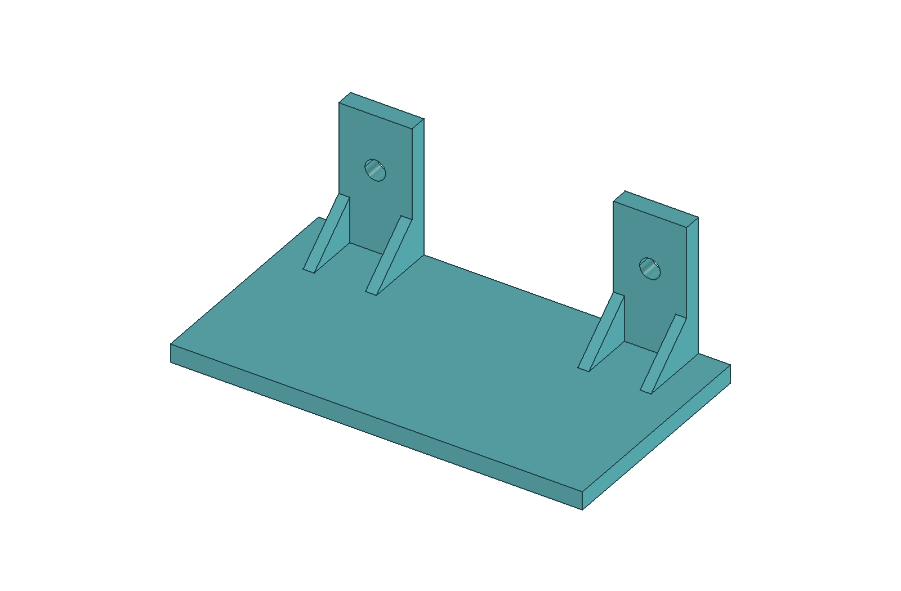

# Polička na zárubeň

První testovací model. **Geometrie ověřena; uživatel zahájil tisk, fyzický výsledek nepotvrzen.** Aktuální průběh a limity kontroly G-code jsou v [deníku](../../docs/denik-tisku.md).

## Zadání a rozměry

Uživatel zadal vodorovnou desku **90 mm širokou × 50 mm hlubokou**, dvě zadní L montážní ramena a dva otvory pro přišroubování k zárubni. Polička je naspodu ramen. Zadaný půdorys není záznamem měření konkrétní zárubně.

| Parametr | Hodnota | Původ |
|---|---:|---|
| Šířka × hloubka desky | 90 × 50 mm | Zadání uživatele |
| Tloušťka desky | 4 mm | Návrh agenta |
| Rameno: šířka × výška nad deskou × tloušťka | 16 × 30 × 4 mm | Návrh agenta |
| Otvory | 2 × Ø 4,5 mm, bez zahloubení | Návrh agenta |
| Rozteč otvorů | 60 mm | Odvozeno z návrhu |
| Celková výška | 34 mm | Odvozeno z návrhu |
| Výztuhy | 4 malé boční | Návrh agenta |

Podrobnější návrhové rozměry jsou v původních [poznámkách](CTI-ME.md), [kontrolním JSON](kontrola-modelu.json) a tabulce parametrů FCStd. **Nosnost, skutečné šrouby, materiál zárubně a rozměrové přizpůsobení skutečnému místu nejsou ověřené.**

## Soubory a úpravy

- [policka-90x50.FCStd](policka-90x50.FCStd) — editovatelný model, otevřít ve FreeCADu.
- [policka-90x50.stl](policka-90x50.stl) — export pro Anycubic Slicer Next; jednotky modelu mm.
- [policka.FCMacro](policka.FCMacro) — programový zdroj generování; [návod ke spuštění](../../docs/software.md#spuštění-makra-ve-freecadu).
- [model-render.png](model-render.png) — náhled z CAD geometrie, nikoli ilustrace ani fotografie výtisku.
- [kontrola-modelu.json](kontrola-modelu.json) — původní výsledky geometrických kontrol.
- [CTI-ME.md](CTI-ME.md) — zachovaná původní dokumentace před zahájením tisku.

Ve FCStd otevři tabulku **Parametry (mm) — upravit sloupec B**. Model používá standardní objekty a výrazy FreeCADu; přepočet nezávisí na vlastní importované Python třídě. Po změně přepočítej a exportuj STL z finálního objektu **Polička — 1 kus, 2 otvory**. STL se při změně FCStd samo neaktualizuje.

Makro obnovuje model z vlastních hodnot `VALUES` a ukládá FCStd, STL a JSON do složky, ve které leží. Před regenerací slaď případné ruční změny s makrem; může přepsat stávající výstupy. Náhled PNG samo negeneruje.

Omezení původního kontrolního výstupu: `hole_centres_xz_mm` je v makru zapsáno napevno jako `[[15, 22], [75, 22]]`. Pro současný návrh odpovídá, ale při další změně parametrů se automaticky neaktualizuje. Nové středy ověř přímo z geometrie. Příznak `mesh_closed` se zapisuje podle `mesh.isSolid()`; případná hodnota `false` sama nezastaví export, a musí se proto výslovně zkontrolovat.

## Již provedené ověření

Přenesené výsledky původní kontroly:

- Jeden platný solid, uzavřená STL síť, celkové rozměry **90 × 50 × 34 mm**.
- Parametrická změna šířky **90 → 100 → 90 mm** prošla včetně posunu druhého otvoru a návratu původního objemu. Uložená finální šířka je 90 mm.
- Při otevření je vidět jen finální objekt, pomocné tvary jsou skryté.
- Uživatel úspěšně otevřel FCStd a importoval STL do sliceru.

Při založení této složky nebyly CAD render ani geometrické testy opakovány; šlo o kopii již ověřených souborů.

## Původ a aktuálnost

Šest původních souborů bylo 19. 9. 2026 zkopírováno beze změny z `/home/novakj/Documents/3D-models/policka-na-zaruben/`. Původní soubory zůstaly zachované, protože je uživatel používal. Další modelování a nové poznatky patří do tohoto checkoutu.

V původním `CTI-ME.md` zůstává věta, že návrh nebyl odeslán ani vytištěn: popisuje okamžik vzniku původního návrhu, **nikoli aktuální stav**. Pozdější uživatelské hlášení o zahájení tisku je zachyceno zde a v deníku. Dokončení ani úspěšný výtisk zatím potvrzeny nejsou.
