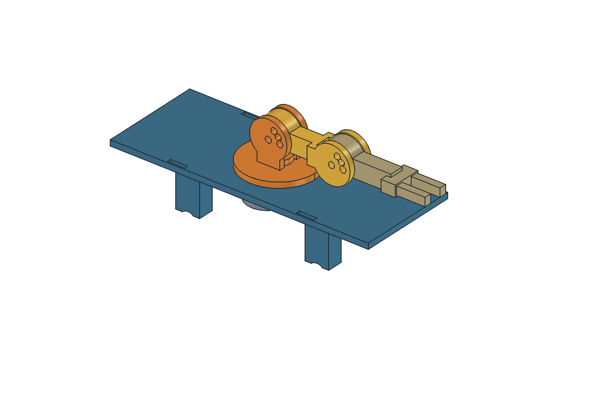

# Robotická ruka — první prototyp na autíčko

Zadání Jiřího z 23. 9. 2026: lehký první tisknutelný základ paže pro kolového humanoidního robota na jednoduchém autíčku. Nohy se nyní neřeší. Krokový motor, který má Jiří k dispozici, má otáčet základnou kolem svislé osy; rameno a loket budou v první revizi ručně polohovatelné. Koncovka bude jednoduchá otevřená dvouprstá ruka pro zkoušku tvaru a dosahu, ještě bez aktivního úchopu.

**Stav 23. 9. 2026: první CAD a dvě nastavené tiskové podložky jsou hotové a místně nařezané.** Je to tisknutelný prototyp pro zkoušku sestavení, ne fyzicky vytištěná ani smontovaná paže. Původní [střecha autíčka](../jednoduche-auticko/strecha.md) zůstává samostatným dílem. Nová plošina přebírá její čtyři spodní dosedy a při zkoušce ji nahrazuje. Rozměry konkrétního motoru je potřeba ověřit měrkou, než se vytiskne celá sestava.

## Co je připravené

| Soubor | Účel |
|---|---|
| [Měrka motoru – nastavený 3MF projekt](rozlozeni/podlozka-merka-01-nastaveny-projekt.3mf) | První tisk, jeden zkušební kus |
| [Sestava – nastavený 3MF projekt](rozlozeni/podlozka-sestava-01-nastaveny-projekt.3mf) | Druhý tisk, všech 12 fyzických montážních kusů |
| [Přehled tiskových podložek](rozlozeni/README.md) | Přesné počty, náhledy, profil, podpory a výsledky řezu |
| [Editovatelný model FreeCAD](roboticka-ruka.FCStd) a [zdrojové makro](roboticka-ruka.FCMacro) | Parametrický zdroj sedmi typů dílů |
| [STL](stl/) a [náhled spodku plošiny](nahled-spodku.png) | Jednotlivé exporty a kontrola motorového prostoru |

Model tvoří výměnná plošina, otočná základna, nadloktí, předloktí s pevně otevřenou dvouprstou rukou, čtyři čepy a čtyři C-pojistky. Dva čepy na každém kloubu tvoří osu a aretaci; rameno a loket lze ručně nastavit do navržených poloh **0°, 30° a 60° směrem nahoru**. Otočná základna má kluzný prstenec opřený o plošinu, aby část svislé zátěže nemusela nést samotná převodovka motoru. Uložení, vůle a skutečná nosnost ještě nejsou fyzicky prokázané.

## Postup první zkoušky

1. Otevři celý [projekt měrky](rozlozeni/podlozka-merka-01-nastaveny-projekt.3mf) v Anycubic Slicer Next a vytiskni jeden kus. Porovnej rozteč děr a profil otvoru se skutečným motorem. Pokud nesedí, oprav parametrický zdroj a znovu připrav STL i obě podložky.
2. Až poté otevři celý [projekt sestavy](rozlozeni/podlozka-sestava-01-nastaveny-projekt.3mf) jednou, bez přidávání kopií. Jde o projekt pro **Anycubic Kobra X 0,4 mm** s procesem 0,16 mm a nekalibrovaným profilem odvozeným ze systémového Anycubic PLA. Podložka je nastavena na 50 °C pro první i další vrstvy. V tiskárně/sliceru zkontroluj skutečně vloženou PLA cívku; profil není kalibrací Jiřího Alzament PLA Basic. Místní řez měrky je bez varování, u sestavy zůstává pouze [varování režimu časosběru](rozlozeni/README.md#proces-a-podpory). Při změně profilu znovu zkontroluj řez a dráhy.
3. Po tisku odstraň podpory pouze z otočné základny a vyčisti kluznou plochu, otvor hřídele i otvory kloubů. Nasazení čepů, pojistek a hřídele zkoušej bez násilí; vůle jsou návrhové.
4. Při vypnutém autíčku zkontroluj volný prostor pod plošinou a připevni motor zespodu dvěma šrouby a maticemi M3. Návrh otvorů a zahloubení počítá s nízkou hlavou do průměru 7 mm a výšky 2 mm; skutečnou délku šroubů a jejich dostupnost je třeba ověřit na motoru. Po sestavení otočné základny spoj nadloktí a předloktí čepy s C-pojistkami a nastav obě aretace nejprve na 0°.
5. Vyměň původní střechu za novou plošinu a nejprve zkoušej **na stojícím autíčku bez nákladu v ruce**. Čtyři dosedy jsou převzaté z původní střechy, ale samy nevytvářejí zámek proti zvednutí. Před jízdou ověř fyzicky dosednutí a bezpečné zajištění plošiny k podvozku. Trasu kabelu motoru a meze otáčení ověř dřív, než se základna začne motorově otáčet; nepouštěj ji nepřetržitě dokola.

Nová plošina zabírá místo dosavadní volné horní plochy, takže umístění existující elektroniky a kabelů autíčka bude potřeba při montáži přehodnotit. Návod k elektrickému připojení zatím neexistuje; [stav elektroniky](../../elektronika/roboticka-ruka/README.md) jej výslovně odděluje od mechanického tisku.

## Co je potvrzené a co je návrh

Jiří potvrdil vlastnictví motoru se štítkem hlasem čteným jako „StepMotor 28BY…-48, 5 V DC“. Přesné označení a rozměry fyzického kusu nejsou jisté; [zápis ve skladu](../../elektronika/vybaveni.md) tuto nejistotu zachovává. [Běžný typ 28BYJ-48 u LaskaKitu](https://www.laskakit.cz/krokovy-motor-28byj-48/) je vodítkem pro první návrhové hodnoty, nikoli měřením tohoto motoru.

Nominální rozměry použité v modelu jsou tělo Ø28 mm, rozteč montážních otvorů 35 mm a hřídel Ø5 mm s ploškami. Podklady jsou [výkres varianty 28BYJ48-W01](https://akizukidenshi.com/goodsaffix/28BYJ48-W01.pdf) a [popis 28BYJ-48 od Waveshare](https://www.waveshare.com/product/5v-step-motor.htm). Jsou to **návrhové hodnoty**, ne změřené hodnoty Jiřího kusu.

Nosnost ramene, momentová rezerva, vůle otočné základny, stabilita auta, skutečný dosed nové plošiny a vhodnost šroubů zatím nejsou fyzicky ověřené. Při první zkoušce pohybuj paží bez zátěže a sleduj naklánění auta i případné drhnutí.

Elektrické zapojení a plán případného řízení motoru jsou v [samostatném záznamu elektroniky](../../elektronika/roboticka-ruka/README.md). Pro tuto revizi nebyl připraven ani nahrán žádný firmware.

## Digitální kontrola a další úpravy

[Kontrola geometrie](kontrola-geometrie.json) ověřila sedm platných jednodílných solidů a uzavřené STL. [Kontrola sestavy](kontrola-sestavy.json) nenašla průnik nové plošiny s původní CAD sestavou autíčka ani s nominálním obrysem motoru. Kontrola současně potvrdila volný prostor ve směru navržených aretačních poloh 0°, 30° a 60°; polohy dolů narážely do plošiny, a proto nejsou pro tento prototyp určené. Zkouška změny rozteče motorových děr 35 → 36 → 35 mm ověřila, že se odpovídající otvory plošiny a měrky přepočítají společně. [Audit podložek a místního řezu](rozlozeni/README.md#co-bylo-ověřeno-v-počítači) ověřil 1 + 12 kopií, skutečně vytvořené podpory otočné základny a průchod slicerem. Žádná tisková úloha nebyla odeslána.

Hlavní rozměry jsou v tabulce `Parameters` ve FreeCAD souboru a v `VALUES` zdrojového makra. Standardní objekty FreeCAD mají vazby na tabulku. Některé odvozené tvary, zejména poloměr a úhly aretačních děr, vznikají při spuštění makra: při jejich změně uprav makro, přegeneruj model a znovu vytvoř STL i 3MF. U změny provedené nejprve v FCStd slaď také makro, aby příští regenerace změnu neztratila. Makro přepisuje vlastní FCStd, STL a kontrolní JSON v této složce; otevřený cílový FCStd odmítne přepsat. Náhledy a 3MF se vytvářejí navazujícími postupy, ne samotným makrem.
